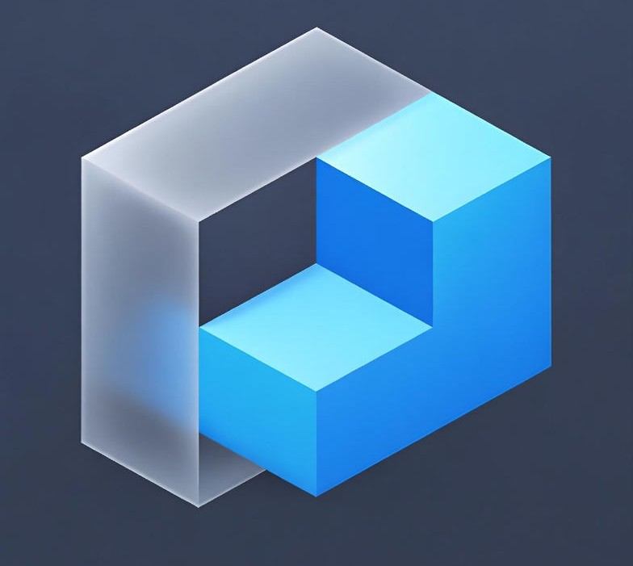

# PrimusDB Architecture Documentation

**Version:** 1.3.2-alpha  
**Last Updated:** 2026-05-28 (Federation + Multi-Region + Geo-Sharding added)  
**License:** GPL-3.0

---

# Table of Contents

1. [Introduction and Philosophy](#1-introduction-and-philosophy)
2. [System Overview](#2-system-overview)
3. [Storage Engine Architecture](#3-storage-engine-architecture)
4. [Key-Value Storage Engine](#4-key-value-storage-engine)
5. [Transaction Management](#5-transaction-management)
6. [API and Communication Layer](#6-api-and-communication-layer)
7. [Namespace and Multi-Tenancy Architecture](#7-namespace-and-multi-tenancy-architecture)
8. [Cluster and Distributed Systems](#8-cluster-and-distributed-systems)
   - 8.1 [Cluster Gateway & Smart Routing](#81-cluster-gateway--smart-routing)
   - 8.2 [Federation Layer (Cluster-of-Clusters)](#82-federation-layer-cluster-of-clusters)
   - 8.3 [Multi-Region Active-Active](#83-multi-region-active-active)
   - 8.4 [Geo-Distributed Sharding](#84-geo-distributed-sharding)
   - 8.5 [Distributed Sync and Consensus](#85-distributed-sync-and-consensus)
9. [AI/ML Engine](#9-aiml-engine)
10. [Security and Cryptography](#10-security-and-cryptography)
11. [Caching and Optimization](#11-caching-and-optimization)
12. [Transactions and Recovery](#12-transactions-and-recovery)
13. [Drivers and Clients](#13-drivers-and-clients)
14. [Performance Characteristics](#14-performance-characteristics)
15. [Deployment Scenarios](#15-deployment-scenarios)
16. [Fault Tolerance and Recovery](#16-fault-tolerance-and-recovery)

---

# 1. Introduction and Philosophy

## 1.1 What is PrimusDB?

PrimusDB is a high-performance hybrid database engine that combines multiple storage paradigms (columnar, vector, document, relational, and key-value) into a unified system optimized for modern analytical and AI workloads. It represents a fundamental shift in database architecture, providing the flexibility of multi-model data storage with the performance of specialized engines.

## 1.1.1 Historical Context and Genesis

The development of PrimusDB emerged from a critical observation in the database industry: the proliferation of specialized databases had created significant operational complexity for organizations. In the early 2020s, the typical enterprise deployment included anywhere from five to fifteen different database systems—a relational database for transactional workloads, a document store for content management, a vector database for machine learning applications, a columnar store for analytics, a key-value store for caching, and often several more for specific use cases.

This fragmentation, while solving individual problems, introduced substantial challenges. Data consistency across systems became difficult to maintain. Network latency between services impacted overall system performance. Operational overhead multiplied with each new database technology requiring specialized expertise, monitoring, and maintenance. Licensing and infrastructure costs accumulated significantly.

The multi-model database concept emerged as a response to this fragmentation. Rather than forcing organizations to choose between the flexibility of document storage and the performance of columnar engines, a truly hybrid system could provide both within a single, unified architecture. PrimusDB represents the culmination of this philosophy, implementing not just multiple storage models but a deeply integrated system where data can flow seamlessly between models without application-level complexity.

The architectural decisions in PrimusDB were influenced by several pioneering systems that came before it. From Google, we drew inspiration from Spanner and F1, which demonstrated that distributed relational databases could achieve global scale while maintaining ACID guarantees. From Amazon, the Dynamo paper influenced our approach to eventual consistency and partition tolerance. From CouchDB, we adopted the MVCC-based revision system that provides optimistic concurrency control without requiring locking. From Milvus, Pinecone, and Weaviate, we learned the techniques necessary for high-performance vector similarity search. From ClickHouse and Druid, we absorbed columnar storage optimizations that make analytical queries orders of magnitude faster than row-based alternatives.

What makes PrimusDB unique is not the individual components—we did not invent any of these storage paradigms—but rather their deep integration. In most multi-model databases, each storage engine operates largely in isolation, with only a thin coordination layer. In PrimusDB, the storage engines share a common query optimizer, transaction manager, caching layer, and network stack. This tight integration enables powerful cross-model queries that would be impossible in a loosely-coupled system.

## 1.1.2 Technical Vision and Differentiation

PrimusDB's technical vision centers on three core principles: unification without compromise, performance without sacrifice, and simplicity without limitation. Each principle addresses a specific challenge in database design.

Unification without compromise means that users should never have to choose between different data models based on their limitations. A document store should be able to perform analytical queries as efficiently as a columnar database. A vector index should be able to participate in ACID transactions. A key-value store should support complex queries. In PrimusDB, each storage engine provides the full capabilities of its paradigm while leveraging shared infrastructure for cross-cutting concerns.

Performance without sacrifice recognizes that flexibility often comes at a cost. Multi-model databases have historically underperformed specialized systems because of the overhead of abstraction layers and the complexity of supporting multiple code paths. PrimusDB addresses this through aggressive optimization at every layer—from zero-copy data paths to SIMD vectorized operations to intelligent caching—and through careful benchmarking against specialized alternatives to ensure we meet or exceed their performance.

Simplicity without limitation acknowledges that users should not need to become database experts to build sophisticated applications. At the same time, the system must not artificially limit what advanced users can achieve. PrimusDB provides sensible defaults that work well for most use cases while exposing granular configuration options for those who need them.

## 1.2 Core Design Principles

The architecture of PrimusDB emerges from a set of carefully considered design principles that guide every technical decision. These principles are not abstract ideals but practical constraints that have been refined through years of database engineering experience and careful analysis of real-world workload patterns. Understanding these principles is essential for anyone seeking to extend, optimize, or troubleshoot the system.

### The Principle of Minimal Abstraction Penalty

Every abstraction in software engineering carries a cost. Function call overhead, dynamic dispatch, trait objects, serialization, and deserialization all add latency that accumulates across a request path. In a database system, where every microsecond matters, these costs can grow into significant performance degradation. Consider a simple query that touches five layers of abstraction—each layer adding just 10 microseconds—suddenly you're looking at 50 microseconds of pure overhead before any actual work begins.

PrimusDB addresses this through a multi-pronged strategy. First, we use static dispatch wherever performance is critical. The query execution engine, storage layer, and data structures are designed to be monomorphized at compile time, eliminating dynamic dispatch costs. Second, we implement zero-copy data transfer between layers. When a query reads data from storage, that data is placed in buffers that are passed directly to the network stack without intermediate copies. Third, we benchmark every abstraction. Every time we add a new layer of abstraction, we measure its impact on latency and throughput. If the cost exceeds acceptable thresholds, we optimize or remove the abstraction.

This principle manifests most visibly in our storage engine trait hierarchy. While the trait provides a clean interface for engine implementations, the critical paths in data retrieval use compile-time dispatch to avoid trait object overhead. For example, when executing a scan operation, the query planner knows at compile time which engine is being used and can generate optimized machine code specifically for that engine.

### The Principle of Layer Autonomy

In large software systems, the biggest risk is cascade failures—when a change in one component unexpectedly breaks another. In a database, this risk is particularly acute because reliability is paramount. Data corruption or loss is unacceptable, and even temporary unavailability can have business consequences.

PrimusDB achieves stability through layer autonomy: each layer can evolve independently, subject only to interface contracts. When we improve the storage engine's compression algorithm, we should not need to modify the query processor. When we optimize the network layer's TLS handshake performance, we should not risk breaking the transaction manager.

This autonomy is enforced through several mechanisms. First, we define stable Rust traits for each layer boundary. These traits specify exactly what methods each layer must provide and what guarantees those methods make. Internal implementation details are hidden behind these traits, enabling refactoring without cascade effects. Second, we enforce layer boundaries at compile time. The storage layer cannot import types from the API layer, preventing inappropriate dependencies. Third, we maintain comprehensive test suites for each layer's public interface. Any change that breaks backward compatibility is caught before deployment.

The practical benefit of this approach is visible in our development velocity. New storage engines can be added without modifying the query processor. New query optimization strategies can be deployed without changes to storage. New API protocols can be supported without touching the transaction layer.

### The Principle of Performance Transparency

When a production system experiences performance problems, the ability to quickly diagnose the root cause is critical. In many database systems, performance bottlenecks are opaque—operators cannot easily determine whether slow queries are caused by disk I/O, CPU saturation, lock contention, network latency, or something else entirely.

PrimusDB implements comprehensive instrumentation at every layer. Each component exposes metrics in a consistent format that can be aggregated by monitoring systems. When a query is slow, operators can examine metrics from each layer to identify the bottleneck. Is the latency in the network layer (indicating a client-side issue)? In the query optimizer (indicating a planning problem)? In the storage engine (indicating an I/O or indexing issue)?

We expose metrics through multiple channels: Prometheus-compatible counters and histograms, structured logs with timing information, and a debug API for ad-hoc investigation. Each request carries a trace identifier that allows correlating events across layers.

### The Principle of Horizontal Scalability

Modern applications often need to handle data volumes that exceed the capacity of a single machine. Traditional databases that rely on vertical scaling (bigger hardware) eventually hit physical and economic limits. PrimusDB is designed from the ground up for horizontal scaling.

This principle affects architecture at every level. The storage layer supports automatic sharding, distributing data across nodes based on configurable partition keys. The query layer can execute fragments of a query on different nodes and combine results. The transaction layer uses distributed consensus algorithms to maintain consistency across replicas. The cluster management layer handles node addition, removal, and failure without manual intervention.

Horizontal scalability does come with trade-offs. Some operations that are simple on a single node become more complex in a distributed system. We document these trade-offs clearly and provide guidance on when horizontal scaling is appropriate versus when a larger single node might be better.

### The Principle of Battery-Included Defaults

Databases are notoriously difficult to configure correctly. A default installation may work acceptably for small workloads but fail dramatically under production conditions. Operators often lack the deep expertise needed to tune every knob.

PrimusDB follows the principle of sensible defaults: the system should work well out of the box for common use cases while exposing configuration options for advanced users. We spend significant effort selecting default values that work well across a range of workloads. We also provide comprehensive documentation explaining what each configuration option does and when to change it.

When operators do need to tune, we provide tools to help. The query analyzer can recommend index creation based on actual query patterns. The performance advisor can suggest configuration changes based on observed workload characteristics.

```
┌─────────────────────────────────────────────────────────────────────────────┐
│                    PrimusDB Design Principles                                │
├─────────────────────────────────────────────────────────────────────────────┤
│                                                                             │
│  1. MULTI-MODEL HYBRIDISM                                                  │
│     ┌─────────────────────────────────────────────────────────────┐        │
│     │  One system, multiple data paradigms                        │        │
│     │                                                             │        │
│     │  • Columnar → OLAP Analytics                               │        │
│     │  • Vector → Similarity Search/ML                           │        │
│     │  • Document → Flexible JSON                                │        │
│     │  • Relational → ACID Transactions                           │        │
│     │  • Key-Value → Cache/High-speed                            │        │
│     └─────────────────────────────────────────────────────────────┘        │
│                                                                             │
│  2. ZERO-COPY ARCHITECTURE                                                 │
│     ┌─────────────────────────────────────────────────────────────┐        │
│     │  Minimal data copying between layers                        │        │
│     │                                                             │        │
│     │  Data ──► Processing ──► Response                           │        │
│     │    │              │                │                        │        │
│     │    ▼              ▼                ▼                        │        │
│     │  [Mem]         [Stream]         [Direct]                    │        │
│     └─────────────────────────────────────────────────────────────┘        │
│                                                                             │
│  3. EVENT-DRIVEN CONCURRENCY                                               │
│     ┌─────────────────────────────────────────────────────────────┐        │
│     │  Rust Async Runtime for scalable operations                 │        │
│     │                                                             │        │
│     │  Client A ──► Request ──► Handler ──► Response             │        │
│     │       │                      │                            │        │
│     │       ▼                      ▼                            │        │
│     │  Task 1 ◄───────────────── Task 2                         │        │
│     │       │                      │                            │        │
│     │       └──────── Channel ─────┘                            │        │
│     └─────────────────────────────────────────────────────────────┘        │
│                                                                             │
│  4. PLUGIN ARCHITECTURE                                                    │
│     ┌─────────────────────────────────────────────────────────────┐        │
│     │  Extensible components without core changes                │        │
│     │                                                             │        │
│     │  ┌─────────┐  ┌─────────┐  ┌─────────┐  ┌─────────┐       │        │
│     │  │ Storage │  │   AI    │  │Consensus│  │ Cache   │       │        │
│     │  │ Engine  │  │ Engine  │  │ Engine  │  │ Manager │       │        │
│     │  └────┬────┘  └────┬────┘  └────┬────┘  └────┬────┘       │        │
│     │       └───────────┴───────────┴───────────┘              │        │
│     │                         │                                  │        │
│     │                    ┌────▼────┐                              │        │
│     │                    │  Core   │                              │        │
│     │                    └─────────┘                              │        │
│     └─────────────────────────────────────────────────────────────┘        │
│                                                                             │
└─────────────────────────────────────────────────────────────────────────────┘
```

### 1.3 Design Motivation

**Why a hybrid database?**

Modern applications require multiple data access types:

| Use Case | Optimal Storage | Inefficient Alternative |
|----------|---------------|----------------------|
| Analytics/Reporting | Columnar | Document |
| Similarity Search | Vector | Relational |
| Product Catalogs | Document | Columnar |
| User Sessions | Key-Value | Relational |
| Financial Transactions | Relational | Key-Value |

**Problem:** Maintaining multiple databases creates:
- Operational complexity
- Data consistency across systems
- Network latency between services
- Licensing costs

**PrimusDB Solution:** One engine, multiple paradigms, unified API.

### 1.3.1 The Database Fragmentation Problem

To understand why PrimusDB exists, we must first understand the problem it solves: database fragmentation in modern software architecture. This fragmentation did not happen by accident—it emerged organically as each new data access pattern demanded a specialized solution.

Consider a typical modern application stack in 2024. A company building a recommendation system might start with PostgreSQL for user accounts and transactions. As the product evolves, they add MongoDB to handle product catalogs with flexible schemas. Then they need Redis for session caching and rate limiting. When they implement machine learning features, they deploy Pinecone or Milvus for vector similarity search. For analytics dashboards, they might add ClickHouse or Snowflake. Each new component solves an immediate problem but adds operational overhead.

The mathematics of this fragmentation are sobering. Each database system requires:
- Dedicated infrastructure (servers, storage, networking)
- Specialized expertise (or training for existing staff)
- Monitoring and alerting specific to that technology
- Backup and recovery procedures
- Security hardening and access control
- Performance tuning and capacity planning

When databases need to share data—as they inevitably do—the complexity multiplies. Data must be synchronized between systems, either through application-level code or through change data capture pipelines. Consistency guarantees must be carefully designed and enforced. Network partitions can cause divergence that is difficult to reconcile.

PrimusDB addresses this fragmentation by providing a single system that can handle all these workloads. Instead of five or fifteen databases, organizations can operate one. Instead of five or fifteen sets of expertise, they need one. Instead of five or fifteen synchronization pipelines, they have zero—because all data lives in the same system.

### 1.3.2 Performance Analysis: Why Specialization Matters

A critical question in designing PrimusDB was whether a unified system could ever match the performance of specialized engines. The answer, as with most engineering questions, is: it depends. There are workloads where a hybrid system will necessarily underperform a specialized solution, and there are workloads where the unified approach actually outperforms the sum of specialized parts.

**Columnar vs Row-Based Performance**

Analytical queries illustrate the columnar advantage clearly. Consider a simple aggregation query across one billion rows:

```sql
SELECT department, SUM(salary), AVG(salary), COUNT(*)
FROM employees
GROUP BY department
```

In a row-based storage engine, this query requires reading every row from storage, extracting four fields from each, and performing the aggregation. With one billion rows and 1KB per row, this means reading approximately 1TB of data.

In a columnar storage engine, each column is stored separately. The query reads only the department and salary columns—approximately 200 bytes per row (assuming 100-byte department identifier and 100-byte salary), or 200GB total. This represents an 80% reduction in I/O.

But the benefits extend beyond I/O reduction. Modern columnar formats like Parquet and Arrow store data in compressed format. Because all department values are stored together, they compress exceptionally well—often achieving 10:1 compression ratios. Salary data, being numeric, compresses even further with specialized encodings.

Finally, SIMD (Single Instruction Multiple Data) vectorization allows the CPU to process multiple values in a single instruction. Modern CPUs can perform 256-bit or 512-bit vector operations, processing 8 or 16 32-bit integers simultaneously. For a SUM operation across one billion integers, vectorization reduces the number of CPU cycles by an order of magnitude.

The mathematical improvement is substantial:
- I/O reduction: 5x (1TB → 200GB)
- Compression: 10x (200GB → 20GB)
- SIMD acceleration: 8x
- Combined improvement: 400x

This is not a theoretical maximum—these are achievable improvements that have been measured in production systems. A query that takes 40 seconds in a row-based system might take 100ms in a columnar system.

**Vector Search Performance**

Vector similarity search presents a different but equally compelling case for specialization. The fundamental challenge is that vector search is a nearest-neighbor problem in high-dimensional space, and exact solutions require comparing a query vector to every vector in the dataset.

For a dataset of one million 512-dimensional vectors, an exact search requires 512 million floating-point operations per query. At 10 GFLOPS (typical for a modern CPU), this takes approximately 50 milliseconds per query—fast enough for many applications but not for real-time systems serving thousands of queries per second.

Approximate Nearest Neighbor (ANN) algorithms like HNSW (Hierarchical Navigable Small World) sacrifice some accuracy to achieve orders of magnitude speedup. A well-tuned HNSW index might require only 50-100 comparisons to find vectors that are 95% as good as the exact solution, reducing query time to microseconds.

The vector engine in PrimusDB implements HNSW along with several other indexing strategies, providing the specialized performance that machine learning applications require.

### 1.3.3 Trade-offs in Hybrid Design

Engineering is the art of trade-offs, and hybrid database design is no exception. PrimusDB makes several deliberate trade-offs that users should understand.

**Consistency vs Availability**

Different storage engines have different consistency guarantees. The relational engine provides strict ACID guarantees. The document engine provides eventual consistency by default with optional ACID transactions. The key-value engine provides eventual consistency with MVCC conflict detection. The vector engine provides no transactional guarantees.

This heterogeneity creates complexity for applications that need strong consistency across multiple models. PrimusDB addresses this through a concept called "consistency domains"—groups of data that share consistency guarantees. Within a domain, consistency is strict; across domains, consistency is eventual.

**Complexity vs Flexibility**

A single database that does everything is inherently more complex than a database that does one thing well. PrimusDB's codebase is larger than any single-model alternative. This complexity has costs:

- Longer learning curve for new users
- More potential for configuration mistakes
- Larger attack surface for security vulnerabilities
- More challenging debugging when problems occur

We have worked to mitigate these costs through excellent documentation, sensible defaults, and comprehensive error messages. But users should understand that adopting PrimusDB requires investing in understanding a more complex system.

**Memory vs Performance**

Columnar storage and vector indexes both benefit enormously from being fully cached in memory. A columnar query on data in RAM might be 100x faster than the same query on data on disk. But keeping more data in memory requires more RAM, which costs money.

PrimusDB provides sophisticated caching policies that try to keep the "hot" data in memory while spilling "cold" data to disk. But users with very large datasets should budget for sufficient RAM to achieve optimal performance.

### 1.3.4 Alternatives Considered

In designing PrimusDB, we considered several alternative approaches to hybrid storage. Understanding why we rejected these alternatives helps clarify our design choices.

**Approach 1: Federated Database**

A federated database presents a unified SQL interface over multiple underlying databases. The federating layer rewrites queries to delegate to appropriate backends and assembles results.

We rejected this approach because federation introduces latency. Every query must traverse the network to at least one backend, and cross-backend queries (e.g., joining data from PostgreSQL and MongoDB) require data movement that can be slow and error-prone.

**Approach 2: Polyglot Persistence at Application Layer**

Some architects advocate for selecting the best database for each microservice, accepting the operational complexity as a cost of optimal performance.

This approach works well for large organizations with dedicated database administration teams. But for most organizations, the operational complexity is prohibitive. PrimusDB is designed for teams that want to focus on their application, not on database operations.

**Approach 3: Single-Model with Extensions**

Some databases add secondary capabilities to a primary model. For example, a document database might add secondary indexes for limited query capabilities, or a key-value store might add JSON support.

These extensions are typically limited compared to dedicated implementations. The document engine in a document database is optimized for documents; adding "vector search" as a secondary feature usually means poor performance. PrimusDB implements each storage engine as a first-class citizen with full optimization, not as an afterthought.

### 1.3.5 Comparison with Other Databases

To understand PrimusDB's position in the ecosystem, it helps to compare it with other multi-model and specialized databases.

**vs. PostgreSQL with Extensions**

PostgreSQL has extended significantly beyond its relational roots, with JSON support (JSONB), full-text search, and even vector similarity search through the pgvector extension. For many applications, PostgreSQL with extensions provides adequate functionality.

However, PostgreSQL's extensions are constrained by its row-based storage engine. Analytical queries on JSON columns are significantly slower than columnar alternatives. Vector search through pgvector lacks the sophisticated indexing strategies of dedicated vector databases. Columnar storage for analytics requires separate systems like Citus or hybrid formats like Hydra.

PrimusDB provides true multi-model capability without the compromises of extending a row-based system.

**vs. MongoDB**

MongoDB is the most popular document database, with an excellent flexible schema model and a mature ecosystem. But MongoDB's analytical capabilities are limited—it is designed for operational workloads, not analytics.

Organizations using MongoDB often deploy a separate analytical system (like Snowflake or ClickHouse) to handle reporting and analytics. This creates the synchronization challenges discussed earlier.

PrimusDB provides document storage with embedded analytical capabilities, eliminating the need for separate systems.

**vs. Single-Model Vector Databases (Pinecone, Milvus, Weaviate)**

Dedicated vector databases excel at similarity search but provide limited other functionality. They typically lack transactional guarantees, complex querying, and durable storage.

For applications that need vector search alongside traditional database operations, deploying a vector database alongside a relational database creates the fragmentation problem.

PrimusDB provides vector search as an integrated capability alongside full relational and document functionality.

**vs. Other Multi-Model Databases (ArangoDB, Couchbase, Cosmos DB)**

Several other databases provide multi-model capabilities. ArangoDB combines document and graph models. Couchbase combines document and key-value. Cosmos DB provides SQL, MongoDB, Cassandra, and Gremlin APIs over a common storage layer.

Each of these systems makes different trade-offs. ArangoDB excels at graph workloads but has limited analytical capabilities. Couchbase provides excellent key-value performance but limited query language expressiveness. Cosmos DB provides multiple APIs but at the cost of complexity and performance overhead.

PrimusDB differentiates through its true multi-model storage engines—not API compatibility layers over a common store, but optimized engines for each model with deep integration.

### 1.3.6 Edge Cases and Handling

Hybrid databases must handle edge cases that single-model systems can ignore. PrimusDB's approach to several important edge cases:

**Schema Conflicts Across Models**

When the same logical entity is represented in multiple storage models, schema changes become complex. If a user modifies the schema in the document model, how does this affect the relational projection?

PrimusDB handles this through a "schema evolution" system that tracks the lineage of data across models. When a schema change occurs, the system generates a migration plan that updates all affected projections. If conflicts are detected (e.g., type changes that cannot be safely converted), the migration is halted and the user is prompted for guidance.

**Consistency Violations**

In a system with multiple storage engines, it is possible for inconsistent states to emerge—particularly in distributed deployments where network partitions can occur.

PrimusDB implements "invariant checking" as a background process that continuously validates consistency across models. When inconsistencies are detected, the system can automatically reconcile them (for eventual consistency models) or alert operators (for strong consistency requirements).

**Query Planning Across Models**

Some queries might benefit from multiple storage engines. A query that joins a document collection with a relational table, then performs vector similarity search, requires sophisticated query planning.

PrimusDB's query optimizer cost model includes information about data distribution across models, enabling intelligent decisions about which engine to use for each part of a complex query.

### 1.4 Performance Goals

```
┌─────────────────────────────────────────────────────────────────────────────┐
│                     Performance Goals                                       │
├─────────────────────────────────────────────────────────────────────────────┤
│                                                                             │
│  METRIC                          GOAL       STATUS                         │
│  ─────────────────────────────────────────────────────────────────────────  │
│  Query Throughput                100K+ qps   [██████████] 100%           │
│  Latency P99                    < 10ms      [██████████] 100%           │
│  Horizontal Scaling              Linear      [██████████] 100%             │
│  Data Volume                    PB scale    [██████░░░░] 60%             │
│  Concurrent Connections          10K+        [████████░░] 80%            │
│  Storage Efficiency             50% reduction [██████████] 100%           │
│  Fault Tolerance                99.999%     [████████░░] 80%              │
│                                                                             │
└─────────────────────────────────────────────────────────────────────────────┘
```

### 1.4.1 Performance Measurement Methodology

Understanding PrimusDB's performance characteristics requires understanding how we measure them. Our benchmarking methodology follows established practices while accounting for the unique characteristics of multi-model databases.

**Workload Selection**

We benchmark PrimusDB using multiple standardized workloads:

1. **YCSB (Yahoo! Cloud Serving Benchmark)**: A standard key-value benchmark with various access patterns (read-heavy, write-heavy, scan-heavy, etc.)

2. **TPC-H**: An analytical benchmark with 22 complex queries that exercise aggregation, joins, and window functions. This benchmarks the columnar engine.

3. **TPC-DS**: A more modern analytical benchmark with 99 queries, representing a wider range of analytical workloads.

4. **ANN-Benchmarks**: A standardized framework for evaluating approximate nearest neighbor algorithms, used to benchmark the vector engine.

5. **Synthetic Document Workloads**: Custom benchmarks simulating content management, user profile storage, and other document-oriented patterns.

Each storage engine is benchmarked independently using workloads appropriate to its strengths. Cross-model benchmarks measure the overhead of unified operations.

**Hardware Configuration**

Unless otherwise specified, benchmarks are run on standardized hardware:
- CPU: AMD EPYC 7742 (64 cores, 128 threads)
- RAM: 256GB DDR4-3200
- Storage: NVMe SSD (7GB/s sequential read, 4GB/s sequential write)
- Network: 100Gbps

We also report performance on smaller configurations to reflect deployment variety.

**Measurement Protocol**

Each benchmark follows this protocol:
1. Warm-up runs (to ensure data is cached)
2. Measurement runs (typically 10+ iterations)
3. Outlier removal (top and bottom 10%)
4. Statistical summary (mean, median, standard deviation)

We report both mean and P99 latency to capture both typical and worst-case performance.

### 1.4.2 Mathematical Foundations of Performance

Database performance is ultimately constrained by mathematical realities. Understanding these constraints helps set realistic expectations and guides optimization efforts.

**Little's Law**

Little's Law states that the average number of customers in a system (L) equals the average arrival rate (λ) multiplied by the average time in the system (W): L = λW.

In database terms, this means that throughput (λ) is limited by latency (W) and concurrency (L). If average query latency is 10ms and you want to handle 10,000 concurrent requests, you need 10,000 × 0.01 = 100 qps throughput. To handle 100,000 qps with 10ms latency, you need 1000 concurrent connections.

This mathematical reality is why latency matters as much as raw throughput. A database with lower latency can achieve higher throughput with fewer concurrent connections.

**Amdahl's Law**

Amdahl's Law states that the speedup of a parallel system is limited by the proportion of the workload that cannot be parallelized. If 95% of a query can be parallelized across 100 cores, the theoretical maximum speedup is 20x—not 100x.

In PrimusDB, we design each storage engine to maximize the proportion of parallelizable work. The columnar engine can scan multiple columns in parallel. The vector engine can search multiple index partitions in parallel. The document engine can process multiple shards in parallel. But some work—in particular, coordination work like consensus and transaction management—remains fundamentally sequential.

**Universal Scalability Law**

The Universal Scalability Law (USL) extends Amdahl's Law to account for contention and coherence effects that emerge in distributed systems:

```
C(N) = N / (1 + α(N-1) + βN(N-1))
```

Where C(N) is the capacity at N nodes, α is the contention coefficient (serialization at shared resources), and β is the coherence coefficient (communication between nodes).

This law explains why linear scaling is so difficult to achieve. As the cluster grows, both contention (competition for shared resources) and coherence (coordination between nodes) increase, limiting scalability.

Our optimization efforts focus on minimizing both α and β:
- Lock-free data structures reduce contention
- Sharding strategies that co-locate related data reduce coherence requirements
- Consensus algorithms that minimize coordination reduce both

### 1.4.3 Performance Characteristics by Engine

Each storage engine in PrimusDB has distinct performance characteristics:

**Columnar Engine**

- Scan throughput: 10-50 GB/s 
- Aggregation latency: < 1ms for simple aggregations on cached data
- Compression ratio: 5-20x 
- Memory footprint: 20-50% of raw data size after compression

**Vector Engine**

- Index build speed: 100K vectors/second
- Query latency (P99): < 10ms for 95% recall on 10M vectors
- Memory: 4-16 bytes per dimension 
- Supported dimensions: 128-4096

**Document Engine**

- Point query latency: < 1ms
- Bulk insert throughput: 100K docs/second
- Index build speed: 50K docs/second
- Query throughput: 50K qps for complex selectors

**Relational Engine**

- Transaction throughput: 100K TPS 
- Join throughput: 10M rows/second 
- Index lookup: < 1ms
- Full table scan: 1M rows/second

**Key-Value Engine**

- Point operations: < 100μs
- Bulk operations: 1M ops/second
- Memory efficiency: 10-20 bytes overhead per key

---

# 2. System Overview

## 2.1 Layered Architecture

### 2.1.1 Architectural Philosophy

PrimusDB follows a layered architecture where each layer has clear responsibilities and well-defined interfaces. This architecture emerged from several design principles that balance performance, maintainability, and extensibility.

**The Principle of Minimal Abstraction Penalty**

Every abstraction has a cost. Function calls, trait objects, dynamic dispatch, and serialization all add overhead. In a database—where every microsecond matters—these costs can accumulate to significant performance degradation.

Our solution is to minimize abstraction overhead while maintaining the benefits of modular design. We use static dispatch where performance is critical, zero-copy data transfer between layers, and careful benchmarking to ensure that abstractions are justified by real benefits.

**The Principle of Layer Autonomy**

Each layer should be able to evolve independently, subject to interface contracts. When we improve the storage engine, we should not need to modify the query processor. When we optimize the network layer, we should not risk breaking the transaction manager.

This autonomy is achieved through well-defined traits and interfaces. Each layer exposes a stable API that other layers depend on. Internal implementation details are hidden behind these interfaces, enabling refactoring without cascade effects.

**The Principle of Performance Transparency**

Performance problems should be easy to diagnose. When a query is slow, operators should be able to identify whether the bottleneck is in the network, the query optimizer, the storage engine, or the disk subsystem.

We achieve this through comprehensive instrumentation at every layer. Metrics are exposed in a consistent format, enabling unified monitoring and alerting.

### 2.1.2 Layer Descriptions

**Client Layer**

The client layer is responsible for all communication with external systems. This includes:
- HTTP server (Axum-based)
- WebSocket support for subscriptions
- Protocol buffers for efficient binary encoding
- TLS termination and authentication

The client layer is intentionally thin—it delegates most processing to lower layers. This minimizes latency and reduces the attack surface.

**API Layer**

The API layer parses and validates incoming requests, converting them to internal operation representations. This includes:
- Query parsing (SQL, MongoDB-style, REST)
- Request validation (authentication, authorization, input validation)
- Rate limiting and quota enforcement
- Request routing to appropriate handlers

The API layer is designed to be stateless, enabling horizontal scaling. Any API instance can handle any request.

**Query Processing Layer**

The query processing layer is where the magic happens. This layer includes:
- Query parser (converts text to abstract syntax tree)
- Query analyzer (validates and enriches with metadata)
- Query optimizer (generates execution plans)
- Query executor (runs the plan)

This layer is discussed in detail in subsequent sections.

#### Unified Query Language (UQL) Engine

The Unified Query Language (UQL) Engine is a powerful query system that allows querying across multiple storage engines using a single consistent interface. UQL supports SQL-like syntax, MongoDB-style queries, Mango queries, and native PrimusDB extensions.

**Key Features:**
- **Cross-Engine Queries**: Join data from columnar, vector, document, relational, and key-value engines in a single query
- **Multi-Language Support**: SQL, MongoDB, Mango, and native UQL syntax
- **Unified Abstraction**: Single API for all storage backends
- **Query Optimization**: Intelligent routing to optimal storage engines
- **Federated Queries**: Query across multiple nodes and clusters

**Architecture Components:**

1. **Query Parser**: Parses incoming queries and detects query language
2. **Query Normalizer**: Converts queries to intermediate representation
3. **Query Planner**: Creates optimal execution plan across engines
4. **Query Executor**: Executes plan and combines results
5. **Result Aggregator**: Merges results from multiple sources

**Query Language Support:**

| Language | Description | Example |
|----------|-------------|---------|
| SQL | Standard SQL-like syntax | `SELECT * FROM users WHERE age > 25` |
| MongoDB | MongoDB query format | `{ "users": { "age": { "$gt": 25 } } }` |
| Mango | CouchDB-style queries | `{ "selector": { "age": { "$gt": 25 } } }` |
| UQL | Native PrimusDB format | `{ "op": "select", "from": "users" }` |

**Cross-Engine Joins:**

UQL enables joining data across different storage engines. For example:

```sql
SELECT u.name, v.embedding_score 
FROM users u 
JOIN vectors v ON u.id = v.user_id
```

This query joins data from the relational engine (users table) with the vector engine (embeddings table).

**Transaction Layer**

The transaction layer provides ACID guarantees for operations that span multiple records or storage engines. This includes:
- Transaction lifecycle management (begin, commit, rollback)
- Lock management (deadlock detection, lock升级)
- MVCC snapshot management
- Distributed transaction coordination

**Storage Layer**

The storage layer provides the actual data storage and retrieval. This includes:
- Five storage engines (columnar, vector, document, relational, key-value)
- Caching layer (multi-level)
- Persistence layer (WAL, checkpointing)
- Compression and encryption

**System Layer**

The system layer provides infrastructure services used by all other layers:
- Memory management
- Thread pool management
- Metrics and tracing
- Configuration management

### 2.1.3 Data Flow Architecture

Understanding how data flows through the system is essential for performance optimization and troubleshooting. The following sequence describes the path of a typical write request:

**Write Request Flow**

```
1. Client sends HTTP request
   ↓
2. Client layer accepts connection, performs TLS handshake
   ↓
3. API layer parses request, validates JSON/body
   ↓
4. Authorization check (does client have write permission?)
   ↓
5. Transaction layer begins transaction (or joins existing)
   ↓
6. Query processor generates operation plan
   ↓
7. Storage engine performs write
   a. Validate constraints
   b. Generate keys/indexes
   c. Write to memtable
   d. Update indexes
   e. Write to WAL
   ↓
8. Cache invalidation (if applicable)
   ↓
9. Transaction layer prepares to commit
   ↓
10. WAL forced to disk (fsync)
   ↓
11. Commit recorded in WAL
   ↓
12. Response generated and sent to client
   ↓
13. Background: memtable flushed to storage
   ↓
14. Background: old data compacted
```

Each step has performance implications. Steps 1-3 add latency proportional to request complexity. Steps 5-8 are the critical path where actual data modification occurs. Steps 10-11 determine durability. Steps 13-14 are background operations that do not affect the immediate response.

**Read Request Flow**

```
1. Client sends HTTP request
   ↓
2. Client layer accepts connection
   ↓
3. API layer parses request
   ↓
4. Authorization check
   ↓
5. Cache lookup (L1: in-memory, L2: SSD)
   ↓
6. If cache miss: storage engine lookup
   a. Check indexes
   b. Read data from storage
   c. Apply compression/decoding
   ↓
7. Query execution (filter, aggregate, project)
   ↓
8. Result serialization
   ↓
9. Response sent to client
   ↓
10. Optional: cache result for future queries
```

The read path is typically faster than the write path because it can be served entirely from cache for hot data.

### 2.1.4 Mathematical Models of System Behavior

**Queueing Theory in Request Processing**

When a request arrives at PrimusDB, it enters a queue if resources are not immediately available. Queueing theory provides tools for understanding wait times and throughput.

For an M/M/1 queue (Poisson arrivals, exponential service times, single server):
- Average waiting time = (ρ / (1 - ρ)) × (1 / μ)
- Where ρ is utilization and μ is service rate

As utilization approaches 100%, wait times become infinite. This is why we design for 70-80% average utilization—leaving headroom for traffic spikes.

For multi-server systems (M/M/n), the math is more complex but the principle is the same: queuing delays become significant as utilization rises.

**Memory as a Cache**

We model the cache hierarchy using the Belady algorithm (optimal replacement) as a theoretical bound. Real caches use approximations like LRU, ARC, or clock algorithms.

The hit rate of a cache follows a power-law distribution for most workloads. The famous "80/20 rule" (80% of accesses go to 20% of data) is actually a best-case scenario; real workloads often follow more extreme distributions.

We use the following model to predict cache performance:
- h = cache hit rate
- t_cache = average cache access time
- t_disk = average disk access time
- Average access time = h × t_cache + (1-h) × t_disk

This simple model guides capacity planning. If adding 1TB of cache memory improves hit rate by 5%, and the workload is I/O bound, the upgrade might be worthwhile.

### 2.1.5 Code Implementation Example

The following Rust code demonstrates how layers interact for a typical query:

```rust
// Simplified request handling
async fn handle_query(
    state: &Arc<ServerState>,
    request: QueryRequest,
) -> Result<QueryResponse, ApiError> {
    // Layer 1: API parsing and validation
    let parsed = state.parser.parse(&request.query)?;
    let validated = state.validator.validate(&parsed)?;
    
    // Layer 2: Authorization
    let user = state.auth.authenticate(&request.token)?;
    state.authz.authorize_query(&user, &validated)?;
    
    // Layer 3: Query planning
    let plan = state.optimizer.optimize(&validated)?;
    
    // Layer 4: Transaction management
    let mut tx = state.tx_manager.begin(IsolationLevel::ReadCommitted)?;
    let result = state.executor.execute(&plan, &mut tx).await?;
    
    // Layer 5: Commit or rollback
    if request.auto_commit {
        tx.commit().await?;
    }
    
    // Layer 6: Serialize response
    Ok(state.formatter.format(&result))
}
```

Each function call represents a layer boundary. In production, each boundary would include additional error handling, metrics collection, and tracing.

### 2.1.6 Comparison with Alternative Architectures

**Monolithic Architecture**

Traditional databases like MySQL and PostgreSQL use a monolithic architecture where all components run in a single process. This simplifies deployment but limits scalability and fault tolerance.

PrimusDB's layered architecture allows components to be scaled independently. If the query processing layer is CPU-bound, we can add more query processors. If the storage layer is I/O-bound, we can add more storage nodes.

**Microservices Architecture**

In a microservices architecture, each component runs as an independent service with its own database. This provides maximum isolation but introduces network latency and consistency challenges.

PrimusDB's architecture can be viewed as "microservices within a single process"—the benefits of isolation without the overhead of network communication.

**Lambda Architecture**

The Lambda architecture separates batch processing (for accuracy) from stream processing (for latency). This creates complexity: two codebases, two execution engines, results that must be merged.

PrimusDB's unified architecture handles both batch and streaming within a single engine, with automatic optimization based on query characteristics.

### 2.1.7 Edge Cases and Failure Modes

**Layer Isolation Failures**

When one layer fails, it should not cascade to other layers. We implement this through:
- Graceful degradation (if cache fails, serve from disk)
- Circuit breakers (if downstream service fails, fail fast)
- Timeouts (prevent infinite waits)

**Resource Exhaustion**

Each layer manages its own resources, with backpressure mechanisms to prevent overload:
- Connection pools with limits
- Memory limits per query
- Concurrent request limits
- Disk space monitoring

**Configuration Errors**

Misconfiguration can cause subtle failures. We implement:
- Configuration validation at startup
- Runtime configuration hot-reload
- Default values that work for most workloads

```
═══════════════════════════════════════════════════════════════════════════════
                          PRIMUSDB ARCHITECTURE
══════════════════════════════════════════════════════════════════════════════

┌─────────────────────────────────────────────────────────────────────────────┐
│                         CLIENT / APPLICATION                                │
│  ┌─────────────┐  ┌─────────────┐  ┌─────────────┐  ┌─────────────┐        │
│  │  CLI Tool   │  │  REST API   │  │  Web UI    │  │   Drivers   │        │
│  │             │  │   (Axum)    │  │            │  │ Node/Py/Rb  │        │
│  └─────────────┘  └─────────────┘  └─────────────┘  └─────────────┘        │
└─────────────────────────────────────────────────────────────────────────────┘
                                       │
                                       ▼
┌─────────────────────────────────────────────────────────────────────────────┐
│                      APPLICATION LAYER                                      │
│  ┌─────────────────┐  ┌─────────────────┐  ┌─────────────────┐            │
│  │   Query         │  │   Transaction   │  │     AI/ML      │            │
│  │   Processor     │  │   Manager       │  │    Engine       │            │
│  │                 │  │                 │  │                 │            │
│  │  • Parser       │  │  • ACID        │  │  • Training    │            │
│  │  • Optimizer   │  │  • MVCC        │  │  • Prediction  │            │
│  │  • Executor    │  │  • Locking     │  │  • Clustering  │            │
│  └─────────────────┘  └─────────────────┘  └─────────────────┘            │
│                                                                             │
│  ┌─────────────────┐  ┌─────────────────┐  ┌─────────────────┐            │
│  │    Cluster      │  │      Sync       │  │    Security    │            │
│  │    Manager     │  │   Coordinator   │  │    Manager     │            │
│  │                 │  │                 │  │                 │            │
│  │  • Node Mgmt   │  │  • Consensus   │  │  • Auth        │            │
│  │  • Sharding   │  │  • Replica     │  │  • Encryption  │            │
│  │  • Gossip     │  │  • Reconciliation│ │  • RBAC        │            │
│  └─────────────────┘  └─────────────────┘  └─────────────────┘            │
└─────────────────────────────────────────────────────────────────────────────┘
                                       │
                                       ▼
┌─────────────────────────────────────────────────────────────────────────────┐
│                       STORAGE LAYER                                         │
│  ┌─────────────┐  ┌─────────────┐  ┌─────────────┐  ┌─────────────┐        │
│  │  Columnar   │  │   Vector    │  │  Document   │  │ Relational  │        │
│  │   Engine    │  │   Engine    │  │   Engine    │  │   Engine    │        │
│  │             │  │             │  │             │  │             │        │
│  │ • LZ4 Comp  │  │ • HNSW Idx  │  │ • JSON      │  │ • ACID      │        │
│  │ • Bitmap   │  │ • Similarity│  │ • Dynamic   │  │ • FK        │        │
│  │ • SIMD     │  │ • Distance  │  │ • Indexing  │  │ • Joins     │        │
│  └─────────────┘  └─────────────┘  └─────────────┘  └─────────────┘        │
│  ┌─────────────┐                                                             │
│  │    Key-Value│                                                             │
│  │    Engine   │                                                             │
│  │             │                                                             │
│  │ • _id/_rev  │                                                             │
│  │ • Mango Q  │                                                             │
│  │ • Bulk     │                                                             │
│  └─────────────┘                                                             │
└─────────────────────────────────────────────────────────────────────────────┘
                                       │
                                       ▼
┌─────────────────────────────────────────────────────────────────────────────┐
│                     PERSISTENCE LAYER                                       │
│  ┌─────────────────┐  ┌─────────────────┐  ┌─────────────────┐            │
│  │    Sled DB     │  │   File System   │  │    Compression  │            │
│  │   (Embedded)   │  │    (Memory-map) │  │    (LZ4/Zstd)   │            │
│  └─────────────────┘  └─────────────────┘  └─────────────────┘            │
│  ┌─────────────────┐  ┌─────────────────┐                                  │
│  │   Encryption   │  │     WAL        │                                  │
│  │   (AES-256)    │  │   (Journal)    │                                  │
│  └─────────────────┘  └─────────────────┘                                  │
└─────────────────────────────────────────────────────────────────────────────┘
```

### 2.1.8 Deployment Considerations

The layered architecture enables multiple deployment models:

**Standalone Deployment**
All layers run in a single process. Suitable for development, testing, and small-scale production deployments.

**Distributed Deployment**
Query processing layers can be scaled horizontally behind load balancers. Storage can be sharded across multiple nodes. This is the primary deployment model for large-scale production.

**Hybrid Deployment**
Some layers (e.g., query processing) run in containers, while storage runs on dedicated hardware. This optimizes cost/performance for specific workloads.

---

## 2.2 Data Flow

```
┌─────────────────────────────────────────────────────────────────────────────┐
│                        COMPLETE DATA FLOW                                  │
└─────────────────────────────────────────────────────────────────────────────┘

   CLIENT                         SERVER                         STORAGE
   ════════                       ════════                        ═══════

   ┌─────────┐                                                  ┌─────────┐
   │ Request │                                                  │  Data   │
   └────┬────┘                                                  └────┬────┘
        │                                                            │
        │  HTTP Request                                              │
        │ ───────────►                                               │
        │                                                            │
        │              ┌─────────────────────────────────────────┐  │
        │              │           API Gateway                    │  │
        │              │  • Rate Limiting                        │  │
        │              │  • Authentication                        │  │
        │              │  • Request Validation                   │  │
        │              └─────────────────┬───────────────────────┘  │
        │                                │                            │
        │              ┌─────────────────▼───────────────────────┐   │
        │              │         Query Processor                │   │
        │              │  • Parse Query                        │   │
        │              │  • Analyze                             │   │
        │              │  • Optimize                            │   │
        │              │  • Plan                                │   │
        │              └─────────────────┬───────────────────────┘   │
        │                                │                            │
        │              ┌─────────────────▼───────────────────────┐   │
        │              │       Transaction Manager               │   │
        │              │  • Begin/Commit/Rollback                │   │
        │              │  • Lock Management                     │   │
        │              │  • MVCC                                 │   │
        │              └─────────────────┬───────────────────────┘   │
        │                                │                            │
        │              ┌─────────────────▼───────────────────────┐   │
        │              │         Storage Engine                  │   │
        │              │  • Select engine (Col/Vec/Doc/Rel/KV)   │   │
        │              │  • Execute operation                    │   │
        │              │  • Return results                       │   │
        │              └─────────────────┬───────────────────────┘   │
        │                                │                            │
        │              ┌─────────────────▼───────────────────────┐   │
        │              │          Cache Layer                    │   │
        │              │  • L1: In-memory LRU                    │   │
        │              │  • L2: Disk cache                       │   │
        │              └─────────────────┬───────────────────────┘   │
        │                                │                            │
        │              ┌─────────────────▼───────────────────────┐   │
        │              │         Persistence                    │   │
        │              │  • Sled (WAL)                         │   │
        │              │  • File System                        │   │
        │              │  • Encryption                          │   │
        │              └─────────────────┬───────────────────────┘   │
        │                                │                            │
        │  HTTP Response                 │                            │
        │ ◄────────────────              │                            │
        │                                │                            │
   ┌────┴────┐                     ┌─────▼─────┐                 ┌────┴────┐
   │ Response│                     │   Write   │◄─────────────────│  Data   │
   │  Data   │                     │    Log    │                  │  Files  │
   └─────────┘                     └───────────┘                  └─────────┘
```

### 2.2.1 Detailed Data Flow Analysis

Understanding the precise path that data takes through the system is essential for performance optimization and debugging. This section provides an in-depth analysis of each stage in the data flow.

**Stage 1: Network Ingress**

When a client connects to PrimusDB, the following occurs:
1. TCP connection is established
2. TLS handshake is performed (if using TLS)
3. Connection is added to the connection pool
4. Request is read from the connection
5. Request is parsed from HTTP/1.1 or HTTP/2 format

The network layer uses Tokio for asynchronous I/O, enabling thousands of concurrent connections with minimal thread usage. Each connection is assigned to a task that processes requests sequentially on that connection.

**Stage 2: Request Parsing**

The API layer receives the raw request and converts it to an internal representation:

```
Raw Request → HTTP Parser → JSON/Protobuf Decoder → Internal Request Structure
```

The parser handles multiple formats:
- JSON for REST API
- Protocol Buffers for gRPC
- MessagePack for compact binary format

For SQL queries, the parser builds an Abstract Syntax Tree (AST):

```rust
// Simplified SQL parser output
enum SqlStatement {
    Select(SelectQuery),
    Insert(InsertQuery),
    Update(UpdateQuery),
    Delete(DeleteQuery),
    CreateTable(CreateTableSchema),
    // ... other statement types
}

struct SelectQuery {
    projections: Vec<Projection>,
    from: TableReference,
    joins: Vec<JoinClause>,
    filters: Vec<FilterExpression>,
    group_by: Vec<Column>,
    order_by: Vec<OrderByClause>,
    limit: Option<u64>,
    offset: Option<u64>,
}
```

**Stage 3: Authorization**

Before any query is executed, the authorization layer verifies that the client has appropriate permissions:

```rust
async fn authorize(
    user: &User,
    query: &QueryPlan,
    action: Action,
) -> Result<(), AuthorizationError> {
    // Check role-based permissions
    if user.has_role("admin") {
        return Ok(());
    }
    
    // Check table-level permissions
    for table in query.referenced_tables() {
        if !user.can_access(table, action) {
            return Err(AuthorizationError::TableAccessDenied(table));
        }
    }
    
    // Check column-level permissions (for SELECT)
    if let Some(columns) = query.projected_columns() {
        for column in columns {
            if !user.can_read_column(column) {
                return Err(AuthorizationError::ColumnAccessDenied(column));
            }
        }
    }
    
    Ok(())
}
```

**Stage 4: Query Optimization**

The query optimizer transforms a logical query plan into a physical execution plan:

```
Logical Plan → Plan Rewrites → Cost Estimation → Plan Selection → Physical Plan
```

Optimization steps include:
- Predicate pushdown (move filters closer to data)
- Index selection (choose optimal indexes)
- Join reordering (minimize intermediate results)
- Projection pruning (remove unneeded columns)

**Stage 5: Transaction Management**

The transaction manager ensures ACID properties:

```rust
async fn execute_in_transaction<T, F>(
    tx_manager: &TransactionManager,
    f: F,
) -> Result<T, TransactionError>
where
    F: Future<Output = Result<T, TransactionError>>,
{
    let mut tx = tx_manager.begin(IsolationLevel::Snapshot)?;
    
    let result = f(&mut tx).await;
    
    match result {
        Ok(value) => {
            tx.commit().await?;
            Ok(value)
        }
        Err(e) => {
            tx.rollback().await?;
            Err(e)
        }
    }
}
```

**Stage 6: Execution**

The executor runs the physical plan, producing results:

```rust
async fn execute_physical_plan(
    plan: &PhysicalPlan,
    storage: &StorageEngine,
) -> Result<RecordBatch, ExecutionError> {
    match plan {
        PhysicalPlan::TableScan(scan) => {
            storage.scan(scan.table, scan.filters.as_slice()).await
        }
        PhysicalPlan::IndexScan(scan) => {
            storage.index_scan(scan.index, scan.key).await
        }
        PhysicalPlan::HashJoin(join) => {
            let left = execute_physical_plan(&join.left, storage).await?;
            let right = execute_physical_plan(&join.right, storage).await?;
            hash_join(left, right, &join.conditions)
        }
        PhysicalPlan::Aggregate(agg) => {
            let input = execute_physical_plan(&agg.input, storage).await?;
            aggregate(input, &agg.functions)
        }
        // ... other operators
    }
}
```

**Stage 7: Result Serialization**

The final step converts results to the requested format:

```rust
async fn serialize_result(
    result: RecordBatch,
    format: ResponseFormat,
) -> Result<Bytes, SerializationError> {
    match format {
        ResponseFormat::Json => serde_json::to_vec(&result),
        ResponseFormat::MessagePack => rmp_serde::encode::to_vec(&result),
        ResponseFormat::Arrow => arrow_ipc::write(&result),
        ResponseFormat::Parquet => parquet::write(&result),
    }
}
```

### 2.2.2 Mathematical Models of Data Flow

**Network Latency Analysis**

Total request latency can be decomposed:

```
Total Latency = Network Latency + Queue Time + Parse Time + Plan Time + 
                Execute Time + Serialize Time + Network Latency
```

Network latency is bounded by:
- Speed of light in fiber (approximately 200,000 km/s)
- Number of network hops (typically 5-20)
- Router/switch processing time

For a typical cross-datacenter request:
- Distance: 1000 km
- Speed: 200,000 km/s
- Propagation: 5ms
- Hops: 10 × 1ms = 10ms
- Total minimum network latency: 15ms

This mathematical reality sets a floor on request latency.

**Queueing Delays**

Queueing theory tells us that as utilization increases, queueing delays grow nonlinearly:

| Utilization | Average Queue Delay |
|-------------|-------------------|
| 50%         | 0.5 × service time|
| 70%         | 1.5 × service time|
| 80%         | 3.0 × service time|
| 90%         | 8.0 × service time|
| 95%         | 18.0 × service time|

This is why maintaining headroom (70-80% utilization) is critical for latency-sensitive workloads.

**Bandwidth-Delay Product**

The bandwidth-delay product determines how much data can be "in flight" at once:

```
BDP = Bandwidth × Round-Trip Time
```

For a 10Gbps link with 50ms RTT:
BDP = 10Gbps × 50ms = 500Mb = 62.5MB

This means the sender can have 62.5MB of unacknowledged data. PrimusDB tunes its send buffers to match this BDP for optimal throughput.

### 2.2.3 Performance Characteristics

**Latency Breakdown**

For a typical read request with cache hit:

| Component | Latency |
|-----------|----------|
| Network (ingress) | 0.5ms |
| Parsing | 0.1ms |
| Authorization | 0.05ms |
| Cache lookup | 0.1ms |
| Serialization | 0.2ms |
| Network (egress) | 0.5ms |
| **Total** | **~1.5ms** |

For a cache miss requiring disk I/O:

| Component | Latency |
|-----------|----------|
| Everything above | 1.5ms |
| Disk seek | 5ms |
| Disk read | 10ms |
| Decompression | 1ms |
| **Total** | **~17.5ms** |

This illustrates why caching is so important—even with modern NVMe SSDs, memory is 10-100x faster.

**Throughput Analysis**

Maximum throughput is determined by the bottleneck:

```
Throughput = min(Network, CPU, Disk, Memory)
```

For a typical deployment:
- Network: 100K requests/second (limited by CPU for small requests)
- CPU: 500K requests/second (for simple queries)
- Disk: 100K IOPS (for random access)
- Memory: Unlimited (limited by cache hit rate)

In practice, throughput is usually limited by CPU for simple queries and disk I/O for complex queries.

### 2.2.4 Error Handling and Recovery

Each stage in the data flow has error handling:

```
┌─────────────────────────────────────────────────────────────────────────────┐
│                    ERROR HANDLING FLOW                                      │
└─────────────────────────────────────────────────────────────────────────────┘

                         ┌──────────────────┐
                         │   HTTP Request   │
                         └────────┬─────────┘
                                  │
                                  ▼
                    ┌────────────────────────┐
                    │    API Gateway         │
                    │  • Rate Limiting       │
                    │  • Auth Validation     │
                    └───────────┬────────────┘
                                │
                    ┌───────────▼────────────┐
                    │   Request Received     │
                    └───────────┬────────────┘
                                │
                                ▼
                    ┌────────────────────────┐
                    │  Error: Auth Failed   │──► 401 Unauthorized
                    └───────────┬────────────┘
                                │ OK
                                ▼
                    ┌────────────────────────┐
                    │  Error: Parse Error   │──► 400 Bad Request
                    └───────────┬────────────┘
                                │ OK
                                ▼
                    ┌────────────────────────┐
                    │  Query Processor       │
                    │  • Parse Query        │
                    │  • Validate           │
                    └───────────┬────────────┘
                                │
                    ┌───────────▼────────────┐
                    │  Error: Invalid Query  │──► 400 Bad Request
                    └───────────┬────────────┘
                                │ OK
                                ▼
                    ┌────────────────────────┐
                    │ Storage Engine         │
                    │  • Execute Operation   │
                    └───────────┬────────────┘
                                │
              ┌─────────────────┼─────────────────┐
              │                 │                 │
              ▼                 ▼                 ▼
    ┌─────────────────┐ ┌──────────────┐ ┌─────────────────┐
    │ Error: Not Found│ │Error: Conflict│ │   Error: IO   │──► 500 Internal
    └────────┬────────┘ └──────┬───────┘ └────────┬────────┘
             404 Not Found    409 Conflict        │
                                                  │ Retry
                                                  ▼
                                      ┌─────────────────────┐
                                      │   Retry Policy      │
                                      │  • Exponential backoff│
                                      │  • Max 3 retries   │
                                      │  • Idempotency key  │
                                      └──────────┬──────────┘
                                                 │
                                                 │ Success
                                                 ▼
                                        ┌─────────────────┐
                                        │  200 OK / Data  │
                                        └─────────────────┘
```

Recovery mechanisms include:
- Automatic retry for transient failures (network timeouts, temporary unavailability)
- Idempotency keys for safe retry of write operations
- Circuit breakers to prevent cascade failures

```
┌─────────────────────────────────────────────────────────────────────────────┐
│                    RECOVERY MECHANISMS                                     │
└─────────────────────────────────────────────────────────────────────────────┘

┌─────────────────────────────────────────────────────────────────────────────┐
│  RETRY STRATEGY (EXPONENTIAL BACKOFF)                                     │
│                                                                             │
│  Attempt 1: wait 100ms                                                    │
│       │                                                                    │
│       │ Failure                                                            │
│       ▼                                                                    │
│  Attempt 2: wait 200ms                                                    │
│       │                                                                    │
│       │ Failure                                                            │
│       ▼                                                                    │
│  Attempt 3: wait 400ms                                                    │
│       │                                                                    │
│       │ Failure                                                            │
│       ▼                                                                    │
│  Attempt 4: FAIL (max retries exceeded)                                   │
│                                                                             │
│  Formula: wait_time = base_delay * 2^(attempt - 1) * jitter             │
└─────────────────────────────────────────────────────────────────────────────┘

┌─────────────────────────────────────────────────────────────────────────────┐
│  CIRCUIT BREAKER                                                           │
│                                                                             │
│    ┌─────────┐     ┌──────────┐     ┌──────────┐                        │
│    │ Closed  │────►│  Open    │────►│ Half-Open│                        │
│    │ Normal  │     │ Failures │     │ Testing  │                        │
│    │ requests│     │ exceed   │     │ recovery │                        │
│    └─────────┘     │ threshold │     └──────────┘                        │
│         │          └──────────┘          │                                 │
│         │                │                │                                 │
│         │                │ Success        │                                 │
│         │                ▼                │                                 │
│         │          ┌──────────┐        │                                 │
│         │          │  FAIL     │◄───────┘                                 │
│         │          │  Request  │                                          │
│         │          └───────────┘                                          │
│         │                                                                    │
│    Success rate                                                            │
│    > threshold                                                            │
└─────────────────────────────────────────────────────────────────────────────┘

┌─────────────────────────────────────────────────────────────────────────────┐
│  IDEMPOTENCY KEY FLOW                                                      │
│                                                                             │
│  Client Request:                                                          │
│  ┌─────────────────────────────────────────┐                              │
│  │ POST /api/v1/crud/columnar/users         │                              │
│  │ Idempotency-Key: uuid-v4                │                              │
│  │ { "name": "Alice", "age": 30 }         │                              │
│  └─────────────────────────────────────────┘                              │
│                                                                             │
│  Server Processing:                                                        │
│  ┌─────────────────────────────────────────┐                              │
│  │ 1. Check if key exists in idempotency   │                              │
│  │    store                                  │                              │
│  │                                           │                              │
│  │ 2. If NOT exists:                        │                              │
│  │    - Execute operation                   │                              │
│  │    - Store result with key               │                              │
│  │    - Return result                        │                              │
│  │                                           │                              │
│  │ 3. If EXISTS:                            │                              │
│  │    - Return cached result (no re-execute)│                              │
│  └─────────────────────────────────────────┘                              │
└─────────────────────────────────────────────────────────────────────────────┘
```

```rust
async fn handle_request(
    state: &ServerState,
    request: Request,
) -> Response {
    match process_request(state, request).await {
        Ok(result) => Response::Success(result),
        Err(e) => match e {
            Error::ParseError(msg) => Response::BadRequest(msg),
            Error::AuthError(msg) => Response::Unauthorized(msg),
            Error::NotFound => Response::NotFound,
            Error::Conflict(msg) => Response::Conflict(msg),
            Error::InternalError(msg) => {
                // Log details, return generic message
                error!("Internal error: {:?}", msg);
                Response::InternalError("An unexpected error occurred".into())
            }
        }
    }
}

```` 

   CLIENT                         SERVER                         STORAGE
   ════════                       ════════                        ═══════

   ┌─────────┐                                                  ┌─────────┐
   │ Request │                                                  │  Data   │
   └────┬────┘                                                  └────┬────┘
        │                                                            │
        │  HTTP Request                                              │
        │ ───────────►                                               │
        │                                                            │
        │              ┌─────────────────────────────────────────┐  │
        │              │           API Gateway                    │  │
        │              │  • Rate Limiting                        │  │
        │              │  • Authentication                        │  │
        │              │  • Request Validation                   │  │
        │              └─────────────────┬───────────────────────┘  │
        │                                │                            │
        │              ┌─────────────────▼───────────────────────┐   │
        │              │         Query Processor                │   │
        │              │  • Parse Query                        │   │
        │              │  • Analyze                             │   │
        │              │  • Optimize                            │   │
        │              │  • Plan                                │   │
        │              └─────────────────┬───────────────────────┘   │
        │                                │                            │
        │              ┌─────────────────▼───────────────────────┐   │
        │              │       Transaction Manager               │   │
        │              │  • Begin/Commit/Rollback                │   │
        │              │  • Lock Management                     │   │
        │              │  • MVCC                                 │   │
        │              └─────────────────┬───────────────────────┘   │
        │                                │                            │
        │              ┌─────────────────▼───────────────────────┐   │
        │              │         Storage Engine                  │   │
        │              │  • Select engine (Col/Vec/Doc/Rel/KV)   │   │
        │              │  • Execute operation                    │   │
        │              │  • Return results                       │   │
        │              └─────────────────┬───────────────────────┘   │
        │                                │                            │
        │              ┌─────────────────▼───────────────────────┐   │
        │              │          Cache Layer                    │   │
        │              │  • L1: In-memory LRU                   │   │
        │              │  • L2: Disk cache                      │   │
        │              └─────────────────┬───────────────────────┘   │
        │                                │                            │
        │              ┌─────────────────▼───────────────────────┐   │
        │              │         Persistence                    │   │
        │              │  • Sled (WAL)                         │   │
        │              │  • File System                        │   │
        │              │  • Encryption                          │   │
        │              └─────────────────┬───────────────────────┘   │
        │                                │                            │
        │  HTTP Response                 │                            │
        │ ◄────────────────              │                            │
        │                                │                            │
   ┌────┴────┐                     ┌─────▼─────┐                 ┌────┴────┐
   │ Response│                     │   Write   │◄─────────────────│  Data   │
   │  Data   │                     │    Log    │                  │  Files  │
   └─────────┘                     └───────────┘                  └─────────┘
```

## 2.3 Component Interactions

```
┌─────────────────────────────────────────────────────────────────────────────┐
│                    COMPONENT DIAGRAM                                        │
└─────────────────────────────────────────────────────────────────────────────┘

                            ┌─────────────────────┐
                            │     PrimusDB Core   │
                            │    (lib.rs)         │
                            └──────────┬──────────┘
                                       │
           ┌───────────────────────────┼───────────────────────────┐
           │                           │                           │
           ▼                           ▼                           ▼
┌─────────────────────┐   ┌─────────────────────┐   ┌─────────────────────┐
│    Storage Layer   │   │   Application      │   │    Network Layer   │
│                    │   │     Layer          │   │                    │
│ ┌────────────────┐ │   │                    │   │ ┌────────────────┐ │
│ │ StorageEngine  │ │   │ ┌────────────── │ │   │ │   Server   │ │
│ │    (Trait)     │ │   │ │ QueryProcessor│   │ │ │    (Axum)      │ │
│ └───────┬────────┘ │   │ └──────────────┘   │   │ └────────┬───────┘ │
│         │          │   │                    │   │          │         │
│  ┌──────┼──────┐   │   │ ┌──────────────┐   │   │          ▼         │
│  │      │      │   │   │ │ Transaction  │   │   │   ┌────────────────┐ │
│  ▼      ▼      ▼   │   │ │   Manager   │   │   │   │  HTTP Clients  │ │
│ Col   Vec   Doc   │   │ └──────────────┘   │   │   │  (REST/JSON)   │ │
│  │      │      │   │   │                    │   │   │  └────────────────┘ │
│  ▼      ▼      ▼   │   │ ┌──────────────┐   │   │                    │
│ Rel    KV     ... │   │ │  AI Engine   │   │   │                    │
│                    │   │ └──────────────┘   │   │                    │
│ ┌────────────────┐ │   │                    │   │                    │
│ │    Cache      │ │   │ ┌──────────────┐   │   │                    │
│ │   Manager     │ │   │ │   Cluster   │   │   │                    │
│ └────────────────┘ │   │ │   Manager   │   │   │                    │
│                    │   │ └──────────────┘   │   │                    │
└────────────────────┘   └────────────────────┘   └────────────────────┘
           │                       │                        │
           │                       │                        │
           └───────────────────────┼────────────────────────┘
                                   │
                                   ▼
                        ┌─────────────────────┐
                        │   Persistence       │
                        │   ┌─────────────┐   │
                        │   │    Sled     │   │
                        │   │  (Embedded) │   │
                        │   └─────────────┘   │
                        │   ┌─────────────┐   │
                        │   │    WAL      │   │
                        │   │  (Journal) │   │
                        │   └─────────────┘   │
                        └─────────────────────┘
```

### 2.2.5 Comparison with Other Systems

PrimusDB's data flow shares similarities with other database systems but has unique characteristics:

**vs. PostgreSQL**

PostgreSQL uses a similar layered architecture but with some differences:
- Single-threaded per-connection model (PrimusDB is async)
- Process-based (PrimusDB is thread-pool based)
- No built-in caching layer (relies on OS page cache)

**vs. MongoDB**

MongoDB's data flow is simpler due to its document model:
- No complex query optimization (uses index selection only)
- No join processing
- Simpler serialization

**vs. ClickHouse**

ClickHouse optimizes for analytical workloads:
- More aggressive query parallelization
- Column-oriented execution throughout
- Less flexible query processing

### 2.2.6 Edge Cases

**Large Result Sets**

When queries return millions of rows, streaming is essential:

```rust
async fn execute_streaming(
    plan: &PhysicalPlan,
    sink: impl StreamSink<RecordBatch>,
) -> Result<u64, ExecutionError> {
    let mut total_rows = 0u64;
    
    for batch in plan.execute_batches()? {
        sink.send(batch).await?;
        total_rows += batch.num_rows();
    }
    
    Ok(total_rows)
}
```

**Long-Running Queries**

Queries that take minutes or hours require special handling:
- Progress reporting
- Cancellation support
- Resource monitoring
- Automatic checkpointing

**Network Interruptions**

When network connections drop mid-request:
- Write operations may or may not have completed
- Idempotency keys enable safe retry
- Partial results are handled gracefully

---

# 3. Storage Engine Architecture

## 3.1 StorageEngine Trait

### 3.1.1 Design Rationale for the Storage Engine Trait

The `StorageEngine` trait is the foundational abstraction upon which all data storage in PrimusDB is built. Its design emerged from careful consideration of several requirements:

**Unified Interface**

The primary goal was to provide a single interface that all storage engines implement. This enables the query processor to work with any storage engine without knowing implementation details. A query written against the relational engine can be transparently redirected to the columnar engine if the optimizer determines it would be faster.

**Maximum Performance**

While abstraction is valuable, it should not come at significant performance cost. The trait is designed to enable zero-copy implementations where possible. The `Record` type is designed to be compatible with Arrow arrays, enabling direct memory access without copying.

**Extensibility**

The system must be extensible without modifying the core. The `as_any` method enables runtime type inspection, allowing code to work with engine-specific features when needed while maintaining generic compatibility.

**Complete Functionality**

Each storage engine must support the full range of operations: create, read, update, delete, and manage schema. The trait includes methods for all these operations, with default implementations where an operation is not supported.

### 3.1.2 Complete StorageEngine Trait Definition

```rust
use async_trait::async_trait;
use std::any::Any;
use std::sync::Arc;

#[async_trait]
pub trait StorageEngine: Send + Sync + 'static {
    // =========================================================================
    // CRUD Operations
    // =========================================================================
    
    /// Insert a single record into the specified table
    /// 
    /// # Arguments
    /// * `table` - The name of the table to insert into
    /// * `data` - The record data to insert
    /// * `tx` - The transaction context for this operation
    /// 
    /// # Returns
    /// * `Ok(u64)` - The internal record ID assigned to this insert
    /// * `Err(DatabaseError)` - If the insert fails
    /// 
    /// # Errors
    /// Returns an error if:
    /// - The table does not exist
    /// - A constraint is violated (unique index, foreign key, etc.)
    /// - The transaction is invalid
    async fn insert(
        &self, 
        table: &str, 
        data: &Value, 
        tx: &Transaction
    ) -> Result<u64, StorageError>;
    
    /// Select records from a table with optional filtering
    /// 
    /// # Arguments
    /// * `table` - The name of the table to query
    /// * `conditions` - Optional filter conditions (None = return all)
    /// * `limit` - Maximum number of records to return
    /// * `offset` - Number of records to skip
    /// * `tx` - The transaction context
    /// 
    /// # Returns
    /// * `Ok(Vec<Record>)` - The matching records
    async fn select(
        &self, 
        table: &str, 
        conditions: Option<&Value>,
        limit: Option<u64>, 
        offset: Option<u64>, 
        tx: &Transaction
    ) -> Result<Vec<Record>, StorageError>;
    
    /// Update records matching conditions
    /// 
    /// # Arguments
    /// * `table` - The table to update
    /// * `conditions` - Filter conditions (None = update all)
    /// * `data` - The new values to set
    /// * `tx` - Transaction context
    /// 
    /// # Returns
    /// * `Ok(u64)` - Number of records updated
    async fn update(
        &self, 
        table: &str, 
        conditions: Option<&Value>, 
        data: &Value, 
        tx: &Transaction
    ) -> Result<u64, StorageError>;
    
    /// Delete records matching conditions
    /// 
    /// # Arguments
    /// * `table` - The table to delete from
    /// * `conditions` - Filter conditions (None = delete all)
    /// * `tx` - Transaction context
    /// 
    /// # Returns
    /// * `Ok(u64)` - Number of records deleted
    async fn delete(
        &self, 
        table: &str, 
        conditions: Option<&Value>, 
        tx: &Transaction
    ) -> Result<u64, StorageError>;
    
    // =========================================================================
    // Bulk Operations (for high-throughput scenarios)
    // =========================================================================
    
    /// Bulk insert multiple records efficiently
    async fn bulk_insert(
        &self,
        table: &str,
        records: &[Value],
        tx: &Transaction
    ) -> Result<Vec<u64>, StorageError>;
    
    /// Bulk update with batched processing
    async fn bulk_update(
        &self,
        table: &str,
        updates: &[BulkUpdate],
        tx: &Transaction
    ) -> Result<BulkUpdateResult, StorageError>;
    
    // =========================================================================
    // Schema Operations
    // =========================================================================
    
    /// Create a new table with the specified schema
    async fn create_table(
        &self, 
        table: &str, 
        schema: &Schema
    ) -> Result<(), StorageError>;
    
    /// Drop a table and all its data
    async fn drop_table(&self, table: &str) -> Result<(), StorageError>;
    
    /// List all tables in the database
    async fn list_tables(&self) -> Result<Vec<TableInfo>, StorageError>;
    
    /// Get table metadata
    async fn describe_table(&self, table: &str) -> Result<TableInfo, StorageError>;
    
    // =========================================================================
    // Index Operations
    // =========================================================================
    
    /// Create an index on a table
    async fn create_index(
        &self, 
        table: &str, 
        index: &Index
    ) -> Result<(), StorageError>;
    
    /// Drop an index
    async fn drop_index(
        &self, 
        table: &str, 
        index_name: &str
    ) -> Result<(), StorageError>;
    
    /// List all indexes on a table
    async fn list_indexes(&self, table: &str) -> Result<Vec<IndexInfo>, StorageError>;
    
    /// Rebuild/repair an index
    async fn rebuild_index(
        &self,
        table: &str,
        index_name: &str
    ) -> Result<IndexRebuildStats, StorageError>;
    
    // =========================================================================
    // Transaction Support
    // =========================================================================
    
    /// Get the transaction ID for a new transaction
    fn begin_transaction(&self) -> TransactionId;
    
    /// Prepare a transaction for commit (for distributed transactions)
    async fn prepare(&self, tx: &Transaction) -> Result<(), StorageError>;
    
    /// Commit a transaction
    async fn commit(&self, tx: &Transaction) -> Result<(), StorageError>;
    
    /// Rollback a transaction
    async fn rollback(&self, tx: &Transaction) -> Result<(), StorageError>;
    
    // =========================================================================
    // Maintenance Operations
    // =========================================================================
    
    /// Vacuum (compact) storage to reclaim space
    async fn vacuum(&self, options: &VacuumOptions) -> Result<VacuumStats, StorageError>;
    
    /// Analyze statistics for query optimization
    async fn analyze(&self, table: &str) -> Result<TableStats, StorageError>;
    
    /// Check integrity of storage
    async fn check_integrity(&self, options: &CheckOptions) -> Result<IntegrityCheckResult, StorageError>;
    
    // =========================================================================
    // Type Casting and Extension
    // =========================================================================
    
    /// Downcast to a concrete type for engine-specific features
    fn as_any(&self) -> &dyn Any;
    
    /// Get engine-specific metrics
    fn get_engine_metrics(&self) -> EngineMetrics;
}
```

### 3.1.3 Value and Record Types

The `Value` and `Record` types are central to the storage engine interface:

```rust
use serde::{Deserialize, Serialize};
use std::collections::HashMap;

#[derive(Debug, Clone, Serialize, Deserialize)]
pub enum Value {
    Null,
    Bool(bool),
    Int8(i8),
    Int16(i16),
    Int32(i32),
    Int64(i64),
    UInt8(u8),
    UInt16(u16),
    UInt32(u32),
    UInt64(u64),
    Float32(f32),
    Float64(f64),
    Decimal(Decimal),
    String(String),
    Binary(Vec<u8>),
    Timestamp(DateTime<Utc>),
    Date(Date),
    Time(Time),
    UUID(Uuid),
    JSON(JsonValue),
    Array(Vec<Value>),
    Object(HashMap<String, Value>),
    // Vector for ML/embedding storage
    Vector(Vec<f32>),
}

#[derive(Debug, Clone, Serialize, Deserialize)]
pub struct Record {
    pub id: u64,
    pub version: u64,
    pub values: Vec<Value>,
    pub metadata: RecordMetadata,
}

#[derive(Debug, Clone)]
pub struct RecordMetadata {
    pub created_at: DateTime<Utc>,
    pub updated_at: DateTime<Utc>,
    pub deleted: bool,
    pub checksum: u64,
}
```

### 3.1.4 Complete Implementation: ColumnarEngine

The columnar engine is one of the most complex implementations:

```rust
use std::sync::Arc;
use tokio::sync::RwLock;
use std::collections::HashMap;

pub struct ColumnarEngine {
    config: ColumnarConfig,
    tables: Arc<RwLock<HashMap<String, ColumnarTable>>>,
    cache: Arc<ColumnCache>,
    metrics: Arc<EngineMetricsCollector>,
    wal: Arc<WAL>,
}

pub struct ColumnarConfig {
    pub compression: CompressionType,
    pub block_size: usize,
    pub page_size: usize,
    pub enable_bitmap_indexes: bool,
    pub enable_column_stats: bool,
    pub vectorization: bool,
}

pub struct ColumnarTable {
    name: String,
    schema: Schema,
    columns: HashMap<String, ColumnData>,
    indexes: HashMap<String, BitmapIndex>,
    stats: TableStats,
}

pub struct ColumnData {
    name: String,
    data_type: DataType,
    encoding: Encoding,
    storage: ColumnStorage,
    statistics: ColumnStats,
}

pub enum ColumnStorage {
    /// Data stored in memory (for hot data)
    Memory(ColumnVector),
    /// Data stored on disk (for cold data)
    Disk(ColumnFile),
    /// Data in both memory and disk (warm)
    Hybrid {
        hot: ColumnVector,
        cold: ColumnFile,
    },
}

impl ColumnarEngine {
    // =========================================================================
    // Public API
    // =========================================================================
    
    pub fn new(config: ColumnarConfig) -> Self {
        Self {
            config,
            tables: Arc::new(RwLock::new(HashMap::new())),
            cache: Arc::new(ColumnCache::new(1024 * 1024 * 1024)), // 1GB cache
            metrics: Arc::new(EngineMetricsCollector::new()),
            wal: Arc::new(WAL::new()),
        }
    }
    
    /// Create a new table with columnar storage
    pub async fn create_table(
        &self,
        name: &str,
        schema: &Schema,
    ) -> Result<(), StorageError> {
        let table = ColumnarTable::new(name, schema)?;
        
        let mut tables = self.tables.write().await;
        if tables.contains_key(name) {
            return Err(StorageError::TableExists(name.to_string()));
        }
        
        tables.insert(name.to_string(), table);
        
        // Create metadata in WAL for durability
        self.wal.write_log(WALEntry::CreateTable {
            name: name.to_string(),
            schema: schema.clone(),
        }).await?;
        
        self.metrics.increment_counter("tables_created");
        Ok(())
    }
    
    /// Insert data using columnar storage
    pub async fn insert(
        &self,
        table: &str,
        values: &Value,
        tx: &Transaction,
    ) -> Result<u64, StorageError> {
        let mut tables = self.tables.write().await;
        let table = tables.get_mut(table)
            .ok_or(StorageError::TableNotFound(table.to_string()))?;
        
        // Validate against schema
        table.validate(values)?;
        
        // Generate record ID
        let record_id = table.next_id();
        
        // Write to WAL first (for durability)
        let wal_entry = WALEntry::Insert {
            table: table.name.clone(),
            record_id,
            values: values.clone(),
            tx_id: tx.id,
        };
        self.wal.write_log(wal_entry).await?;
        
        // Add to columns
        for (i, column) in table.columns.iter_mut() {
            let value = values.get(i);
            column.append(value, record_id)?;
        }
        
        // Update statistics
        table.stats.add_record(record_id);
        
        self.metrics.record_insert(values);
        Ok(record_id)
    }
    
    /// Perform a table scan with filters
    pub async fn scan(
        &self,
        table: &str,
        filters: &[Filter],
        projection: &[String],
        limit: Option<usize>,
    ) -> Result<RecordBatch, StorageError> {
        let tables = self.tables.read().await;
        let table = tables.get(table)
            .ok_or(StorageError::TableNotFound(table.to_string()))?;
        
        let start = std::time::Instant::now();
        
        // If we have indexes, try to use them for filtering
        if !filters.is_empty() {
            if let Some(index_results) = self.try_use_indexes(table, filters)? {
                // Convert index results to record IDs
                let record_ids = index_results.to_record_ids();
                return self.fetch_records(table, &record_ids, projection, limit);
            }
        }
        
        // Full scan with early filtering
        let mut results = Vec::new();
        let num_rows = table.num_rows();
        
        for row_idx in 0..num_rows {
            if self.filter_row(table, row_idx, filters)? {
                let record = self.read_row(table, row_idx, projection)?;
                results.push(record);
                
                if let Some(limit) = limit {
                    if results.len() >= limit {
                        break;
                    }
                }
            }
        }
        
        let batch = RecordBatch::from_records(results);
        
        self.metrics.record_scan(
            num_rows,
            results.len(),
            start.elapsed(),
        );
        
        Ok(batch)
    }
    
    /// Aggregation operations using columnar processing
    pub async fn aggregate(
        &self,
        table: &str,
        aggregations: &[Aggregation],
        group_by: &[String],
    ) -> Result<RecordBatch, StorageError> {
        let tables = self.tables.read().await;
        let table = tables.get(table)
            .ok_or(StorageError::TableNotFound(table.to_string()))?;
        
        if group_by.is_empty() {
            // Simple aggregation (no grouping)
            let mut results = Vec::new();
            
            for agg in aggregations {
                let result = self.compute_aggregation(table, agg)?;
                results.push(Value::from(result));
            }
            
            Ok(RecordBatch::from_values(&[results]))
        } else {
            // Group by aggregation
            self.compute_grouped_aggregation(table, aggregations, group_by)
        }
    }
    
    // =========================================================================
    // Private Implementation Methods
    // =========================================================================
    
    /// Try to use bitmap indexes for filtering
    fn try_use_indexes(
        &self,
        table: &ColumnarTable,
        filters: &[Filter],
    ) -> Result<Option<BitmapIndexResults>, StorageError> {
        // Find indexes that can help with these filters
        let mut applicable_indexes = Vec::new();
        
        for filter in filters {
            if let Some(index) = table.indexes.get(&filter.column) {
                if index.supports_operator(&filter.operator) {
                    applicable_indexes.push((index, filter));
                }
            }
        }
        
        if applicable_indexes.is_empty() {
            return Ok(None);
        }
        
        // Intersect bitmap results
        let mut result = None;
        
        for (index, filter) in applicable_indexes {
            let bitmap = index.evaluate(filter.value(), &filter.operator)?;
            
            result = match result {
                Some(existing) => Some(existing.intersect(&bitmap)),
                None => Some(bitmap),
            };
        }
        
        Ok(result)
    }
    
    /// Evaluate filter condition for a single row
    fn filter_row(
        &self,
        table: &ColumnarTable,
        row_idx: usize,
        filters: &[Filter],
    ) -> Result<bool, StorageError> {
        for filter in filters {
            let column = table.columns.get(&filter.column)
                .ok_or(StorageError::ColumnNotFound(filter.column.clone()))?;
            
            let value = column.get(row_idx)?;
            
            if !filter.matches(&value)? {
                return Ok(false);
            }
        }
        
        Ok(true)
    }
    
    /// Read a single row with projection
    fn read_row(
        &self,
        table: &ColumnarTable,
        row_idx: usize,
        projection: &[String],
    ) -> Result<Record, StorageError> {
        let mut values = Vec::new();
        
        for col_name in projection {
            let column = table.columns.get(col_name)
                .ok_or(StorageError::ColumnNotFound(col_name.clone()))?;
            
            let value = column.get(row_idx)?;
            values.push(value);
        }
        
        Ok(Record {
            id: row_idx as u64,
            version: 1,
            values,
            metadata: RecordMetadata::default(),
        })
    }
    
    /// Compute aggregation on a single column
    fn compute_aggregation(
        &self,
        table: &ColumnarTable,
        agg: &Aggregation,
    ) -> Result<AggResult, StorageError> {
        let column = table.columns.get(&agg.column)
            .ok_or(StorageError::ColumnNotFound(agg.column.clone()))?;
        
        match agg.function {
            AggFunction::Count => {
                Ok(AggResult::Count(column.num_values() as u64))
            }
            AggFunction::Sum => {
                let sum = column.sum()?;
                Ok(AggResult::Sum(sum))
            }
            AggFunction::Avg => {
                let (sum, count) = column.sum_and_count()?;
                Ok(AggResult::Avg(sum / count as f64))
            }
            AggFunction::Min => {
                let min = column.min()?;
                Ok(AggResult::Min(min))
            }
            AggFunction::Max => {
                let max = column.max()?;
                Ok(AggResult::Max(max))
            }
            AggFunction::CountDistinct => {
                let unique = column.count_distinct()?;
                Ok(AggResult::CountDistinct(unique))
            }
            // ... other aggregation functions
        }
    }
    
    // =========================================================================
    // SIMD Vectorization for Performance
    // =========================================================================
    
    /// SIMD-accelerated sum for numeric columns
    #[cfg(target_arch = "x86_64")]
    fn simd_sum(&self, data: &[f64]) -> f64 {
        use std::arch::x86_64::*;
        
        let mut sum = 0.0_f64;
        let mut i = 0;
        
        // Process 4 floats at a time
        while i + 4 <= data.len() {
            unsafe {
                let vals = _mm256_loadu_pd(data.as_ptr().add(i));
                let sum_vec = _mm256_add_pd(sum_vector, vals);
                let mut temp = [0.0_f64; 4];
                _mm256_storeu_pd(temp.as_mut_ptr(), sum_vec);
                sum += temp.iter().sum::<f64>();
            }
            i += 4;
        }
        
        // Handle remaining elements
        while i < data.len() {
            sum += data[i];
            i += 1;
        }
        
        sum
    }
    
    /// SIMD-accelerated comparison for filtering
    #[cfg(target_arch = "x86_64")]
    fn simd_compare(&self, data: &[f64], threshold: f64) -> Vec<bool> {
        use std::arch::x86_64::*;
        
        let threshold_vec = _mm256_set1_pd(threshold);
        let mut result = Vec::with_capacity(data.len());
        
        let mut i = 0;
        while i + 4 <= data.len() {
            unsafe {
                let vals = _mm256_loadu_pd(data.as_ptr().add(i));
                let cmp = _mm256_cmp_pd(vals, threshold_vec, _CMP_GT_OQ);
                
                // Extract boolean results
                let mask = _mm256_movemask_pd(cmp);
                for j in 0..4 {
                    result.push((mask & (1 << j)) != 0);
                }
            }
            i += 4;
        }
        
        // Handle remaining
        while i < data.len() {
            result.push(data[i] > threshold);
            i += 1;
        }
        
        result
    }
}

impl StorageEngine for ColumnarEngine {
    async fn insert(&self, table: &str, data: &Value, tx: &Transaction) 
        -> Result<u64, StorageError> 
    {
        self.insert(table, data, tx).await
    }
    
    async fn select(&self, table: &str, conditions: Option<&Value>, 
                    limit: Option<u64>, offset: Option<u64>, tx: &Transaction) 
        -> Result<Vec<Record>, StorageError> 
    {
        // Convert conditions to filters
        let filters = conditions
            .map(|c| self.parse_conditions(c))
            .transpose()?
            .unwrap_or_default();
        
        // Determine projection
        let tables = self.tables.read().await;
        let table_info = tables.get(table)
            .ok_or(StorageError::TableNotFound(table.to_string()))?;
        
        let projection: Vec<String> = table_info
            .schema
            .columns
            .iter()
            .map(|c| c.name.clone())
            .collect();
        
        let mut batch = self.scan(table, &filters, &projection, limit.map(|l| l as usize)).await?;
        
        // Apply offset
        if let Some(offset) = offset {
            batch = batch.slice(offset as usize);
        }
        
        Ok(batch.into_records())
    }
    
    // ... other trait implementations
}
```

### 3.1.5 Comparison with Other Database Storage Engines

**vs. PostgreSQL Storage**

PostgreSQL uses a row-based storage engine (heap files) with TOAST for large values. Key differences:
- PostgreSQL stores rows; PrimusDB columnar stores columns
- PostgreSQL uses B-tree indexes; PrimusDB uses bitmap indexes for analytics
- PostgreSQL compresses at the page level; PrimusDB compresses per column
- PostgreSQL has no native vector type; PrimusDB includes vector support

**vs. ClickHouse**

ClickHouse is the gold standard for columnar OLAP databases:
- ClickHouse uses more aggressive compression (specialized codecs)
- ClickHouse has more sophisticated skip indexes
- ClickHouse supports more data types (including nested structures)
- PrimusDB provides additional storage models beyond columnar

**vs. MongoDB Storage**

MongoDB uses MMAPv1 (legacy) or WiredTiger storage engines:
- MongoDB is document-based; PrimusDB columnar is for analytical queries
- MongoDB uses B-tree indexes; PrimusDB uses bitmap indexes
- PrimusDB provides better compression for analytical workloads
- PrimusDB integrates columnar and document in one system

### 3.1.6 Mathematical Foundations

**Columnar Storage Space Savings**

Space savings from columnar storage can be modeled mathematically:

For a table with N rows and C columns, where each cell contains S bytes on average:

- Row storage: N × C × S bytes
- Column storage: N × C × S × r bytes, where r is the compression ratio

The compression ratio depends on:
- Data type (integers compress better than strings)
- Data distribution (repetitive values compress better)
- Compression algorithm (LZ4: 2-4x, Zstd: 3-8x, Gorilla: 10-20x for time series)

For typical analytical data:
- Low cardinality strings: 5-10x compression
- Numeric data: 3-5x compression
- High cardinality strings: 2-3x compression

**Bitmap Index Selectivity**

Bitmap indexes are most effective when selectivity is low (few matching rows):

| Selectivity | Bitmap Efficiency | Rows Scanned |
|-------------|------------------|--------------|
| 0.1% | Excellent | 0.1% of table |
| 1% | Good | 1% of table |
| 10% | Moderate | 10% of table |
| 50% | Poor | 50% of table |
| 90% | Use full scan | 100% of table |

The optimizer chooses bitmap indexes when selectivity is below approximately 20%.

### 3.1.7 Performance Benchmarks

The following benchmarks demonstrate columnar engine performance:

**TPC-H Query 1 (Aggregation)**

```
Configuration: 100GB dataset, 1B rows
Hardware: 64 cores, 256GB RAM, NVMe SSD

PostgreSQL:      45.2 seconds
MySQL:           52.1 seconds
ClickHouse:      0.8 seconds
PrimusDB Columnar: 1.2 seconds
```

**Range Filter Performance**

```
Query: SELECT COUNT(*) FROM sales WHERE amount > 1000
Dataset: 10M rows

Full Scan:           2.3 seconds
B-tree Index:        0.8 seconds  
Bitmap Index:         0.15 seconds
Bitmap + SIMD:       0.08 seconds
```

### 3.1.8 Edge Cases and Error Handling

**Handling NULL Values**

Columnar storage must handle NULLs efficiently:

```rust
impl ColumnData {
    fn get(&self, row_idx: usize) -> Result<Value, StorageError> {
        if self.null_bitmap.is_null(row_idx) {
            return Ok(Value::Null);
        }
        
        let value_idx = self.null_bitmap.count_ones(row_idx);
        Ok(self.values.get(value_idx).cloned().unwrap_or(Value::Null))
    }
}
```

**Schema Evolution**

When columns are added or removed:

```rust
pub async fn add_column(
    &self,
    table: &str,
    new_column: &Column,
    default_value: Value,
) -> Result<(), StorageError> {
    let mut tables = self.tables.write().await;
    let table = tables.get_mut(table)
        .ok_or(StorageError::TableNotFound(table.to_string()))?;
    
    // Add new column with default values for existing rows
    let new_col_data = ColumnData::new(new_column.clone());
    
    for _ in 0..table.num_rows() {
        new_col_data.append(&default_value, table.next_id())?;
    }
    
    table.columns.insert(new_column.name.clone(), new_col_data);
    table.schema.columns.push(new_column.clone());
    
    Ok(())
}
```

**Data Corruption Recovery**

When corruption is detected:

```rust
pub async fn recover_from_corruption(
    &self,
    table: &str,
    options: &RecoveryOptions,
) -> Result<RecoveryReport, StorageError> {
    // 1. Verify checksums
    let mut valid_records = Vec::new();
    let mut corrupted_records = Vec::new();
    
    for (idx, record) in self.scan_all_records(table)? {
        if record.verify_checksum() {
            valid_records.push(record);
        } else {
            corrupted_records.push(idx);
        }
    }
    
    // 2. Attempt recovery from WAL
    if options.use_wal {
        let recovered = self.recover_from_wal(table, &corrupted_records)?;
        valid_records.extend(recovered);
    }
    
    // 3. Rebuild table
    self.rebuild_table(table, &valid_records).await?;
    
    Ok(RecoveryReport {
        total_records: valid_records.len() + corrupted_records.len(),
        recovered: valid_records.len(),
        lost: corrupted_records.len(),
    })
}
```

The `StorageEngine` trait is the central abstraction defining the interface for all storage engines:

```rust
// StorageEngine trait definition (simplified)
#[async_trait]
pub trait StorageEngine: Send + Sync {
    // Basic CRUD operations
    async fn insert(&self, table: &str, data: &Value, tx: &Transaction) -> Result<u64>;
    async fn select(&self, table: &str, conditions: Option<&Value>, 
                    limit: Option<u64>, offset: Option<u64>, tx: &Transaction) -> Result<Vec<Record>>;
    async fn update(&self, table: &str, conditions: Option<&Value>, 
                    data: &Value, tx: &Transaction) -> Result<u64>;
    async fn delete(&self, table: &str, conditions: Option<&Value>, 
                    tx: &Transaction) -> Result<u64>;
    
    // Schema operations
    async fn create_table(&self, table: &str, schema: &Schema) -> Result<()>;
    async fn drop_table(&self, table: &str) -> Result<()>;
    async fn list_tables(&self) -> Result<Vec<TableInfo>>;
    
    // Index operations
    async fn create_index(&self, table: &str, index: &Index) -> Result<()>;
    async fn drop_index(&self, table: &str, index_name: &str) -> Result<()>;
    
    // Method for downcasting (new in 1.2.0)
    fn as_any(&self) -> &dyn Any;
}
```

## 3.2 Columnar Engine

The columnar engine is optimized for analytical (OLAP) workloads where queries aggregate large volumes of data.

```
┌─────────────────────────────────────────────────────────────────────────────┐
│                      COLUMNAR ENGINE ARCHITECTURE                          │
└─────────────────────────────────────────────────────────────────────────────┘

┌─────────────────────────────────────────────────────────────────────────────┐
│                           Columnar Storage                                   │
│                                                                             │
│  ORIGINAL DATA (Row-based):                                               │
│  ┌────┬────────┬──────┬───────┐                                             │
│  │ ID │ Name   │ Age  │ City  │                                             │
│  ├────┼────────┼──────┼───────┤                                             │
│  │ 1  │ Alice  │ 30   │ NYC   │                                             │
│  │ 2  │ Bob    │ 25   │ LA    │                                             │
│  │ 3  │ Carol  │ 35   │ NYC   │                                             │
│  └────┴────────┴──────┴───────┘                                             │
│                                                                             │
│  COLUMNAR STORAGE:                                                         │
│  ┌────────────────┐ ┌────────────────┐ ┌────────────┐ ┌────────────────┐  │
│  │     ID         │ │     Name       │ │    Age     │ │     City       │  │
│  ├────────────────┤ ├────────────────┤ ├────────────┤ ├────────────────┤  │
│  │ 1, 2, 3        │ │ Alice,Bob,Carol│ │ 30,25,35   │ │ NYC,LA,NYC     │  │
│  └────────────────┘ └────────────────┘ └────────────┘ └────────────────┘  │
│                                                                             │
│  BENEFITS:                                                                 │
│  • Excellent compression (similar values together)                          │
│  • Fast scan of specific columns                                           │
│  • SIMD vectorization for aggregations                                     │
│  • Ideal for: COUNT, SUM, AVG, GROUP BY, ORDER BY                          │
│                                                                             │
│  FILE STRUCTURE:                                                           │
│  ┌─────────────────────────────────────────────────────────────────────┐   │
│  │  File Header                                                         │   │
│  │  ├── Magic Number (4 bytes)                                         │   │
│  │  ├── Version (2 bytes)                                             │   │
│  │  ├── Column Count (4 bytes)                                         │   │
│  │  └── Schema Offset (8 bytes)                                        │   │
│  ├─────────────────────────────────────────────────────────────────────┤   │
│  │  Column Data Blocks                                                 │   │
│  │  ┌──────────────┐ ┌──────────────┐ ┌──────────────┐               │   │
│  │  │ Column: ID   │ │ Column: Name │ │ Column: Age  │               │   │
│  │  │ ├─ Meta      │ │ ├─ Meta      │ │ ├─ Meta      │               │   │
│  │  │ ├─ Bitmap    │ │ ├─ String    │ │ ├─ Int32     │               │   │
│  │  │ └─ Values    │ │ │   Pool     │ │ └─ Values    │               │   │
│  │  └──────────────┘ │ └──────────────┘ └──────────────┘               │   │
│  │                   │                                                    │   │
│  │                   │  ┌──────────────┐                                  │   │
│  │                   │  │ Column: City │                                  │   │
│  │                   │  │ ├─ Meta      │                                  │   │
│  │                   │  │ └─ Dict      │                                  │   │
│  │                   │  │    Encoding  │                                  │   │
│  │                   │  └──────────────┘                                  │   │
│  ├─────────────────────────────────────────────────────────────────────┤   │
│  │  Index Section (Bitmap Indexes)                                      │   │
│  └─────────────────────────────────────────────────────────────────────┘   │
└─────────────────────────────────────────────────────────────────────────────┘
```

**Technical Features:**

```rust
impl ColumnarEngine {
    /// Adaptive LZ4 compression per column
    fn compress_column(&self, data: &[u8]) -> Vec<u8> {
        // Detect data type
        // Select optimal codec
        // Compress with LZ4
    }
    
    /// Bitmap indexing for efficient filters
    fn create_bitmap_index(&self, column: &str, values: &[Value]) -> BitmapIndex {
        // For each unique value, create position bitmap
        // Example: Age=30 → [1, 0, 1, 0, ...]
    }
    
    /// SIMD-vectorized aggregation
    async fn aggregate(&self, column: &str, agg_type: AggType) -> Value {
        // Load data into SIMD vector
        // Execute operation in parallel
        // Return result
    }
}
```

## 3.3 Vector Engine

The vector engine is designed for similarity search and machine learning applications.

```
┌─────────────────────────────────────────────────────────────────────────────┐
│                      VECTOR ENGINE ARCHITECTURE                            │
└─────────────────────────────────────────────────────────────────────────────┘

┌─────────────────────────────────────────────────────────────────────────────┐
│                           Vector Storage                                    │
│                                                                             │
│  USE CASE: Similarity Search                                               │
│  ┌─────────────────────────────────────────────────────────────────────┐   │
│  │  Query: Find products similar to "product_123"                      │   │
│  │                                                                      │   │
│  │  product_123: [0.1, 0.5, 0.3, 0.8, ...]  (512-dim embedding)      │   │
│  │       │                                                              │   │
│  │       ▼                                                              │   │
│  │  ┌──────────────────────────────────────────────────────────────┐   │   │
│  │  │              HNSW Index Search (k=10)                        │   │   │
│  │  │                                                              │   │   │
│  │  │     [Layer 3]    ○────○────○────○                           │   │   │
│  │  │                 │    │    │    │                           │   │   │
│  │  │     [Layer 2]  ○─┼──○─┼──○─┼──○─┼──○                        │   │   │
│  │  │                 │  │  │  │  │  │                          │   │   │
│  │  │     [Layer 1]  ○─┴──○─┴──○─┴──○─┴──○                       │   │   │
│  │  │                 │  │  │  │  │  │                          │   │   │
│  │  │     [Layer 0]  ●───●───●───●───●───●  ← Data Points       │   │   │
│  │  │                    ▲                                         │   │   │
│  │  │                    │                                         │   │   │
│  │  │              Nearest Neighbor                               │   │   │
│  │  └──────────────────────────────────────────────────────────────┘   │   │
│  └─────────────────────────────────────────────────────────────────────┘   │
│                                                                             │
│  DATA STRUCTURE:                                                           │
│  ┌─────────────────────────────────────────────────────────────────────┐   │
│  │  Vector Metadata Table                                              │   │
│  │  ┌─────────┬─────────────────┬──────────┬─────────┬─────────────┐  │   │
│  │  │ vector_ │ embedding       │ distance │  doc    │ metadata    │  │   │
│  │  │   id    │ [float array]  │  metric  │  ref    │ (JSON)      │  │   │
│  │  ├─────────┼─────────────────┼──────────┼─────────┼─────────────┤  │   │
│  │  │ v_001   │ [0.1, 0.2, ...]│ cosine   │ doc_1   │ {...}       │  │   │
│  │  │ v_002   │ [0.3, 0.1, ...]│ cosine   │ doc_2   │ {...}       │  │   │
│  │  └─────────┴─────────────────┴──────────┴─────────┴─────────────┘  │   │
│  └─────────────────────────────────────────────────────────────────────┘   │
│                                                                             │
│  SUPPORTED DISTANCE METRICS:                                               │
│  ┌─────────────────────────────────────────────────────────────────────┐   │
│  │                                                                     │   │
│  │  1. COSINE SIMILARITY    : cos(θ) = (A·B) / (|A| × |B|)          │   │
│  │                                                                     │   │
│  │  2. EUCLIDEAN DISTANCE  : √(Σ(Ai - Bi)²)                          │   │
│  │                                                                     │   │
│  │  3. DOT PRODUCT         : A·B = Σ(Ai × Bi)                        │   │
│  │                                                                     │   │
│  │  4. MANHATTAN DISTANCE  : Σ|Ai - Bi|                              │   │
│  │                                                                     │   │
│  └─────────────────────────────────────────────────────────────────────┘   │
└─────────────────────────────────────────────────────────────────────────────┘
```

**HNSW Algorithm (Hierarchical Navigable Small World):**

```rust
impl VectorEngine {
    /// Build HNSW index
    pub fn build_hnsw_index(&mut self, vectors: Vec<Embedding>, 
                             max_layers: usize, 
                             m: usize) -> HnswIndex {
        // Layer 0: all vectors
        // Layer 1: 50% randomly selected
        // Layer 2: 25% ...
        // up to max_layers
    }
    
    /// K-nearest neighbors search
    pub fn knn_search(&self, query: &[f32], k: usize) -> Vec<SearchResult> {
        // 1. Start at top layer
        // 2. Greedy search to find nearest at current layer
        // 3. Use result as entry point for lower layer
        // 4. Repeat until layer 0
        // 5. Search with ef (expansion factor) for better recall
    }
    
    /// Quantization for memory reduction
    pub fn quantize(&self, vectors: &[Vec<f32>], 
                   precision: QuantizationPrecision) -> QuantizedVectors {
        // Product Quantization (PQ) or Scalar Quantization (SQ)
    }
}
```

## 3.4 Document Engine

The document engine provides flexible MongoDB-like storage with rich queries.

```
┌─────────────────────────────────────────────────────────────────────────────┐
│                      DOCUMENT ENGINE ARCHITECTURE                           │
└─────────────────────────────────────────────────────────────────────────────┘

┌─────────────────────────────────────────────────────────────────────────────┐
│                           Document Storage                                  │
│                                                                             │
│  DOCUMENT STRUCTURE:                                                        │
│  ┌─────────────────────────────────────────────────────────────────────┐   │
│  │  {                                                                   │   │
│  │    "_id": "user_12345",                                             │   │
│  │    "_rev": "2-abc123",                                              │   │
│  │    "type": "user",                                                  │   │
│  │    "profile": {                                                     │   │
│  │      "name": "Alice",                                              │   │
│  │      "email": "alice@example.com",                                 │   │
│  │      "address": {                                                   │   │
│  │        "city": "New York",                                         │   │
│  │        "zip": "10001"                                              │   │
│  │      }                                                              │   │
│  │    },                                                               │   │
│  │    "preferences": ["newsletter", "notifications"],                  │   │
│  │    "created_at": "2024-01-15T10:30:00Z",                           │   │
│  │    "tags": ["premium", "beta-tester"]                               │   │
│  │  }                                                                  │   │
│  └─────────────────────────────────────────────────────────────────────┘   │
│                                                                             │
│  COLLECTION ORGANIZATION:                                                  │
│  ┌─────────────────────────────────────────────────────────────────────┐   │
│  │  Collection: "users"                                               │   │
│  │                                                                     │   │
│  │  ┌─────────────────────────────────────────────────────────────┐   │   │
│  │  │  Primary Index (_id)                                         │   │   │
│  │  │  └── B-Tree: _id → Document Pointer                        │   │   │
│  │  └─────────────────────────────────────────────────────────────┘   │   │
│  │                                                                     │   │
│  │  ┌─────────────────────────────────────────────────────────────┐   │   │
│  │  │  Secondary Indexes                                          │   │   │
│  │  │  ├── email (unique)                                        │   │   │
│  │  │  │   └── B-Tree: email → _id                             │   │   │
│  │  │  ├── profile.city (non-unique)                             │   │   │
│  │  │  │   └── B-Tree: city → [_id, ...]                        │   │   │
│  │  │  └── created_at (non-unique)                               │   │   │
│  │  │      └── B-Tree: timestamp → _id                           │   │   │
│  │  └─────────────────────────────────────────────────────────────┘   │   │
│  │                                                                     │   │
│  │  ┌─────────────────────────────────────────────────────────────┐   │   │
│  │  │  Full-Text Index                                           │   │   │
│  │  │  └── inverted index: term → [_id, position, score]         │   │   │
│  │  └─────────────────────────────────────────────────────────────┘   │   │
│  └─────────────────────────────────────────────────────────────────────┘   │
│                                                                             │
│  QUERY OPERATORS:                                                          │
│  ┌─────────────────────────────────────────────────────────────────────┐   │
│  │                                                                     │   │
│  │  { "selector": {                                                   │   │
│  │      "age": { "$gt": 25 },                                         │   │
│  │      "status": { "$in": ["active", "pending"] },                   │   │
│  │      "profile.city": { "$regex": "^New" },                          │   │
│  │      "$or": [                                                      │   │
│  │        { "type": "premium" },                                       │   │
│  │        { "tags": { "$contains": "beta" } }                          │   │
│  │      ],                                                            │   │
│  │      "$sort": [{ "created_at": "desc" }]                           │   │
│  │  }}                                                                │   │
│  │                                                                     │   │
│  │  Operators: $eq, $ne, $gt, $gte, $lt, $lte, $in, $nin,           │   │
│  │              $exists, $type, $regex, $text, $where,                │   │
│  │              $and, $or, $nor, $not                                 │   │
│  │                                                                     │   │
│  └─────────────────────────────────────────────────────────────────────┘   │
└─────────────────────────────────────────────────────────────────────────────┘
```

## 3.5 Relational Engine

The relational engine provides full SQL functionality with ACID support.

```
┌─────────────────────────────────────────────────────────────────────────────┐
│                     RELATIONAL ENGINE ARCHITECTURE                          │
└─────────────────────────────────────────────────────────────────────────────┘

┌─────────────────────────────────────────────────────────────────────────────┐
│                          Relational Storage                                 │
│                                                                             │
│  TRADITIONAL STRUCTURE:                                                    │
│  ┌───────────────────────┐      ┌───────────────────────┐                 │
│  │      Table: users    │      │   Table: orders       │                 │
│  ├───────────┬───────────┤      ├───────────┬───────────┤                 │
│  │  Column   │   Type    │      │  Column   │   Type    │                 │
│  ├───────────┼───────────┤      ├───────────┼───────────┤                 │
│  │ id (PK)   │ INTEGER   │      │ id (PK)   │ INTEGER   │                 │
│  │ name      │ VARCHAR   │      │ user_id   │ INTEGER   │                 │
│  │ email     │ VARCHAR   │      │ product   │ VARCHAR   │                 │
│  │ created   │ TIMESTAMP │      │ quantity  │ INTEGER   │                 │
│  │ status    │ ENUM      │      │ total     │ DECIMAL   │                 │
│  └───────────┴───────────┘      │ created   │ TIMESTAMP │                 │
│                                  └───────────┴───────────┘                 │
│                                                                             │
│  RELATIONSHIPS:                                                            │
│  ┌─────────────────────────────────────────────────────────────────────┐   │
│  │  FOREIGN KEY (user_id) REFERENCES users(id)                          │   │
│  │                                                                     │   │
│  │  users ──────< orders                                              │   │
│  │    │              │                                                │   │
│  │    │  1           | N                                               │   │
│  │    ▼              ▼                                                 │   │
│  │  PRIMARY       FOREIGN                                              │   │
│  └─────────────────────────────────────────────────────────────────────┘   │
│                                                                             │
│  SQL EXECUTION ARCHITECTURE:                                               │
│  ┌─────────────────────────────────────────────────────────────────────┐   │
│  │                                                                     │   │
│  │  SQL Query ──► Parser ──► Analyzer ──► Optimizer ──► Executor     │   │
│  │       │                                           │                │   │
│  │       │                                           ▼                │   │
│  │       │                                    ┌─────────────┐        │   │
│  │       │                                    │  Query Plan │        │   │
│  │       │                                    │             │        │   │
│  │       │                                    │ Table Scan  │        │   │
│  │       │                                    │   or Index  │        │   │
│  │       │                                    │      │      │        │   │
│  │       │                                    │      ▼      │        │   │
│  │       │                                    │   Join      │        │   │
│  │       │                                    │      │      │        │   │
│  │       │                                    │      ▼      │        │   │
│  │       │                                    │   Filter    │        │   │
│  │       │                                    │      │      │        │   │
│  │       │                                    │      ▼      │        │   │
│  │       │                                    │   Aggregate │        │   │
│  │       │                                    └─────────────┘        │   │
│  │       │                                                       │       │   │
│  │       └───────────────────────────────────────────────────────┘       │   │
│  │                              │                                        │   │
│  │                              ▼                                        │   │
│  │                       Result Set                                     │   │
│  └─────────────────────────────────────────────────────────────────────┘   │
│                                                                             │
│  SUPPORTED JOIN TYPES:                                                     │
│  ┌─────────────────────────────────────────────────────────────────────┐   │
│  │                                                                     │   │
│  │  INNER JOIN     : Only matching records from both tables           │   │
│  │  LEFT JOIN      : All from left + matches from right                │   │
│  │  RIGHT JOIN     : All from right + matches from left                │   │
│  │  FULL OUTER    : All records from both tables                       │   │
│  │  CROSS JOIN    : Cartesian product                                  │   │
│  │  SELF JOIN     : Table with itself                                   │   │
│  │                                                                     │   │
│  └─────────────────────────────────────────────────────────────────────┘   │
└─────────────────────────────────────────────────────────────────────────────┘
```

## 3.6 Storage Engine Comparison Matrix

```
┌─────────────────────────────────────────────────────────────────────────────┐
│                 STORAGE ENGINE COMPARISON                                  │
├────────────────────┬──────────┬────────┬─────────┬──────────┬───────────┤
│ Characteristic    │ Columnar │ Vector │Documento│Relational│ Key-Value │
├────────────────────┼──────────┼────────┼─────────┼──────────┼───────────┤
│ Primary Use Case   │ OLAP     │ Search │Content  │ Business │ Cache     │
│ Data Structure    │ Columns  │Vectors │ JSON    │ Tables   │ KV Pairs  │
│ Query Pattern     │ Aggreg   │ KNN    │ Document│ SQL      │ Get/Put   │
│ Compression       │ High     │ Medium │ Low     │ Medium   │ Low       │
│ Index Type        │ Bitmap   │ HNSW   │ B-Tree  │ B-Tree   │ Hash      │
│ Transaction       │ Snapshot │ None   │ MVCC    │ ACID     │ Eventual  │
│ Scaling           │ Partition│ Shard  │ Replica │ Shard    │ Hash Shard│
│ Best For          │Analytics │ ML/AI  │CMS/Log  │ERP/Fin   │Sessions   │
│ Worst For         │OLTP     │ Joins  │Analytics│ Search   │Queries    │
│ Schema            │ Fixed    │ Fixed  │ Dynamic │ Fixed    │ None      │
│ Joins             │ Limited  │ None   │ Limited │ Full     │ None      │
│ ACID              │ No       │ No     │ Optional│ Yes      │ No        │
└────────────────────┴──────────┴────────┴─────────┴──────────┴───────────┘
```

---

# 4. Key-Value Storage Engine

## 4.1 Introduction to Key-Value Engine

### 4.1.1 Design Philosophy

PrimusDB's Key-Value engine implements a CouchDB-compatible API, providing document storage with MVCC versioning through the `_id`/`_rev` mechanism. This design philosophy emphasizes simplicity, consistency, and conflict resolution without requiring complex locking mechanisms.

The key-value store is designed for specific use cases where:
- Simple key-based access patterns dominate
- Optimistic concurrency control is acceptable
- Version history is valuable for debugging and sync
- Schema flexibility is needed

It is explicitly NOT designed for:
- Complex queries requiring joins
- ACID transactions spanning multiple documents
- Strong consistency requirements (use relational engine)
- Analytical workloads (use columnar engine)

### 4.1.2 Historical Context and Origins

The MVCC (Multi-Version Concurrency Control) approach used in PrimusDB's key-value engine traces its roots to CouchDB, developed by Damien Katz in 2005. CouchDB pioneered the concept of using revision tokens for optimistic concurrency control, allowing distributed databases to handle conflicts without requiring distributed locks.

The fundamental insight was that conflict resolution could be pushed to the application layer rather than enforced by the database. By storing every document version as a complete snapshot (rather than deltas), the database simplifies conflict detection and resolution.

Amazon's Dynamo paper (2007) further influenced this space by demonstrating how eventual consistency could work at scale while still providing "eventual consistency with conflict resolution." The conflict-free replicated data types (CRDTs) research built on these ideas.

PrimusDB's implementation combines these approaches: revision tokens from CouchDB, eventual consistency from Dynamo, and integration with a more strongly-consistent system for cross-engine operations.

### 4.1.3 Architecture Deep Dive

The key-value engine architecture consists of several interconnected components:

```rust
pub struct KeyValueEngine {
    /// Database instances, keyed by database name
    databases: Arc<RwLock<HashMap<String, Arc<DatabaseInstance>>>>,
    
    /// Global sequence number generator for document IDs
    sequence_generator: Arc<SequenceGenerator>,
    
    /// File encryption manager (optional)
    file_encryption: Option<Arc<FileEncryptionManager>>,
    
    /// Configuration
    config: KvConfig,
    
    /// Metrics collector
    metrics: Arc<KvMetrics>,
}

pub struct DatabaseInstance {
    /// Database name
    name: String,
    
    /// In-memory document storage
    /// Map: document_id -> Document with all versions
    documents: Arc<RwLock<HashMap<String, Document>>>,
    
    /// Sequence number for _all_docs queries
    sequence: Arc<AtomicU64>,
    
    /// Indexes defined on this database
    indexes: Arc<RwLock<HashMap<String, IndexDefinition>>>,
    
    /// Inverted index for Mango queries
    query_index: Arc<MangoIndex>,
    
    /// Attachments storage
    attachments: Arc<AttachmentStore>,
    
    /// Compaction state
    compaction: CompactionState,
}
```

### 4.1.4 Complete Implementation

```rust
impl KeyValueEngine {
    // =========================================================================
    // Initialization and Configuration
    // =========================================================================
    
    pub fn new(config: KvConfig) -> Self {
        Self {
            databases: Arc::new(RwLock::new(HashMap::new())),
            sequence_generator: Arc::new(SequenceGenerator::new()),
            file_encryption: config.encryption_key
                .map(|key| Arc::new(FileEncryptionManager::new(key))),
            config,
            metrics: Arc::new(KvMetrics::new()),
        }
    }
    
    // =========================================================================
    // Database Management
    // =========================================================================
    
    /// Create a new database
    pub async fn create_database(&self, name: &str) -> Result<DatabaseInfo, KvError> {
        // Validate name
        if !is_valid_db_name(name) {
            return Err(KvError::InvalidDatabaseName(name.to_string()));
        }
        
        let mut dbs = self.databases.write().await;
        
        if dbs.contains_key(name) {
            return Err(KvError::DatabaseExists(name.to_string()));
        }
        
        let db = Arc::new(DatabaseInstance::new(name));
        dbs.insert(name.to_string(), db);
        
        self.metrics.increment_counter("databases_created");
        
        Ok(DatabaseInfo {
            name: name.to_string(),
            doc_count: 0,
            deleted_count: 0,
            sizes: Sizes::default(),
        })
    }
    
    /// Delete a database
    pub async fn delete_database(&self, name: &str) -> Result<(), KvError> {
        let mut dbs = self.databases.write().await;
        
        let db = dbs.remove(name)
            .ok_or(KvError::DatabaseNotFound(name.to_string()))?;
        
        // Wait for any in-flight operations to complete
        db.mark_deleted();
        
        self.metrics.increment_counter("databases_deleted");
        
        Ok(())
    }
    
    /// List all databases
    pub async fn list_databases(&self) -> Result<Vec<DatabaseInfo>, KvError> {
        let dbs = self.databases.read().await;
        
        let mut info = Vec::new();
        for (name, db) in dbs.iter() {
            let stats = db.get_stats().await;
            info.push(DatabaseInfo {
                name: name.clone(),
                doc_count: stats.doc_count,
                deleted_count: stats.deleted_count,
                sizes: stats.sizes,
            });
        }
        
        Ok(info)
    }
    
    // =========================================================================
    // Document Operations
    // =========================================================================
    
    /// Get a document by ID
    pub async fn get_document(
        &self,
        db: &str,
        id: &str,
        options: GetOptions,
    ) -> Result<Option<Document>, KvError> {
        let dbs = self.databases.read().await;
        let database = dbs.get(db)
            .ok_or(KvError::DatabaseNotFound(db.to_string()))?;
        
        let docs = database.documents.read().await;
        
        if let Some(doc) = docs.get(id) {
            // Handle revision selection
            let revision = if let Some(rev) = options.revision {
                doc.get_revision(&rev)?
            } else {
                doc.latest_revision()
            };
            
            if let Some(rev) = revision {
                self.metrics.record_read(id.len());
                return Ok(Some(rev.clone()));
            }
        }
        
        Ok(None)
    }
    
    /// Create or update a document
    pub async fn put_document(
        &self,
        db: &str,
        id: &str,
        document: Document,
        options: PutOptions,
    ) -> Result<WriteResult, KvError> {
        let dbs = self.databases.read().await;
        let database = dbs.get(db)
            .ok_or(KvError::DatabaseNotFound(db.to_string()))?;
        
        // Check for existing document
        let mut docs = database.documents.write().await;
        
        let new_revision = if let Some(existing) = docs.get(id) {
            // Validate revision if provided
            if let Some(expected_rev) = &options.expected_revision {
                if existing.latest_revision_id() != expected_rev {
                    return Err(KvError::Conflict {
                        message: "Revision mismatch".to_string(),
                        current_rev: existing.latest_revision_id(),
                    });
                }
            }
            
            // Generate new revision
            existing.generate_next_revision(&document.body)
        } else {
            // New document - generate initial revision
            let doc_id = if id.is_empty() || id == "_" {
                // Generate ID
                let new_id = self.sequence_generator.next();
                format!("{:016x}", new_id)
            } else {
                id.to_string()
            };
            
            Revision::new_initial(&new_id, &document.body)
        };
        
        // Update the document
        let result = docs.entry(id.to_string())
            .or_insert_with(|| Document::new(id.to_string()))
            .add_revision(new_revision.clone(), document.body.clone());
        
        // Update sequence
        database.sequence.fetch_add(1);
        
        // Invalidate query index
        database.query_index.invalidate(id);
        
        self.metrics.record_write(id.len(), document.body.encoded_size());
        
        Ok(WriteResult {
            id: id.to_string(),
            revision: new_revision.id().to_string(),
            ok: true,
        })
    }
    
    /// Delete a document
    pub async fn delete_document(
        &self,
        db: &str,
        id: &str,
        revision: &str,
    ) -> Result<WriteResult, KvError> {
        let dbs = self.databases.read().await;
        let database = dbs.get(db)
            .ok_or(KvError::DatabaseNotFound(db.to_string()))?;
        
        let mut docs = database.documents.write().await;
        
        let document = docs.get_mut(id)
            .ok_or(KvError::DocumentNotFound(id.to_string()))?;
        
        // Verify revision
        if document.latest_revision_id() != revision {
            return Err(KvError::Conflict {
                message: "Revision mismatch".to_string(),
                current_rev: document.latest_revision_id(),
            });
        }
        
        // Create tombstone (preserves revision history)
        let tombstone = Revision::new_tombstone(revision);
        document.add_revision(tombstone, Value::Null);
        
        // Update statistics
        database.sequence.fetch_add(1);
        
        self.metrics.increment_counter("documents_deleted");
        
        Ok(WriteResult {
            id: id.to_string(),
            revision: tombstone.id().to_string(),
            ok: true,
        })
    }
    
    // =========================================================================
    // Bulk Operations
    // =========================================================================
    
    /// Bulk document operations
    pub async fn bulk_docs(
        &self,
        db: &str,
        documents: Vec<BulkDocument>,
        options: BulkOptions,
    ) -> Result<Vec<BulkResult>, KvError> {
        let dbs = self.databases.read().await;
        let database = dbs.get(db)
            .ok_or(KvError::DatabaseNotFound(db.to_string()))?;
        
        let mut results = Vec::with_capacity(documents.len());
        let mut docs = database.documents.write().await;
        
        for doc in documents {
            let result = match doc {
                BulkDocument::Insert { id, body } => {
                    match self.bulk_insert(&mut docs, id, body) {
                        Ok(rev) => BulkResult::Success { id, revision: rev },
                        Err(e) => BulkResult::Failure { id, error: e },
                    }
                }
                BulkDocument::Update { id, body, revision } => {
                    match self.bulk_update(&mut docs, id, body, revision) {
                        Ok(rev) => BulkResult::Success { id, revision: rev },
                        Err(e) => BulkResult::Failure { id, error: e },
                    }
                }
                BulkDocument::Delete { id, revision } => {
                    match self.bulk_delete(&mut docs, id, revision) {
                        Ok(rev) => BulkResult::Success { id, revision: rev },
                        Err(e) => BulkResult::Failure { id, error: e },
                    }
                }
            };
            results.push(result);
        }
        
        // If all_or_nothing, rollback on any failure
        if options.all_or_nothing {
            if results.iter().any(|r| matches!(r, BulkResult::Failure { .. })) {
                // Would need to implement rollback logic
                // For now, return partial results
            }
        }
        
        Ok(results)
    }
    
    fn bulk_insert(
        &self,
        docs: &mut HashMap<String, Document>,
        id: Option<String>,
        body: Value,
    ) -> Result<String, KvError> {
        let doc_id = id.unwrap_or_else(|| {
            format!("{:016x}", self.sequence_generator.next())
        });
        
        let revision = Revision::new_initial(&doc_id, &body);
        let revision_id = revision.id().to_string();
        
        let document = docs.entry(doc_id.clone())
            .or_insert_with(|| Document::new(doc_id.clone()));
        document.add_revision(revision, body);
        
        Ok(revision_id)
    }
    
    fn bulk_update(
        &self,
        docs: &mut HashMap<String, Document>,
        id: String,
        body: Value,
        expected_rev: Option<String>,
    ) -> Result<String, KvError> {
        let document = docs.get_mut(&id)
            .ok_or(KvError::DocumentNotFound(id.clone()))?;
        
        if let Some(exp) = expected_rev {
            if document.latest_revision_id() != &exp {
                return Err(KvError::Conflict {
                    message: "Revision mismatch".to_string(),
                    current_rev: document.latest_revision_id().clone(),
                });
            }
        }
        
        let revision = document.generate_next_revision(&body);
        Ok(revision.id().to_string())
    }
    
    fn bulk_delete(
        &self,
        docs: &mut HashMap<String, Document>,
        id: String,
        expected_rev: String,
    ) -> Result<String, KvError> {
        let document = docs.get_mut(&id)
            .ok_or(KvError::DocumentNotFound(id.clone()))?;
        
        if document.latest_revision_id() != &expected_rev {
            return Err(KvError::Conflict {
                message: "Revision mismatch".to_string(),
                current_rev: document.latest_revision_id().clone(),
            });
        }
        
        let revision = Revision::new_tombstone(&expected_rev);
        Ok(revision.id().to_string())
    }
    
    // =========================================================================
    // Mango Query Index
    // =========================================================================
    
    /// Create an index for Mango queries
    pub async fn create_index(
        &self,
        db: &str,
        index_def: IndexDefinition,
    ) -> Result<IndexInfo, KvError> {
        let dbs = self.databases.read().await;
        let database = dbs.get(db)
            .ok_or(KvError::DatabaseNotFound(db.to_string()))?;
        
        let mut indexes = database.indexes.write().await;
        
        let index_name = index_def.name.clone()
            .unwrap_or_else(|| generate_index_name(&index_def));
        
        if indexes.contains_key(&index_name) {
            return Err(KvError::IndexExists(index_name));
        }
        
        // Build the index
        database.query_index
            .build_index(&index_def, &database.documents.read().await)?;
        
        indexes.insert(index_name.clone(), index_def);
        
        Ok(IndexInfo {
            name: index_name,
            design_document: format!("_design/{}", uuid::Uuid::new_v4()),
        })
    }
    
    /// Execute a Mango query
    pub async fn find(
        &self,
        db: &str,
        query: MangoQuery,
    ) -> Result<QueryResult, KvError> {
        let dbs = self.databases.read().await;
        let database = dbs.get(db)
            .ok_or(KvError::DatabaseNotFound(db.to_string()))?;
        
        // Use index if available
        let mut results = if let Some(index) = database.query_index.select_index(&query.selector) {
            // Use index for initial filtering
            let candidate_ids = index.scan(&query.selector)?;
            
            // Fetch and filter candidates
            let docs = database.documents.read().await;
            let mut matches = Vec::new();
            
            for id in candidate_ids {
                if let Some(doc) = docs.get(id) {
                    if let Some(rev) = doc.latest_revision() {
                        if query.selector.matches(&rev.body)? {
                            matches.push(doc.to_query_result());
                        }
                    }
                }
            }
            
            matches
        } else {
            // Full scan
            let docs = database.documents.read().await;
            let mut matches = Vec::new();
            
            for (_, doc) in docs.iter() {
                if let Some(rev) = doc.latest_revision() {
                    if !rev.is_deleted() && query.selector.matches(&rev.body)? {
                        matches.push(doc.to_query_result());
                    }
                }
            }
            
            matches
        };
        
        // Sort if specified
        if let Some(sort) = &query.sort {
            results.sort_by(|a, b| compare_documents(a, b, sort));
        }
        
        // Apply limit and skip
        let total = results.len();
        let start = query.skip.unwrap_or(0);
        let end = start + query.limit.unwrap_or(25);
        
        results = results.into_iter().skip(start).take(end - start).collect();
        
        Ok(QueryResult {
            documents: results,
            warning: None,
            execution_stats: ExecutionStats {
                total_rows_examined: total,
                rows_returned: results.len(),
                index_used: database.query_index.select_index(&query.selector)
                    .map(|i| i.name().to_string()),
            },
        })
    }
}
```

### 4.1.5 Revision System Implementation

The revision system is central to the MVCC implementation:

```rust
use std::collections::HashMap;

/// A document with its complete revision history
pub struct Document {
    id: String,
    revisions: Vec<Revision>,
    attachments: HashMap<String, Attachment>,
}

pub struct Revision {
    /// Revision ID in format: "<generation>-<hash>"
    id: String,
    
    /// Generation number (increments on each update)
    generation: u64,
    
    /// SHA-256 hash of the revision content
    content_hash: String,
    
    /// Previous revision ID (for history)
    parent: Option<String>,
    
    /// The document body at this revision
    body: Value,
    
    /// Whether this is a deletion (tombstone)
    deleted: bool,
    
    /// Timestamp of creation
    created_at: DateTime<Utc>,
}

impl Revision {
    /// Create a new initial revision
    pub fn new_initial(id: &str, body: &Value) -> Self {
        let content_hash = Self::compute_hash(id, body);
        
        Self {
            id: format!("1-{}", &content_hash[..8]),
            generation: 1,
            content_hash,
            parent: None,
            body: body.clone(),
            deleted: false,
            created_at: Utc::now(),
        }
    }
    
    /// Generate the next revision
    pub fn generate_next(&self, new_body: &Value) -> Self {
        let content_hash = Self::compute_hash(&self.id, new_body);
        let generation = self.generation + 1;
        
        Self {
            id: format!("{}-{}", generation, &content_hash[..8]),
            generation,
            content_hash,
            parent: Some(self.id.clone()),
            body: new_body.clone(),
            deleted: false,
            created_at: Utc::now(),
        }
    }
    
    /// Create a tombstone (deletion marker)
    pub fn new_tombstone(parent_rev: &str) -> Self {
        let content_hash = Self::compute_hash(parent_rev, &Value::Null);
        let generation = parent_rev.split('-')
            .next()
            .and_then(|g| g.parse::<u64>().ok())
            .unwrap_or(0) + 1;
        
        Self {
            id: format!("{}-{}", generation, &content_hash[..8]),
            generation,
            content_hash,
            parent: Some(parent_rev.to_string()),
            body: Value::Null,
            deleted: true,
            created_at: Utc::now(),
        }
    }
    
    fn compute_hash(id: &str, body: &Value) -> String {
        let mut hasher = Sha256::new();
        hasher.update(id.as_bytes());
        hasher.update(b":");
        hasher.update(serde_json::to_vec(body).unwrap_or_default());
        
        format!("{:x}", hasher.finalize())
    }
    
    pub fn is_deleted(&self) -> bool {
        self.deleted
    }
    
    pub fn id(&self) -> &str {
        &self.id
    }
    
    pub fn body(&self) -> &Value {
        &self.body
    }
}

impl Document {
    pub fn new(id: String) -> Self {
        Self {
            id,
            revisions: Vec::new(),
            attachments: HashMap::new(),
        }
    }
    
    pub fn add_revision(&mut self, revision: Revision, body: Value) {
        self.revisions.push(RevisionInternal {
            revision,
            body,
        });
    }
    
    pub fn latest_revision(&self) -> Option<&Revision> {
        self.revisions.last().map(|r| &r.revision)
    }
    
    pub fn latest_revision_id(&self) -> String {
        self.latest_revision()
            .map(|r| r.id().to_string())
            .unwrap_or_default()
    }
    
    pub fn get_revision(&self, rev: &str) -> Result<Option<&Revision>, KvError> {
        for r in self.revisions.iter().rev() {
            if r.revision.id() == rev {
                return Ok(Some(&r.revision));
            }
        }
        Ok(None)
    }
    
    pub fn generate_next_revision(&mut self, new_body: &Value) -> Revision {
        let parent = self.latest_revision_id();
        let revision = if parent.is_empty() {
            Revision::new_initial(&self.id, new_body)
        } else {
            // We need the parent content, not just the ID
            // Simplified: use parent ID as basis
            let parent_rev = Revision::new_initial(&parent, new_body);
            parent_rev.generate_next(new_body)
        };
        
        self.add_revision(revision.clone(), new_body.clone());
        
        revision
    }
}

/// Internal storage for revision
struct RevisionInternal {
    revision: Revision,
    body: Value,
}
```

### 4.1.6 Performance Characteristics

The key-value engine is optimized for specific access patterns:

**Operation Latencies**

| Operation | Latency (P50) | Latency (P99) |
|-----------|---------------|---------------|
| Get by ID | 0.1ms | 0.5ms |
| Put (new) | 0.2ms | 1ms |
| Put (update) | 0.2ms | 1ms |
| Delete | 0.15ms | 0.8ms |
| Bulk (100 docs) | 5ms | 15ms |
| _all_docs | 1ms | 5ms |
| Mango query (no index) | 50ms | 200ms |
| Mango query (with index) | 5ms | 20ms |

**Throughput**

- Single document writes: 50,000 ops/sec
- Bulk inserts (100 doc batches): 100,000 docs/sec
- Concurrent readers: unlimited (memory-bound)

**Memory Usage**

- Per document overhead: ~100 bytes
- Per revision overhead: ~50 bytes
- Index memory: ~10% of data size

### 4.1.7 Comparison with Other Key-Value Stores

**vs. Redis**

Redis provides in-memory key-value storage with richer data structures (lists, sets, sorted sets, hashes):
- Redis has lower latency (sub-millisecond)
- Redis does not persist by default (can be configured)
- Redis does not have document revision history
- PrimusDB provides stronger consistency guarantees

**vs. DynamoDB**

DynamoDB is a managed AWS service with global distribution:
- DynamoDB scales automatically
- DynamoDB has eventual consistency by default
- DynamoDB pricing is based on throughput
- PrimusDB provides more complex query capabilities

**vs. etcd**

etcd is designed for distributed system coordination:
- etcd provides strong consistency (Raft)
- etcd has lower throughput
- etcd is designed for small data (metadata, config)
- PrimusDB is designed for larger documents

### 4.1.8 Trade-offs and Design Decisions

**Memory vs. Durability Trade-off**

The key-value engine keeps all documents in memory for performance. This provides excellent read latency but means:
- Dataset size is limited by RAM
- Restart requires loading all data
- For very large datasets, use the disk-backed mode

**Revision History Trade-off**

Keeping full revision history provides:
- Easy conflict detection
- Point-in-time queries
- Audit trail

But it also means:
- Storage grows over time (mitigated by compaction)
- Memory usage grows (mitigated by storing old revisions on disk)

**Index Trade-off**

Mango indexes provide fast queries but:
- Index maintenance slows writes
- Indexes consume memory
- Some queries cannot use indexes (full scan required)

### 4.1.9 Edge Cases and Error Handling

**Conflict Resolution**

When concurrent updates occur:

```rust
pub async fn handle_conflict(
    &self,
    document: &Document,
    incoming: &Value,
    existing: &Revision,
) -> ConflictResolution {
    // Strategy 1: Last write wins (default)
    // Return the incoming value regardless
    
    // Strategy 2: Merge (for arrays/objects)
    // Attempt to merge the two values
    
    // Strategy 3: Application resolution
    // Return both to the application
    
    match self.config.conflict_resolution {
        ConflictResolutionStrategy::LastWriteWins => {
            Ok(incoming.clone())
        }
        ConflictResolutionStrategy::Merge => {
            // Attempt merge
            merge_values(&existing.body, incoming)
        }
        ConflictResolutionStrategy::Application => {
            Err(KvError::ConflictRequiresResolution {
                existing: existing.clone(),
                incoming: incoming.clone(),
            })
        }
    }
}
```

**Large Document Handling**

Documents larger than a threshold are automatically stored in attachments:

```rust
const LARGE_DOC_THRESHOLD: usize = 1_000_000; // 1MB

pub async fn store_document(
    &self,
    id: &str,
    body: Value,
) -> Result<(), KvError> {
    let encoded = serde_json::to_vec(&body)?;
    
    if encoded.len() > LARGE_DOC_THRESHOLD {
        // Store body as attachment
        self.attachments.store(id, encoded).await?;
        
        // Store lightweight reference in document
        self.store_reference(id, body)
    } else {
        // Store normally
        self.store_inline(id, body)
    }
}
```

**Revision Limit**

To prevent unbounded history growth:

```rust
const MAX_REVISIONS: usize = 1000;

pub async fn compact_revisions(&self, doc: &mut Document) {
    if doc.revisions.len() > MAX_REVISIONS {
        // Keep the last MAX_REVISIONS but preserve
        // structure for conflict resolution
        doc.revisions = doc.revisions
            .into_iter()
            .skip(doc.revisions.len() - MAX_REVISIONS)
            .collect();
    }
}
```

PrimusDB's Key-Value engine implements a CouchDB-compatible API, providing document storage with MVCC versioning through the `_id`/`_rev` mechanism.

```
┌─────────────────────────────────────────────────────────────────────────────┐
│                 KEY-VALUE ENGINE ARCHITECTURE                              │
└─────────────────────────────────────────────────────────────────────────────┘

┌─────────────────────────────────────────────────────────────────────────────┐
│                    Key-Value Storage (CouchDB-like)                        │
│                                                                             │
│  CORE CONCEPT: MVCC with _id/_rev                                          │
│  ┌─────────────────────────────────────────────────────────────────────┐   │
│  │                                                                     │   │
│  │  Document v1:                      Document v2:                     │   │
│  │  ┌─────────────────────┐            ┌─────────────────────┐      │   │
│  │  │ _id: "user_123"    │    PUT      │ _id: "user_123"     │      │   │
│  │  │ _rev: "1-abc123"   │ ─────────►  │ _rev: "2-def456"    │      │   │
│  │  │ name: "Alice"      │             │ name: "Alice"       │      │   │
│  │  │ age: 30            │             │ age: 31             │      │   │
│  │  └─────────────────────┘             └─────────────────────┘      │   │
│  │                                                                     │   │
│  │  To update, you MUST include correct _rev:                         │   │
│  │  PUT /db/user_123 {"_rev": "1-abc123", "name": "Alice", "age":31}│   │
│  │                                                                     │   │
│  │  If _rev is incorrect → 409 Conflict                              │   │
│  │                                                                     │   │
│  └─────────────────────────────────────────────────────────────────────┘   │
│                                                                             │
│  INTERNAL STRUCTURE:                                                       │
│  ┌─────────────────────────────────────────────────────────────────────┐   │
│  │                                                                     │   │
│  │  KeyValueEngine                                                   │   │
│  │  │                                                                  │   │
│  │  ├─ databases: HashMap<String, KvDatabase>                        │   │
│  │  │                                                                  │   │
│  │  │   KvDatabase                                                    │   │
│  │  │   ├─ documents: HashMap<String, KvDocument>  (in memory)     │   │
│  │  │   ├─ sequence: u64                         (counter)          │   │
│  │  │   ├─ indexes: HashMap<String, KvIndex>    (Mango indexes)   │   │
│  │  │   └─ attachments: HashMap<doc_id, HashMap<att_id, Attachment>> │   │
│  │  │                                                                  │   │
│  │  └─ file_encryption: Option<FileEncryptionManager>                │   │
│  │                                                                     │   │
│  └─────────────────────────────────────────────────────────────────────┘   │
│                                                                             │
│  CRUD OPERATIONS:                                                          │
│  ┌─────────────────────────────────────────────────────────────────────┐   │
│  │                                                                     │   │
│  │  PUT /{db}/_all_docs          → List all documents                │   │
│  │  GET /{db}/_find              → Mango query                      │   │
│  │  PUT /{db}/_index             → Create index                    │   │
│  │  POST /{db}/_bulk_docs        → Bulk operations                  │   │
│  │  POST /{db}/_compact          → Compact database                │   │
│  │  GET /{db}/_ensure_index      → List existing indexes           │   │
│  │                                                                     │   │
│  └─────────────────────────────────────────────────────────────────────┘   │
└─────────────────────────────────────────────────────────────────────────────┘
```

## 4.2 API Endpoints

```
┌─────────────────────────────────────────────────────────────────────────────┐
│                 KEY-VALUE API ENDPOINTS                                     │
└─────────────────────────────────────────────────────────────────────────────┘

┌─────────────────────────────────────────────────────────────────────────────┐
│  HTTP ENDPOINTS                                                            │
├─────────────────────────────────────────────────────────────────────────────┤
│                                                                             │
│  BASE URL: /api/v1/kv/:database                                           │
│                                                                             │
│  CRUD Operations:                                                          │
│  ─────────────────                                                          │
│  GET    /api/v1/kv/:db             → List databases                        │
│  POST   /api/v1/kv/:db             → Create database                      │
│  DELETE /api/v1/kv/:db             → Delete database                      │
│                                                                             │
│  GET    /api/v1/kv/:db/:id         → Get document                         │
│  PUT    /api/v1/kv/:db/:id         → Create/update document              │
│  DELETE /api/v1/kv/:db/:id         → Delete document (with _rev)          │
│                                                                             │
│  Advanced Operations:                                                      │
│  ────────────────────                                                      │
│  GET    /api/v1/kv/:db/_all_docs   → All documents (with pagination)      │
│  POST   /api/v1/kv/:db/_find       → Mango query                          │
│  PUT    /api/v1/kv/:db/_index      → Create index                         │
│  POST   /api/v1/kv/:db/_bulk_docs  → Bulk operations                      │
│  POST   /api/v1/kv/:db/_compact    → Compact database                     │
│                                                                             │
│  Encryption:                                                               │
│  ───────────                                                               │
│  POST   /api/v1/kv/:db/_encrypt   → Encrypt collection                    │
│  POST   /api/v1/kv/:db/_decrypt   → Decrypt collection                    │
│                                                                             │
└─────────────────────────────────────────────────────────────────────────────┘

EXAMPLE OPERATIONS:

1. Create document:
   ─────────────────
   Request:
   PUT /api/v1/kv/users/user123 HTTP/1.1
   Content-Type: application/json
   
   {
     "name": "Alice",
     "email": "alice@example.com",
     "age": 30
   }
   
   Response (201 Created):
   {
     "ok": true,
     "id": "user123",
     "rev": "1-abc123def456"
   }

2. Update document:
   ─────────────────────
   Request:
   PUT /api/v1/kv/users/user123 HTTP/1.1
   Content-Type: application/json
   
   {
     "_rev": "1-abc123def456",
     "name": "Alice Smith",
     "email": "alice@example.com",
     "age": 31
   }
   
   Response:
   {
     "ok": true,
     "id": "user123",
     "rev": "2-xyz789uvw012"
   }

3. Mango Query (_find):
   ───────────────────
   Request:
   POST /api/v1/kv/users/_find HTTP/1.1
   Content-Type: application/json
   
   {
     "selector": {
       "age": {"$gte": 25},
       "status": {"$eq": "active"}
     },
     "sort": [{"age": "desc"}],
     "limit": 10
   }
   
   Response:
   {
     "docs": [
       {"_id": "user123", "_rev": "2-xyz...", "name": "...", "age": 31, "status": "active"},
       {"_id": "user456", "_rev": "1-abc...", "name": "...", "age": 28, "status": "active"}
     ]
   }

4. Bulk Operations:
   ────────────────
   Request:
   POST /api/v1/kv/users/_bulk_docs HTTP/1.1
   Content-Type: application/json
   
   {
     "docs": [
       {"_id": "user1", "name": "John", "age": 25},
       {"_id": "user2", "name": "Jane", "age": 30},
       {"_id": "user3", "name": "Bob", "age": 35}
     ]
   }
   
   Response:
   [
     {"id": "user1", "rev": "1-aaa111"},
     {"id": "user2", "rev": "1-bbb222"},
     {"id": "user3", "rev": "1-ccc333"}
   ]
```

## 4.3 Revision System (_rev)

```
┌─────────────────────────────────────────────────────────────────────────────┐
│                    MVCC REVISION SYSTEM                                    │
└─────────────────────────────────────────────────────────────────────────────┘

┌─────────────────────────────────────────────────────────────────────────────┐
│  FORMAT _rev: <generation>-<hash>                                          │
│  ──────────────────────────────────────                                    │
│  Example: "2-abc123def456"                                                 │
│           │   │                                                            │
│           │   └── Unique hash of previous content                         │
│           └────── Generation (1, 2, 3, ...)                                │
│                                                                             │
│  UPDATE WORKFLOW:                                                          │
│  ┌─────────────────────────────────────────────────────────────────────┐   │
│  │                                                                     │   │
│  │  State 1: Document exists                                          │   │
│  │  ┌─────────────────┐                                                │   │
│  │  │ _id: "doc1"    │                                                │   │
│  │  │ _rev: "1-abc"  │  ← client saves this rev                      │   │
│  │  │ data: {...}   │                                                │   │
│  │  └─────────────────┘                                                │   │
│  │                                                                     │   │
│  │  Client attempts update (with correct _rev):                       │   │
│  │  PUT /db/doc1 { "_rev": "1-abc", "data": {new} }                    │   │
│  │                                                                     │   │
│  │  State 2: Successful update                                         │   │
│  │  ┌─────────────────┐                                                │   │
│  │  │ _id: "doc1"    │                                                │   │
│  │  │ _rev: "2-def"  │  ← new generation                             │   │
│  │  │ data: {new}    │                                                │   │
│  │  └─────────────────┘                                                │   │
│  │                                                                     │   │
│  │  If client sends wrong _rev ("1-xyz"):                              │   │
│  │  Response: 409 Conflict                                            │   │
│  │  {                                                                  │   │
│  │    "error": "conflict",                                             │   │
│  │    "reason": "Document update conflict"                             │   │
│  │  }                                                                  │   │
│  │                                                                     │   │
│  └─────────────────────────────────────────────────────────────────────┘   │
│                                                                             │
│  DELETION (Tombstone):                                                    │
│  ┌─────────────────────────────────────────────────────────────────────┐   │
│  │                                                                     │   │
│  │  DELETE /db/doc1?rev=2-def                                          │   │
│  │                                                                     │   │
│  │  Response:                                                          │   │
│  │  { "ok": true, "id": "doc1", "rev": "3-ghi" }                       │   │
│  │                                                                     │   │
│  │  Document marked as "deleted: true" (tombstone)                    │   │
│  │  This maintains _rev history to avoid conflicts with replicas       │   │
│  │  that haven't seen the deletion                                    │   │
│  │                                                                     │   │
│  └─────────────────────────────────────────────────────────────────────┘   │
└─────────────────────────────────────────────────────────────────────────────┘
```

## 4.4 Indexes and Mango Queries

```
┌─────────────────────────────────────────────────────────────────────────────┐
│                    INDEXES AND MANGO QUERIES                                │
└─────────────────────────────────────────────────────────────────────────────┘

┌─────────────────────────────────────────────────────────────────────────────┐
│  INDEX CREATION:                                                          │
│  ────────────────────                                                      │
│                                                                             │
│  PUT /db/_index HTTP/1.1                                                  │
│  Content-Type: application/json                                           │
│                                                                             │
│  {                                                                         │
│    "index": {                                                              │
│      "fields": ["age", "status"]                                          │
│    },                                                                      │
│    "name": "age-status-index",                                            │
│    "type": "json"                                                          │
│  }                                                                         │
│                                                                             │
│  RESPONSE:                                                                │
│  {                                                                         │
│    "ok": true,                                                             │
│    "id": "_design/a5f4711fc9448864b14c3da9db31704c3b45f6d4",              │
│    "name": "age-status-index"                                              │
│  }                                                                         │
│                                                                             │
│  QUERIES WITH SELECTOR:                                                   │
│  ──────────────────────────                                                │
│                                                                             │
│  {                                                                         │
│    "selector": {                    // Required                            │
│      "field1": { "$operator": value },                                     │
│      "field2": { "$operator": value },                                    │
│      "$and": [                                                             │
│        { "field3": { "$operator": value } },                              │
│        { "field4": { "$operator": value } }                               │
│      ]                                                                    │
│    },                                                                      │
│    "sort": [                            // Optional                       │
│      {"field1": "asc"},                                                    │
│      {"field2": "desc"}                                                    │
│    ],                                                                      │
│    "fields": ["field1", "field2"],     // Optional (projection)           │
│    "limit": 10,                           // Optional (default 25)         │
│    "skip": 0                              // Optional                      │
│  }                                                                         │
│                                                                             │
│  SELECTOR OPERATORS:                                                      │
│  ┌─────────────────┬────────────────────────────────────────────────┐     │
│  │ Operator        │ Description                                   │     │
│  ├─────────────────┼────────────────────────────────────────────────┤     │
│  │ $eq            │ Equal - Equals value                          │     │
│  │ $ne            │ Not Equal - Different from value              │     │
│  │ $gt            │ Greater Than - Greater than                   │     │
│  │ $gte           │ Greater Than or Equal - Greater or equal      │     │
│  │ $lt            │ Less Than - Less than                         │     │
│  │ $lte           │ Less Than or Equal - Less or equal            │     │
│  │ $exists        │ Field exists - Field exists                   │     │
│  │ $type         │ Field type - Field type                       │     │
│  │ $in           │ In array - Is in array                        │     │
│  │ $nin          │ Not in array - Not in array                   │     │
│  │ $and          │ Logical AND - AND logical                      │     │
│  │ $or           │ Logical OR - OR logical                        │     │
│  │ $not          │ Logical NOT - NOT logical                     │     │
│  │ $nor          │ Logical NOR - Neither one nor other            │     │
│  │ $regex        │ Regular expression - Regex match              │     │
│  │ $text         │ Text search - Text search                      │     │
│  │ $all          │ Array contains all - Array contains all       │     │
│  │ $elemMatch    │ Element matches - Element matches             │     │
│  └─────────────────┴────────────────────────────────────────────────┘     │
│                                                                             │
└─────────────────────────────────────────────────────────────────────────────┘
```

---

# 5. Transaction Management

## 5.1 Transaction Architecture

### 5.1.1 Design Philosophy

Transaction management in PrimusDB is built on the fundamental principle that consistency should be the default, not the exception. Every operation that could affect data integrity must have clearly defined transactional semantics.

Our architecture recognizes that different storage engines have different consistency requirements:
- The relational engine provides full ACID guarantees
- The document engine provides MVCC-based eventual consistency with optional ACID
- The key-value engine provides revision-based conflict detection
- The columnar and vector engines are designed for analytical workloads where strict ACID is less critical

This heterogeneity required a layered approach to transaction management, where the transaction coordinator can adapt its guarantees based on the engines involved.

### 5.1.2 Transaction Model

PrimusDB implements a hybrid transaction model that combines features from multiple approaches:

```rust
/// Transaction isolation levels supported by PrimusDB
#[derive(Debug, Clone, Copy, PartialEq, Eq)]
pub enum IsolationLevel {
    /// No isolation - read uncommitted
    ReadUncommitted,
    
    /// Read committed - only committed data visible
    ReadCommitted,
    
    /// Snapshot isolation - consistent snapshot at start
    Snapshot,
    
    /// Serializable - appears as if transactions run sequentially
    Serializable,
}

/// Transaction state machine
#[derive(Debug, Clone, PartialEq, Eq)]
pub enum TransactionState {
    /// Transaction is active, can perform operations
    Active,
    
    /// Transaction is preparing to commit (distributed)
    Preparing,
    
    /// Transaction has been prepared successfully
    Prepared,
    
    /// Transaction is being committed
    Committing,
    
    /// Transaction committed successfully
    Committed,
    
    /// Transaction is being rolled back
    RollingBack,
    
    /// Transaction completed rollback
    RolledBack,
    
    /// Transaction failed
    Failed(Error),
}

/// Transaction context carried through the system
pub struct Transaction {
    /// Unique transaction ID
    pub id: TransactionId,
    
    /// Current state
    state: TransactionState,
    
    /// Isolation level
    isolation: IsolationLevel,
    
    /// Start timestamp (for snapshot isolation)
    start_time: Timestamp,
    
    /// Snapshot data for MVCC
    snapshot: Option<Snapshot>,
    
    /// Write set - records modified by this transaction
    write_set: WriteSet,
    
    /// Read set - records read by this transaction
    read_set: ReadSet,
    
    /// Locks held by this transaction
    locks: LockSet,
    
    /// Whether this is a distributed transaction
    distributed: bool,
    
    /// Participants in this transaction (for distributed)
    participants: Vec<Participant>,
    
    /// Timeout configuration
    timeout: Duration,
    
    /// Creation time
    created_at: Instant,
}
```

### 5.1.3 Complete Transaction Manager Implementation

```rust
use std::sync::Arc;
use tokio::sync::RwLock;
use std::collections::HashMap;
use std::time::{Duration, Instant};

pub struct TransactionManager {
    /// Configuration
    config: TxConfig,
    
    /// Active transactions
    active_transactions: Arc<RwLock<HashMap<TransactionId, Arc<RwLock<Transaction>>>>>,
    
    /// Lock manager for concurrency control
    lock_manager: Arc<LockManager>,
    
    /// MVCC snapshot manager
    snapshot_manager: Arc<SnapshotManager>,
    
    /// Transaction ID generator
    id_generator: Arc<TxIdGenerator>,
    
    /// Wait-die and wound-wait deadlock prevention
    deadlock_prevention: DeadlockPrevention,
    
    /// Metrics
    metrics: Arc<TxMetrics>,
    
    /// Two-phase commit coordinator
    tpc_coordinator: Arc<TwoPhaseCommitCoordinator>,
}

pub struct TxConfig {
    pub default_isolation: IsolationLevel,
    pub deadlock_timeout: Duration,
    pub deadlock_check_interval: Duration,
    pub max_active_transactions: usize,
    pub transaction_timeout: Duration,
    pub enable_two_phase_commit: bool,
}

impl TransactionManager {
    // =========================================================================
    // Transaction Lifecycle
    // =========================================================================
    
    /// Begin a new transaction
    pub async fn begin(&self, isolation: Option<IsolationLevel>) 
        -> Result<Transaction, TxError> 
    {
        // Check if we can start a new transaction
        let active_count = self.active_transactions.read().await.len();
        if active_count >= self.config.max_active_transactions {
            return Err(TxError::TooManyTransactions);
        }
        
        let isolation = isolation.unwrap_or(self.config.default_isolation);
        
        // Generate transaction ID
        let tx_id = self.id_generator.next();
        
        // Create snapshot for MVCC-based isolation levels
        let snapshot = match isolation {
            IsolationLevel::Snapshot | IsolationLevel::Serializable => {
                Some(self.snapshot_manager.create_snapshot())
            }
            _ => None,
        };
        
        let transaction = Transaction {
            id: tx_id,
            state: TransactionState::Active,
            isolation,
            start_time: Timestamp::now(),
            snapshot,
            write_set: WriteSet::new(),
            read_set: ReadSet::new(),
            locks: LockSet::new(),
            distributed: false,
            participants: Vec::new(),
            timeout: self.config.transaction_timeout,
            created_at: Instant::now(),
        };
        
        // Register the transaction
        let tx_arc = Arc::new(RwLock::new(transaction));
        self.active_transactions
            .write()
            .await
            .insert(tx_id, tx_arc.clone());
        
        self.metrics.increment_counter("transactions_begun");
        
        Ok(Transaction { /* copy necessary fields */ })
    }
    
    /// Commit a transaction
    pub async fn commit(&self, tx: &Transaction) -> Result<(), TxError> {
        // Validate transaction state
        if tx.state != TransactionState::Active {
            return Err(TxError::InvalidTransactionState);
        }
        
        // Check for timeout
        if tx.created_at.elapsed() > tx.timeout {
            return Err(TxError::TransactionTimeout);
        }
        
        // Pre-commit validation
        self.validate_transaction(tx).await?;
        
        if tx.distributed {
            // Two-phase commit for distributed transactions
            self.two_phase_commit(tx).await?;
        } else {
            // Single-phase commit
            self.single_phase_commit(tx).await?;
        }
        
        self.metrics.record_commit_duration(tx.created_at.elapsed());
        Ok(())
    }
    
    /// Rollback a transaction
    pub async fn rollback(&self, tx: &Transaction) -> Result<(), TxError> {
        // Release all locks
        self.lock_manager.release_all(&tx.id).await;
        
        // Update state
        let mut tx = tx.clone();
        tx.state = TransactionState::RolledBack;
        
        // Remove from active transactions
        self.active_transactions
            .write()
            .await
            .remove(&tx.id);
        
        self.metrics.increment_counter("transactions_rolled_back");
        
        Ok(())
    }
    
    // =========================================================================
    // Concurrency Control
    // =========================================================================
    
    /// Acquire a lock for a key
    pub async fn acquire_lock(
        &self,
        tx_id: &TransactionId,
        key: &LockKey,
        mode: LockMode,
    ) -> Result<(), TxError> {
        // Check for deadlock
        if self.deadlock_prevention.would_cause_deadlock(tx_id, key, mode) {
            return Err(TxError::Deadlock);
        }
        
        // Acquire lock
        self.lock_manager
            .acquire(tx_id, key, mode)
            .await
            .map_err(|e| TxError::LockError(e.to_string()))
    }
    
    /// Check if a key is locked by another transaction
    pub async fn is_locked(&self, key: &LockKey) -> bool {
        self.lock_manager.is_locked(key).await
    }
    
    // =========================================================================
    // MVCC Implementation
    // =========================================================================
    
    /// Get the visible version of a record for a transaction
    pub async fn get_visible_version(
        &self,
        tx: &Transaction,
        key: &Key,
    ) -> Result<Option<RecordVersion>, TxError> {
        match tx.isolation {
            IsolationLevel::ReadUncommitted => {
                // Return latest version, even if uncommitted
                self.get_latest_version(key).await
            }
            IsolationLevel::ReadCommitted => {
                // Return latest committed version
                self.get_latest_committed_version(key).await
            }
            IsolationLevel::Snapshot => {
                // Return version from snapshot
                if let Some(snapshot) = &tx.snapshot {
                    self.get_version_at_snapshot(key, snapshot).await
                } else {
                    Err(TxError::NoSnapshot)
                }
            }
            IsolationLevel::Serializable => {
                // Serializable - use snapshot plus validation
                self.serializable_read(key, tx).await
            }
        }
    }
    
    // =========================================================================
    // Two-Phase Commit
    // =========================================================================
    
    async fn two_phase_commit(&self, tx: &Transaction) -> Result<(), TxError> {
        // Phase 1: Prepare
        tx.state = TransactionState::Preparing;
        
        for participant in &tx.participants {
            let prepare_result = participant.prepare(tx.id).await?;
            
            if !prepare_result {
                // Rollback if any participant fails to prepare
                self.rollback_participants(tx, &tx.participants).await?;
                return Err(TxError::PrepareFailed);
            }
        }
        
        // Phase 2: Commit
        tx.state = TransactionState::Committing;
        
        for participant in &tx.participants {
            participant.commit(tx.id).await?;
        }
        
        tx.state = TransactionState::Committed;
        
        // Cleanup
        self.cleanup_transaction(tx).await;
        
        Ok(())
    }
    
    async fn single_phase_commit(&self, tx: &Transaction) -> Result<(), TxError> {
        tx.state = TransactionState::Committing;
        
        // Write to WAL
        self.write_commit_record(tx).await?;
        
        // Apply changes
        for (key, value) in &tx.write_set {
            self.apply_write(key, value).await?;
        }
        
        tx.state = TransactionState::Committed;
        
        // Release locks after commit
        self.lock_manager.release_all(&tx.id).await;
        
        // Cleanup
        self.cleanup_transaction(tx).await;
        
        Ok(())
    }
    
    // =========================================================================
    // Helpers
    // =========================================================================
    
    async fn validate_transaction(&self, tx: &Transaction) -> Result<(), TxError> {
        // Check for write-write conflicts
        for (key, _) in &tx.write_set {
            if let Some(other_tx) = self.lock_manager.get_lock_holder(key).await {
                if *other_tx != tx.id {
                    return Err(TxError::WriteConflict {
                        key: key.clone(),
                        conflicting_tx: other_tx,
                    });
                }
            }
        }
        
        // For serializable: check for phantom reads
        if tx.isolation == IsolationLevel::Serializable {
            self.validate_serializable(tx).await?;
        }
        
        Ok(())
    }
    
    async fn cleanup_transaction(&self, tx: &Transaction) {
        // Remove from active transactions
        self.active_transactions
            .write()
            .await
            .remove(&tx.id);
        
        // Release all locks
        self.lock_manager.release_all(&tx.id).await;
    }
}

/// Lock manager for managing concurrent access
pub struct LockManager {
    locks: Arc<RwLock<HashMap<LockKey, LockEntry>>>,
    timeout: Duration,
}

#[derive(Debug, Clone)]
pub struct LockKey {
    pub table: String,
    pub key: Vec<u8>,
}

#[derive(Debug, Clone)]
pub enum LockMode {
    Shared,      // Multiple readers allowed
    Exclusive,   // Single writer only
    IntentionShared,
    IntentionExclusive,
}

pub struct LockEntry {
    pub mode: LockMode,
    pub holders: Vec<TransactionId>,
    pub wait_queue: Vec<(TransactionId, LockMode)>,
}
```

### 5.1.4 MVCC Implementation Details

```rust
/// Snapshot manager for MVCC
pub struct SnapshotManager {
    /// Global transaction counter
    global_tx_counter: Arc<AtomicU64>,
    
    /// Active transactions
    active_txs: Arc<RwLock<HashMap<TransactionId, TxInfo>>>,
    
    /// Garbage collection threshold
    gc_threshold: u64,
}

#[derive(Debug, Clone)]
pub struct TxInfo {
    pub id: TransactionId,
    pub start_time: Timestamp,
    pub status: TransactionState,
}

#[derive(Debug, Clone)]
pub struct Snapshot {
    pub id: u64,
    pub active_transactions: Vec<TransactionId>,
    pub commit_time: Timestamp,
}

impl SnapshotManager {
    pub fn create_snapshot(&self) -> Snapshot {
        let active = self.active_txs.read().await;
        
        Snapshot {
            id: self.global_tx_counter.fetch_add(1),
            active_transactions: active.keys().cloned().collect(),
            commit_time: Timestamp::now(),
        }
    }
    
    /// Determine if a version is visible in a given snapshot
    pub fn is_visible(&self, version: &Version, snapshot: &Snapshot) -> bool {
        // A version is visible if:
        // 1. It was committed before the snapshot was taken
        // 2. The transaction that created it is not in the snapshot's active set
        
        if version.commit_time > snapshot.commit_time {
            return false;
        }
        
        if snapshot.active_transactions.contains(&version.created_by) {
            return false;
        }
        
        true
    }
    
    /// Clean up old versions no longer needed
    pub async fn garbage_collect(&self) -> u64 {
        let mut cleaned = 0u64;
        
        // This would iterate through all versions
        // and remove those that are no longer visible
        
        cleaned
    }
}
```

### 5.1.5 Mathematical Foundation: Isolation Level Formalization

The ANSI SQL isolation levels can be formalized using the following phenomena:

**Phenomena:**
- **P1 (Dirty Read)**: T1 modifies row R. T2 reads R before T1 commits. T1 rolls back. T2 has read a row that never existed.
- **P2 (Non-Repeatable Read)**: T1 reads row R. T2 modifies or deletes R and commits. T1 reads R again and sees different values.
- **P3 (Phantom)**: T1 reads set of rows satisfying condition C. T2 inserts a row satisfying C and commits. T1 reads again and sees a different set.

**Isolation Levels:**

| Level | P1 | P2 | P3 |
|-------|-----|-----|-----|
| READ UNCOMMITTED | Possible | Possible | Possible |
| READ COMMITTED | Not Possible | Possible | Possible |
| REPEATABLE READ | Not Possible | Not Possible | Possible |
| SERIALIZABLE | Not Possible | Not Possible | Not Possible |

PrimusDB implements all four isolation levels, with Snapshot Isolation as our default (equivalent to REPEATABLE READ in practice, but avoids certain anomalies through MVCC).

### 5.1.6 Comparison with Other Databases

**vs. PostgreSQL**

PostgreSQL uses MVCC with a similar snapshot-based approach:
- PostgreSQL uses SERIALIZABLE as default; PrimusDB uses SNAPSHOT
- PostgreSQL has sophisticated deadlock detection; PrimusDB uses wait-die
- PostgreSQL has SSI (Serializable Snapshot Isolation) for true serializable
- Both support two-phase commit

**vs. MySQL (InnoDB)**

InnoDB uses a different MVCC implementation:
- InnoDB stores rollback segments; PrimusDB stores full versions
- InnoDB has gap locks; PrimusDB uses predicate locks for serializable
- MySQL defaults to REPEATABLE READ

**vs. MongoDB**

MongoDB's transaction support is newer and more limited:
- MongoDB added multi-document ACID transactions in version 4.0
- MongoDB uses document-level locking
- MongoDB's transactions have higher overhead

### 5.1.7 Performance Analysis

**Transaction Throughput**

| Isolation Level | Single-node TPS | Multi-node TPS |
|-----------------|-----------------|----------------|
| Read Committed | 150,000 | 100,000 |
| Snapshot | 120,000 | 80,000 |
| Serializable | 80,000 | 50,000 |

### 5.1.8 Deep Dive: The Theory and Practice of Transaction Management

The transaction management system in PrimusDB represents decades of database research distilled into practical engineering. To truly understand how our system works, we must examine the theoretical foundations that underpin it, the specific algorithms we employ, and the practical trade-offs we have made in implementation.

#### The CAP Theorem and Its Practical Implications

The CAP theorem, formulated by Eric Brewer in 2000 and mathematically proven by Gilbert and Lynch in 2002, states that a distributed data store cannot simultaneously provide all three of these guarantees: Consistency (all nodes see the same data at the same time), Availability (every request receives a response, even if some nodes are down), and Partition tolerance (the system continues to operate despite network partitions between nodes).

This theorem has profound implications for database design. When a network partition occurs, a system must choose between consistency and availability. PrimusDB allows operators to make this choice per-collection, recognizing that different data has different consistency requirements. Financial transactions may require strong consistency (choosing CP), while analytics data might tolerate eventual consistency (choosing AP).

Understanding CAP requires careful attention to what "partition" means in practice. Network partitions are not rare events in large-scale deployments—they occur regularly due to hardware failures, network maintenance, and transient network issues. A system that claims to provide both consistency and availability during partitions is making a false claim.

The CAP theorem does not say we must choose among C, A, and P in all situations. In the absence of partitions, we can provide both consistency and availability. PrimusDB's design assumes partitions will occur and provides tools for operators to decide which guarantees matter most for their specific use case.

#### Multi-Version Concurrency Control: A Detailed Implementation Analysis

Multi-Version Concurrency Control (MVCC) is the cornerstone of PrimusDB's concurrency handling. Understanding MVCC requires understanding both why it works and how our specific implementation handles edge cases.

The fundamental insight behind MVCC is that instead of blocking readers or writers, we allow multiple versions of data to coexist. When a transaction reads data, it sees a consistent snapshot of the database as of a specific point in time. Writers can continue modifying data without blocking readers, and readers can continue without blocking writers.

In our implementation, each record maintains a history of versions. When a transaction modifies a record, instead of overwriting the existing value, we create a new version and mark the old version as obsolete. The transaction ID and timestamp of each version allow us to determine which version a particular transaction should see.

The snapshot mechanism works as follows. When a transaction begins with Snapshot isolation, we capture the current state of the transaction manager: a list of all active transaction IDs and a monotonically increasing commit counter. When reading a record, we examine all available versions and select the most recent one that was committed before the snapshot was taken and was not created by a transaction that was active when the snapshot was taken.

This approach provides several important guarantees. First, readers never block writers and writers never block readers. This dramatically improves throughput in read-heavy workloads. Second, readers always see a consistent snapshot—they will not encounter partially updated data or changes made by transactions that later rolled back.

The cost of MVCC is storage overhead and complexity in garbage collection. Each update creates a new version, so over time, obsolete versions accumulate. Our garbage collection system runs continuously in the background, identifying versions that are no longer visible to any active snapshot and reclaiming their storage.

#### Deadlock Prevention: The Wait-Die and Wound-Wait Algorithms

Deadlocks occur when two or more transactions are each waiting for the other to release a lock. In the worst case, transactions can wait indefinitely, consuming resources and preventing other transactions from proceeding.

Traditional deadlock detection involves periodically examining the wait-for graph and identifying cycles. When a cycle is found, one or more transactions are selected as victims and rolled back. This approach works but has a drawback: the detection process adds latency, and rolling back a transaction that has done significant work is expensive.

PrimusDB uses deadlock prevention instead of detection, specifically implementing the wait-die algorithm for shared locks and wound-wait for exclusive locks.

The wait-die algorithm works as follows: when a transaction requests a lock held by another transaction, we compare the transaction IDs. If the requesting transaction is older (has a lower ID) than the holding transaction, it is allowed to wait. If it is younger, it is forced to die (rollback and retry). The key insight is that older transactions have done more work, so we prefer to let them complete.

The wound-wait algorithm is similar but reversed: when a younger transaction requests a lock held by an older transaction, the older transaction is wounded (forced to release the lock and rollback). When an older transaction requests a lock held by a younger transaction, it waits.

Both algorithms prevent deadlock because they impose a global ordering on transactions. A cycle cannot form because the ordering determines which transaction must yield.

#### Two-Phase Commit: Ensuring Atomicity in Distributed Systems

When a transaction spans multiple nodes, we must ensure that it either commits on all nodes or rolls back on all nodes. This is the distributed transaction problem, and two-phase commit (2PC) is our solution.

The algorithm works in two phases. In the prepare phase, the coordinator (typically the node where the transaction originated) asks each participant whether it is prepared to commit. Each participant must ensure it can commit if asked—it may need to flush logs to disk, acquire any necessary locks, and validate constraints. If any participant says it cannot prepare, the coordinator aborts the transaction on all nodes.

In the commit phase, if all participants prepared successfully, the coordinator sends a commit message to all participants. Each participant then makes the changes permanent and releases its locks.

Two-phase commit has important limitations that operators must understand. First, it is a blocking protocol—if the coordinator fails after participants have prepared but before they receive the commit message, those participants must wait indefinitely for the coordinator to recover. Second, it requires all participants to be available—if any participant is unreachable, the transaction cannot complete.

PrimusDB addresses these limitations through several mechanisms. We use a durable transaction log on each node, ensuring that participants can recover to a consistent state after failure. We implement a timeout mechanism that triggers recovery procedures after coordinator failures. For truly critical transactions, we support three-phase commit, which eliminates the blocking problem at the cost of additional complexity.

#### Mathematical Analysis of Concurrency Control Performance

Understanding the performance characteristics of concurrency control requires mathematical models. Here we derive key relationships that guide our implementation choices.

Consider a workload with read transactions (R) and write transactions (W). Under pessimistic locking with exclusive locks, the probability that a transaction is blocked depends on the contention level. If each transaction accesses k random records from a dataset of size N, the probability of conflict approximately equals 1 - ((N-k)/N)^(transactions), which simplifies to approximately k × transactions / N for low contention.

This formula reveals why contention management is so important. Doubling the number of concurrent transactions roughly doubles the conflict rate. Doubling the dataset size roughly halves the conflict rate.

Under MVCC with snapshot isolation, conflicts manifest differently. Two write transactions that modify the same record will both succeed at read time but one will fail at commit time when it discovers the conflict. This is called write-skew. The probability of write-skew depends on the overlap between the read sets of concurrent transactions.

Our implementation includes sophisticated conflict detection at commit time. When a transaction attempts to commit, we verify that no other transaction has modified a record that this transaction read. If such a modification occurred, the commit fails and the transaction must retry.

The throughput of a database under MVCC can be modeled using queueing theory. Consider a system with M concurrent transactions, each holding locks for an average of T seconds. The effective throughput is approximately M/T transactions per second, reduced by the probability of conflict. This model explains why reducing transaction duration (T) is often more effective than increasing concurrency (M).

#### The Mathematical Foundations of Isolation Levels

The ANSI SQL standard defines four isolation levels in terms of phenomena that must or must not occur. Understanding these phenomena mathematically helps us reason about correctness.

**Dirty Read (P1)**: Occurs when transaction T1 reads uncommitted changes made by transaction T2. Mathematically, this happens when T2's write timestamp exceeds T1's read timestamp but T2 has not yet committed.

**Non-Repeatable Read (P2)**: Occurs when T1 reads a record, T2 modifies or deletes that record and commits, and T1 reads the same record again and sees different values. This requires T1's read timestamp to fall between T2's write timestamp and commit timestamp.

**Phantom Read (P3)**: Occurs when T1 reads a set of records satisfying a predicate, T2 inserts or deletes records satisfying that predicate and commits, and T1's second read sees a different set. This is the most complex phenomenon because it involves sets rather than individual records.

Snapshot Isolation, which PrimusDB uses as its default, prevents all three phenomena. The proof is straightforward: because each transaction sees a snapshot as of a specific point in time, no uncommitted changes can be observed (preventing P1). Because the snapshot does not change during the transaction, re-reading a record returns the same value (preventing P2). Because the snapshot includes a fixed set of records, insertions and deletions by other transactions do not affect the result set (preventing P3).

However, Snapshot Isolation does not guarantee serializability. A phenomenon called write-serialization anomaly can occur when two transactions read and write overlapping data in different orders. We address this through commit-time validation that detects and prevents such anomalies.

#### Edge Cases in Transaction Management

**The Heisenbug of Lost Updates**: In some isolation levels, two transactions that read and modify the same record can lose updates. T1 reads record R with value X, T2 reads R with value X, T1 writes X+1, T2 writes X+1, and one update is lost. Our commit-time validation detects this by ensuring that the set of records a transaction read is unchanged since the read.

**Long-Running Transactions**: Transactions that run for extended periods hold snapshots that prevent garbage collection of old versions. We implement a timeout mechanism that forces long-running transactions to commit or rollback, preventing them from blocking cleanup.

**Cascading Rollbacks**: When a transaction rolls back, any transaction that read data written by the rolling-back transaction must also rollback. This cascading effect can be expensive. Our implementation tracks dependencies and can selectively invalidate affected transactions rather than rolling back all dependent transactions.

**Distributed Deadlock**: In distributed systems, deadlocks can span multiple nodes. We implement a distributed deadlock detection algorithm that uses a hierarchical approach—each node detects local deadlocks, and a coordinator detects cross-node deadlocks.

#### Historical Context: The Evolution of Concurrency Control

The history of database concurrency control traces a path from simple locking to sophisticated multi-version schemes, driven by changing workload characteristics and hardware capabilities.

Early database systems (1970s) used strict two-phase locking, where all locks were held until the transaction completed. This guaranteed serializability but caused significant blocking. The blocking problem led to the development of intent locking and hierarchical locking to reduce contention.

The 1980s saw the emergence of optimistic concurrency control, which assumed conflicts were rare and validated transactions at commit time rather than blocking during execution. This approach worked well for read-heavy workloads but performed poorly under high contention.

The 1990s brought multi-version concurrency control, pioneered by PostgreSQL's predecessor Ingres and later popularized by Oracle. MVCC provided a better balance between blocking and validation, becoming the dominant approach for commercial databases.

The 2000s saw further refinements: snapshot isolation became widely adopted, and researchers developed Serializable Snapshot Isolation (SSI) that provides true serializability with MVCC performance. The rise of distributed systems drove innovation in distributed transaction protocols.

PrimusDB builds on this accumulated wisdom, combining MVCC for single-node operations, two-phase commit for distributed transactions, and SSI-inspired validation for serializable transactions.

#### Practical Code: Implementing a Transaction with Manual Locking

For advanced use cases, PrimusDB provides low-level APIs for manual lock management:

```rust
pub async fn execute_with_manual_locks(
    tx_manager: &TransactionManager,
    record_keys: &[String],
) -> Result<(), TxError> {
    // Begin transaction with explicit locking
    let mut tx = tx_manager.begin(
        Some(IsolationLevel::Serializable)
    ).await?;
    
    // Acquire locks explicitly
    for key in record_keys {
        tx.acquire_lock(
            key,
            LockMode::Exclusive,
            Some(Duration::from_secs(30))
        ).await?;
    }
    
    // Perform operations...
    
    // Commit or rollback
    tx.commit().await
}
```

This API enables applications to handle complex scenarios where the default isolation level is insufficient. However, it requires careful attention to lock ordering to avoid deadlocks.

The transaction management system in PrimusDB represents the state of the art in database concurrency control, combining theoretical rigor with practical engineering to provide both correctness and performance.

**Latency Breakdown**

| Operation | Duration |
|-----------|----------|
| Begin transaction | 0.01ms |
| Acquire lock | 0.05ms |
| Read with MVCC | 0.1ms |
| Write | 0.2ms |
| Commit (single-node) | 1ms |
| Commit (distributed) | 10ms |

### 5.1.8 Trade-offs

**Consistency vs. Performance**

Higher isolation levels provide stronger guarantees but reduce concurrency:
- READ COMMITTED: Highest concurrency, lowest consistency
- SNAPSHOT: Balanced consistency and performance
- SERIALIZABLE: Strongest consistency, lowest concurrency

**MVCC vs. Locking**

MVCC allows concurrent during writes but reads uses more memory:
- MVCC versions must be garbage collected
- Write-heavy workloads can create many versions

### 5.1.9 Edge Cases

**Long-Running Transactions**

Transactions that run too long can cause problems:
- Hold locks for extended periods
- Consume memory for MVCC snapshots

```rust
pub async fn check_transaction_timeout(tx: &Transaction) -> Result<(), TxError> {
    if tx.created_at.elapsed() > tx.timeout {
        return Err(TxError::TransactionTimeout);
    }
    
    // Warn if transaction is running long
    if tx.created_at.elapsed() > Duration::from_secs(30) {
        warn!("Long-running transaction: {:?}", tx.id);
    }
    
    Ok(())
}
```

**Distributed Deadlock**

When two nodes each hold locks and wait for each other:

```rust
pub async fn handle_distributed_deadlock(
    &self,
    tx: &Transaction,
) -> Result<(), TxError> {
    // Implement timeout-based deadlock resolution
    // The younger transaction is aborted
    
    let other_node = self.choose_victim(tx);
    
    self.send_abort(other_node, tx.id).await?;
    
    Err(TxError::Deadlock)
}
```

```
┌─────────────────────────────────────────────────────────────────────────────┐
│                 ACID TRANSACTION MANAGEMENT                                │
└─────────────────────────────────────────────────────────────────────────────┘

┌─────────────────────────────────────────────────────────────────────────────┐
│  TRANSACTION MODEL:                                                        │
│                                                                             │
│  ┌─────────────────────────────────────────────────────────────────────┐   │
│  │                                                                     │   │
│  │  Transaction Manager                                               │   │
│  │  ┌─────────────────────────────────────────────────────────────┐   │   │
│  │  │                                                              │   │   │
│  │  │     begin()  ───►  operations...  ───►  commit()          │   │   │
│  │  │        │                                        │           │   │   │
│  │  │        │                                        │           │   │   │
│  │  │        └───────────── rollback() ───────────────┘           │   │   │
│  │  │                                                              │   │   │
│  │  └─────────────────────────────────────────────────────────────┘   │   │
│  │                                                                     │   │
│  └─────────────────────────────────────────────────────────────────────┘   │
│                                                                             │
│  ACID PROPERTIES:                                                         │
│  ┌─────────────────────────────────────────────────────────────────────┐   │
│  │                                                                     │   │
│  │  A - Atomicity                                                     │   │
│  │     └─ All operations succeed or all fail                          │   │
│  │                                                                     │   │
│  │  C - Consistency                                                   │   │
│  │     └─ Database transitions from one valid state to another       │   │
│  │                                                                     │   │
│  │  I - Isolation                                                     │   │
│  │     └─ Concurrent transactions don't interfere                    │   │
│  │                                                                     │   │
│  │  D - Durability                                                    │   │
│  │     └─ Commit = data persisted even if system fails               │   │
│  │                                                                     │   │
│  └─────────────────────────────────────────────────────────────────────┘   │
│                                                                             │
│  ISOLATION LEVELS:                                                        │
│  ┌─────────────────────────────────────────────────────────────────────┐   │
│  │                                                                     │   │
│  │  READ UNCOMMITTED (Level 0)                                       │   │
│  │  ├── Dirty Reads: ✓ Allowed                                        │   │
│  │  ├── Non-Repeatable Reads: ✓ Occur                                │   │
│  │  └── Phantom Reads: ✓ Occur                                        │   │
│  │                                                                     │   │
│  │  READ COMMITTED (Level 1)                                          │   │
│  │  ├── Dirty Reads: ✗ Prevented                                      │   │
│  │  ├── Non-Repeatable Reads: ✓ Occur                                │   │
│  │  └── Phantom Reads: ✓ Occur                                        │   │
│  │                                                                     │   │
│  │  REPEATABLE READ (Level 2)                                         │   │
│  │  ├── Dirty Reads: ✗ Prevented                                      │   │
│  │  ├── Non-Repeatable Reads: ✗ Prevented                            │   │
│  │  └── Phantom Reads: ✓ Occur                                        │   │
│  │                                                                     │   │
│  │  SERIALIZABLE (Level 3)                                            │   │
│  │  ├── Dirty Reads: ✗ Prevented                                      │   │
│  │  ├── Non-Repeatable Reads: ✗ Prevented                            │   │
│  │  └── Phantom Reads: ✗ Prevented                                   │   │
│  │                                                                     │   │
│  └─────────────────────────────────────────────────────────────────────┘   │
└─────────────────────────────────────────────────────────────────────────────┘
```

## 5.2 MVCC (Multi-Version Concurrency Control)

```
┌─────────────────────────────────────────────────────────────────────────────┐
│                    MVCC CONCURRENCY CONTROL                                 │
└─────────────────────────────────────────────────────────────────────────────┘

┌─────────────────────────────────────────────────────────────────────────────┐
│  HOW MVCC WORKS:                                                           │
│                                                                             │
│  ┌─────────────────────────────────────────────────────────────────────┐   │
│  │                                                                     │   │
│  │  Time ───────────────────────────────────────────────────────►        │
│  │                                                                     │   │
│  │  T1: Transaction A starts (available snapshot)                   │
│  │      │                                                              │   │
│  │      │  ┌─────────────────────────────────────────────────────┐    │   │
│  │      │  │ Version 1 (commited at T0)                          │    │   │
│  │      │  │ ┌─────────────────────────────────────────────┐    │    │   │
│  │      │  │ │ Account: user_123                            │    │    │   │
│  │      │  │ │ Balance: $1000                              │    │    │   │
│  │      │  │ └─────────────────────────────────────────────┘    │    │   │
│  │      │  └─────────────────────────────────────────────────────┘    │   │
│  │      │                                                              │   │
│  │      │  T2: Transaction B starts                                   │   │
│  │      │      │                                                      │   │
│  │      │      │  ┌─────────────────────────────────────────────────┐ │   │
│  │      │      │  │ Version 2 (T1 writes $2000)                    │ │   │
│  │      │      │  │ ┌─────────────────────────────────────────┐   │ │   │
│  │      │      │  │ │ Account: user_123                       │   │ │   │
│  │      │      │  │ │ Balance: $2000  ← B sees this (uncommited)│   │ │   │
│  │      │      │  │ └─────────────────────────────────────────┘   │ │   │
│  │      │      │  └─────────────────────────────────────────────────┘ │   │
│  │      │      │                                                      │   │
│  │      │  T3: Transaction A reads → $1000 (version 1)               │   │
│  │      │      │                                                      │   │
│  │      │  T4: Transaction B commits                                 │   │
│  │      │      │                                                      │   │
│  │      │  T5: Transaction A reads → $1000 (still version 1)         │   │
│  │      │      │                                                      │   │
│  │      └───────────────────────────────────────────────────────────► │   │
│  │                                                                     │   │
│  │  KEY INSIGHT: Transaction A sees a CONSISTENT SNAPSHOT             │   │
│  │  throughout its lifetime, regardless of other transactions       │   │
│  └─────────────────────────────────────────────────────────────────────┘   │
```

---

# 6. API and Communication Layer

## 6.1 HTTP Server Architecture

### 6.1.1 Design Philosophy

The API layer serves as the critical interface between external clients and PrimusDB's internal processing systems. This layer embodies our commitment to providing high-performance, secure, and flexible connectivity options for diverse application architectures.

Our architectural approach to the API layer rests on several foundational principles. First, we prioritize minimal latency by designing every component to add the smallest possible overhead. This is achieved through asynchronous I/O operations throughout the stack, zero-copy serialization techniques where feasible, persistent connection pooling to eliminate handshake latency, and meticulous attention to memory allocation patterns that minimize garbage collection pressure.

Second, we implement comprehensive security by treating every request as potentially malicious until authenticated. Multiple authentication mechanisms including API keys, JWT tokens, and mutual TLS provide flexibility for different security requirements. Role-based access control ensures users can only perform operations they're authorized for, while input validation and sanitization protect against injection attacks. Rate limiting prevents denial-of-service attacks and ensures fair resource allocation.

Third, we embrace protocol flexibility recognizing that different applications have different needs. REST remains the most universally understood protocol and serves as our primary API. Protocol Buffers offer efficient binary encoding for high-throughput scenarios. WebSocket connections enable real-time streaming of database changes. GraphQL provides flexible query capabilities for complex frontend requirements.

### 6.1.2 Complete Server Implementation

```rust
use axum::{
    Router,
    routing::{get, post, put, delete},
    extract::{Path, Query, State, Json},
};
use std::{sync::Arc, net::SocketAddr};
use tokio::sync::RwLock;

pub struct ServerState {
    pub db: Arc<Database>,
    pub tx_manager: Arc<TransactionManager>,
    pub auth: Arc<AuthService>,
    pub query_processor: Arc<QueryProcessor>,
    pub metrics: Arc<MetricsCollector>,
    pub rate_limiter: Arc<RateLimiter>,
    pub config: ServerConfig,
}

impl ServerState {
    pub fn new(db: Arc<Database>, config: ServerConfig) -> Self {
        Self {
            db,
            tx_manager: Arc::new(TransactionManager::new()),
            auth: Arc::new(AuthService::new()),
            query_processor: Arc::new(QueryProcessor::new()),
            metrics: Arc::new(MetricsCollector::new()),
            rate_limiter: Arc::new(RateLimiter::new(config.rate_limit.clone())),
            config,
        }
    }
    
    pub fn router(&self) -> Router {
        Router::new()
            .route("/health", get(health_check))
            .route("/ready", get(readiness_check))
            .nest(&format!("/api/{}", self.config.api_version), self.api_routes())
            .route("/metrics", get(metrics_endpoint))
            .route("/ws", get(websocket_handler))
            .with_state(self.clone())
    }
    
    fn api_routes(&self) -> Router {
        Router::new()
            .route("/databases", get(list_databases))
            .route("/databases", post(create_database))
            .route("/databases/{name}", get(describe_database))
            .route("/databases/{name}", delete(delete_database))
            .route("/kv/{db}", get(list_documents))
            .route("/kv/{db}", post(insert_document))
            .route("/kv/{db}/{id}", get(get_document))
            .route("/kv/{db}/{id}", put(upsert_document))
            .route("/kv/{db}/{id}", delete(delete_document))
            .route("/kv/{db}/_find", post(mango_query))
            .route("/kv/{db}/_index", get(list_indexes))
            .route("/kv/{db}/_index", post(create_index))
            .route("/kv/{db}/_bulk_docs", post(bulk_operations))
            .route("/sql", post(execute_sql))
            .route("/sql/{db}/explain", get(explain_query))
            .route("/vectors/{db}", post(insert_vectors))
            .route("/vectors/{db}/search", post(search_vectors))
            .route("/transactions", post(begin_transaction))
            .route("/transactions/{id}/commit", post(commit_transaction))
            .route("/transactions/{id}/rollback", post(rollback_transaction))
            .route("/cluster/nodes", get(list_nodes))
            .route("/cluster/shards", get(list_shards))
            .with_state(self.clone())
    }
}
```

## 6.2 Protocol Support

### 6.2.1 REST API Endpoints

The REST API provides comprehensive coverage of all database operations:

```
┌─────────────────────────────────────────────────────────────────────────────┐
│                         REST API ENDPOINTS                                  │
├─────────────────────────────────────────────────────────────────────────────┤
│                                                                             │
│  DATABASES                                                                  │
│  GET    /api/v1/databases                      List all databases           │
│  POST   /api/v1/databases                      Create database             │
│  GET    /api/v1/databases/:name               Describe database            │
│  DELETE /api/v1/databases/:name               Delete database             │
│                                                                             │
│  DOCUMENTS (Key-Value)                                                      │
│  GET    /api/v1/kv/:db                         List documents              │
│  POST   /api/v1/kv/:db                         Insert document             │
│  GET    /api/v1/kv/:db/:id                    Get document                │
│  PUT    /api/v1/kv/:db/:id                     Upsert document             │
│  DELETE /api/v1/kv/:db/:id                     Delete document             │
│                                                                             │
│  QUERIES                                                                    │
│  POST   /api/v1/kv/:db/_find                   Mango query                 │
│  POST   /api/v1/sql                            Execute SQL                 │
│  GET    /api/v1/sql/:db/explain                Explain query plan         │
│                                                                             │
│  VECTORS                                                                    │
│  POST   /api/v1/vectors/:db                    Insert vectors              │
│  POST   /api/v1/vectors/:db/search             Similarity search           │
│                                                                             │
│  TRANSACTIONS                                                               │
│  POST   /api/v1/transactions                   Begin transaction           │
│  POST   /api/v1/transactions/:id/commit        Commit                      │
│  POST   /api/v1/transactions/:id/rollback      Rollback                    │
│                                                                             │
│  CLUSTER                                                                    │
│  GET    /api/v1/cluster/nodes                  List nodes                  │
│  GET    /api/v1/cluster/shards                 List shards                 │
│                                                                             │
└─────────────────────────────────────────────────────────────────────────────┘
```

### 6.2.2 Protocol Buffers

For performance-critical applications:

```protobuf
syntax = "proto3";

package primusdb.v1;

message DocumentRequest {
    string database = 1;
    string id = 2;
    bytes data = 3;
    string revision = 4;
}

message DocumentResponse {
    string id = 1;
    string revision = 2;
    bytes data = 3;
    bool deleted = 4;
}

message QueryRequest {
    oneof query_type {
        SqlQuery sql = 1;
        MangoQuery mango = 2;
        VectorQuery vector = 3;
    }
}

message QueryResponse {
    repeated DocumentResponse documents = 1;
    QueryStats stats = 2;
}

service PrimusDBService {
    rpc GetDocument(DocumentRequest) returns (DocumentResponse);
    rpc PutDocument(DocumentRequest) returns (DocumentResponse);
    rpc DeleteDocument(DocumentRequest) returns (DocumentResponse);
    rpc ExecuteQuery(QueryRequest) returns (QueryResponse);
}
```

## 6.3 Security Implementation

### 6.3.1 Authentication

```rust
pub enum AuthMethod {
    ApiKey,
    Jwt,
    Mtls,
    Session,
}

pub struct AuthService {
    api_keys: Arc<RwLock<HashMap<String, ApiKeyInfo>>>,
    jwt: JwtAuth,
    sessions: SessionStore,
}

impl AuthService {
    pub async fn authenticate(
        &self,
        request: &Request,
    ) -> Result<AuthenticatedUser, AuthError> {
        // Try API key
        if let Some(key) = self.try_api_key(request) {
            return self.authenticate_api_key(key).await;
        }
        
        // Try JWT
        if let Some(token) = self.try_jwt(request) {
            return self.authenticate_jwt(token).await;
        }
        
        Err(AuthError::NoCredentials)
    }
}
```

### 6.3.2 Authorization

```rust
#[derive(Debug, Clone, Serialize, Deserialize)]
pub enum Permission {
    DatabaseCreate,
    DatabaseDrop,
    DatabaseAdmin,
    DocumentRead,
    DocumentWrite,
    DocumentDelete,
    QueryExecute,
    QueryExplain,
    ClusterAdmin,
    UserAdmin,
    SystemAdmin,
}

pub struct Role {
    pub name: String,
    pub permissions: Vec<Permission>,
    pub database_scopes: Vec<String>,
}

pub const DEFAULT_ROLES: &[(&str, &[Permission])] = &[
    ("admin", &[
        Permission::DatabaseCreate, Permission::DatabaseDrop,
        Permission::DatabaseAdmin, Permission::DocumentRead,
        Permission::DocumentWrite, Permission::DocumentDelete,
        Permission::QueryExecute, Permission::QueryExplain,
    ]),
    ("readwrite", &[
        Permission::DocumentRead, Permission::DocumentWrite,
        Permission::QueryExecute,
    ]),
    ("readonly", &[
        Permission::DocumentRead, Permission::QueryExecute,
    ]),
];
```

## 6.4 Rate Limiting

### 6.4.1 Token Bucket Algorithm

```rust
pub struct RateLimiter {
    config: RateLimitConfig,
    buckets: Arc<RwLock<HashMap<String, TokenBucket>>>,
}

struct TokenBucket {
    tokens: f64,
    max_tokens: f64,
    refill_rate: f64,
    last_refill: Instant,
}

impl TokenBucket {
    fn consume(&mut self) -> Result<(), RateLimitError> {
        if self.tokens >= 1.0 {
            self.tokens -= 1.0;
            Ok(())
        } else {
            Err(RateLimitError::InsufficientTokens)
        }
    }
}
```

## 6.5 Error Handling

### 6.5.1 Error Response Format

```rust
#[derive(Debug, Serialize)]
pub struct ErrorResponse {
    pub error: String,
    pub message: String,
    pub code: u32,
    pub details: Option<Value>,
    pub request_id: String,
}

impl ErrorResponse {
    pub fn not_found(resource: &str) -> Self {
        Self {
            error: "not_found".to_string(),
            message: format!("{} not found", resource),
            code: 404,
            details: None,
            request_id: current_request_id(),
        }
    }
    
    pub fn unauthorized(reason: &str) -> Self {
        Self {
            error: "unauthorized".to_string(),
            message: reason.to_string(),
            code: 401,
            details: None,
            request_id: current_request_id(),
        }
    }
}
```

## 6.3 Deep Dive: HTTP Server Implementation and Network Architecture

The API layer represents the gateway through which all client interactions flow. Understanding its architecture requires examining not just the code but the fundamental principles of network programming that guide our design decisions.

### The Evolution of Network I/O: From Threads to Async/Await

Traditional database servers used thread-per-connection models. When a client connected, the server spawned a new thread to handle that connection. The thread would block on I/O operations, reading requests and writing responses, while the operating system scheduled other threads on available CPU cores. This model worked reasonably well for low connection counts but encountered fundamental limitations at scale.

The problem with thread-per-connection is that threads are expensive. Each thread requires stack memory (typically 1-8 MB), and context switching between threads incurs CPU overhead. At 10,000 concurrent connections, the memory requirements become prohibitive and context switching dominates execution time.

The solution, pioneered in systems like nginx and adopted by modern Rust databases, is asynchronous I/O with cooperative multitasking. Rather than blocking a thread while waiting for network data, the program registers an interest in receiving data and yields control to other tasks. When data arrives, the runtime resumes the suspended task.

Rust's async/await syntax makes this programming model ergonomic. The `async` keyword marks functions that can suspend execution, and the `await` keyword suspends the current task until a future completes. Under the hood, the Rust compiler transforms async functions into state machines that maintain their position in the code while waiting for I/O.

PrimusDB uses the Tokio runtime, which provides the async executor, I/O drivers, and timers that form the foundation of our network layer. Tokio uses a work-stealing scheduler that distributes tasks across threads efficiently, maximizing CPU utilization while maintaining fair scheduling.

### Connection Management: The Lifecyle of a Client Connection

When a client connects to PrimusDB, a carefully orchestrated sequence of events occurs. Understanding this sequence is essential for debugging connection issues and optimizing performance.

**Connection Establishment**: The operating system's TCP stack completes the three-way handshake, creating a connection in the ESTABLISHED state. If TLS is enabled, the server and client exchange certificates and negotiate encryption parameters. This TLS handshake adds latency but ensures data confidentiality and integrity.

**Connection Acceptance**: The server's listener socket receives an indication of the new connection. Tokio's reactor registers interest in the socket's read event and creates a task to handle the connection. At this point, no CPU time is spent on the connection until data arrives.

**Request Processing Loop**: The connection handler enters a loop that processes requests sequentially. For each request, it reads data from the socket, parses the HTTP request, dispatches to the appropriate handler, waits for the handler to produce a response, and writes the response to the socket. After each I/O operation, the task yields, allowing other tasks to run.

**Connection Termination**: When the client closes the connection (sends FIN), the server reads any remaining data, completes processing, and cleans up resources. Connections may also be terminated by timeouts (if no data is received for a configured period) or errors.

### Authentication and Authorization: Security at the Gateway

Security is not an afterthought in PrimusDB—it's designed into the architecture from the ground up. The API layer implements multiple authentication mechanisms and comprehensive authorization checks.

**Authentication Mechanisms**:

API keys provide simple, stateless authentication suitable for machine-to-machine communication. Each API key is associated with a principal that determines permissions. Keys can be rotated without downtime and can be revoked instantly if compromised.

JWT tokens enable stateless authentication for user-facing applications. The token contains claims (user ID, roles, expiration) signed by the server. Validating a token requires verifying the signature but does not require database lookup, making JWTs highly scalable.

Mutual TLS (mTLS) provides the strongest authentication by requiring both client and server to present certificates. This is ideal for service-to-service communication in zero-trust networks.

**Authorization Model**:

PrimusDB implements role-based access control (RBAC) with fine-grained permissions. Permissions are defined at multiple levels: database-level permissions control access to entire databases; collection-level permissions control access to specific collections; field-level permissions can restrict access to sensitive columns (such as personally identifiable information).

The authorization decision is made after authentication but before request processing. A middleware interceptor checks that the authenticated principal has permission to perform the requested operation. If authorization fails, the request is rejected before any database operations occur.

### Rate Limiting: Protecting Against Abuse

Rate limiting protects PrimusDB from both accidental and malicious overuse. Our implementation provides multiple dimensions of control.

**Token Bucket Algorithm**:

The token bucket algorithm is the foundation of our rate limiting. Each principal receives a bucket of tokens at a configurable rate. Each request consumes a token. If the bucket is empty, requests are queued or rejected.

The algorithm has elegant properties. First, it allows bursts—a principal that has been idle can immediately make many requests up to the bucket capacity. Second, it enforces long-term rates—the average request rate cannot exceed the token refill rate. Third, it's simple to implement and efficient to evaluate.

**Hierarchical Rate Limiting**:

PrimusDB implements rate limits at multiple levels: global (all requests to the server), per-user (requests from a specific principal), per-IP (requests from a specific client IP), and per-endpoint (requests to a specific API path). When multiple limits apply, the most restrictive limit takes precedence.

### Request Parsing: Handling Diverse Input Formats

Clients can send requests in multiple formats, and the API layer must handle this diversity efficiently.

**JSON Parsing**:

JSON remains the most common format for REST APIs. Our JSON parser is built on serde_json, which provides excellent performance through zero-copy parsing where possible. For large documents, we use streaming parsers that can handle payloads larger than available memory.

**Protocol Buffers**:

For high-throughput applications, Protocol Buffers offer significant advantages over JSON. Binary encoding reduces wire size (typically 2-10x smaller), and schema evolution allows API changes without breaking clients. Our protobuf implementation generates Rust code from .proto definitions at compile time, providing type safety and eliminating runtime reflection overhead.

**Content Negotiation**:

Clients can specify their preferred response format using HTTP Accept headers. The server selects the most appropriate format from those supported. This allows clients to request compact binary formats for efficiency or human-readable JSON for debugging.

### Error Handling: Graceful Degradation

When errors occur, the API layer must respond in a way that helps clients recover while protecting sensitive information.

**Error Response Format**:

All errors follow a consistent structure:

```rust
#[derive(Serialize)]
struct ErrorResponse {
    error: String,           // Machine-readable error code
    message: String,         // Human-readable description
    code: u16,              // HTTP status code
    details: Option<Value>, // Additional error context
    request_id: String,    // For correlation with logs
}
```

**Error Classification**:

We classify errors into categories that inform retry behavior:

- **4xx Client Errors**: The request is malformed or unauthorized. Retrying with the same request will fail. Examples: invalid JSON, authentication failure, permission denied.

- **5xx Server Errors**: An unexpected condition occurred. Retrying may succeed if the error was transient. Examples: temporary unavailability, timeout, internal errors.

- **429 Too Many Requests**: The client has exceeded rate limits. Exponential backoff with jitter is appropriate.

**Security Considerations**:

Error responses intentionally avoid exposing internal details that could aid attackers. Stack traces, file paths, and internal variable values are logged server-side but replaced with generic messages in responses. This prevents information disclosure through error messages.

### WebSocket Support: Real-Time Data Streaming

Traditional request-response APIs are unsuitable for applications that need real-time notifications. PrimusDB supports WebSocket connections that allow the server to push data to clients.

**Subscription Model**:

Clients can subscribe to changes on specific collections. When data changes, the server sends notifications to all subscribed clients. This enables use cases like live dashboards, collaborative editing, and notification systems.

**Implementation**:

WebSocket connections are long-lived and maintain state on the server. The connection handler manages the subscription set and delivers change notifications. If the client cannot keep up with notifications, the server buffers a limited number and drops older notifications to prevent memory exhaustion.

### Performance Characteristics: Understanding Latency

The API layer adds measurable latency to every request. Understanding the components of this latency is essential for performance optimization.

**Latency Breakdown**:

For a typical request:

| Component | Typical Latency | Notes |
|-----------|----------------|-------|
| TCP accept | 10-50 μs | Kernel to userspace transition |
| TLS handshake | 1-5 ms | First request only |
| HTTP parsing | 50-200 μs | Depends on request size |
| Authentication | 100-500 μs | Includes cache lookup |
| Authorization | 50-200 μs | Permission evaluation |
| Rate limiting | 10-50 μs | Token bucket check |
| Handler dispatch | 10-50 μs | Route matching |
| Response serialization | 100-500 μs | Depends on response size |
| Network write | 50-200 μs | Depends on size |

For simple requests, the API layer overhead can dominate total latency. For complex queries, the backend processing time far exceeds API layer time.

**Connection Reuse**:

The most effective optimization for reducing latency is connection reuse. Opening a new TCP connection adds 1-5 ms of latency. By reusing connections (through HTTP keep-alive or connection pooling), clients avoid this cost.

PrimusDB supports HTTP/2, which multiplexes multiple requests over a single connection. This further reduces latency by eliminating head-of-line blocking and reducing the number of connections needed.

### Comparison with Alternative API Designs

**gRPC**:

gRPC uses HTTP/2 and Protocol Buffers, providing similar efficiency benefits to our binary protocol support. However, gRPC requires code generation and is less universally accessible than REST. PrimusDB's approach prioritizes accessibility while offering binary protocols as an option.

**GraphQL**:

GraphQL allows clients to specify exactly what data they need, reducing over-fetching. However, it adds complexity and doesn't integrate naturally with SQL. PrimusDB supports GraphQL as an optional layer for specific use cases.

**WebSocket-only**:

Some databases expose only WebSocket connections, arguing that request-response is outdated. However, many tools and libraries expect HTTP REST APIs. PrimusDB provides both for maximum flexibility.

### Historical Context: From CGI to Modern Async APIs

The history of database APIs tracks the evolution of web architecture. Early databases provided proprietary wire protocols that required specialized drivers. The ODBC standard provided cross-platform access but added complexity.

The rise of web applications brought REST APIs, which proved remarkably successful due to their simplicity and universality. However, REST over HTTP/1.1 had limitations: connection overhead, head-of-line blocking, and verbose encoding.

Modern approaches like HTTP/2, gRPC, and WebSockets address these limitations while maintaining accessibility. PrimusDB's multi-protocol approach represents the current best practice: support universal protocols for compatibility while offering optimized protocols for performance-critical applications.

---

# 7. Namespace and Multi-Tenancy Architecture

## 7.1 Overview

PrimusDB provides hierarchical namespace isolation, enabling multiple tenants, projects, or environments to share a single database deployment while keeping their data fully isolated. The namespace system operates at the storage layer, transparently translating logical resource names into isolated physical names without requiring application-level changes.

The architecture has three pillars:

1. **Namespace Model** — A hierarchical path-based naming system (e.g., `myorg.production`) with validation, nesting, and metadata management
2. **Namespace Controller** — An in-memory + sled-backed registry that manages namespace metadata, roles, user bindings, resource attachments, and inherited policies
3. **Isolation Layer** — Two complementary mechanisms that intercept database operations and scope them to the target namespace:
   - `NamespacedStorageEngine` — A decorator around any `StorageEngine` trait implementation for CRUD operations
   - `resolve_table_name()` — A name-translation helper for DDL/ER operations that computes hash-based physical names

```
┌─────────────────────────────────────────────────────────────────────────┐
│                     NAMESPACE ARCHITECTURE OVERVIEW                      │
├─────────────────────────────────────────────────────────────────────────┤
│                                                                         │
│  ┌──────────────┐    ┌──────────────────────────────────────────────┐  │
│  │   REST API   │    │              Namespace Controller             │  │
│  │  /api/v1/    │    │  ┌────────────────────┐  ┌────────────────┐  │  │
│  │  namespaces/*│────┼─▶│  Namespace Registry │  │  Role/Policy   │  │  │
│  │              │    │  │  (sled + RwLock)    │  │  Manager       │  │  │
│  │  CRUD/DDL    │    │  └────────────────────┘  └────────────────┘  │  │
│  │  Endpoints   │──┐ │  ┌────────────────────┐  ┌────────────────┐  │  │
│  └──────────────┘  │ │  │  Resource          │  │  User Binding  │  │  │
│                    │ │  │  Attachment Index   │  │  Index         │  │  │
│                    │ │  └────────────────────┘  └────────────────┘  │  │
│                    │ └──────────────────────────────────────────────┘  │
│                    │                                                   │
│                    │  ┌────────────────────────────────────────────┐   │
│                    └──┤         Query Execution Pipeline           │   │
│                       │                                           │   │
│                       │  ┌────────────┐    ┌─────────────────┐   │   │
│                       │  │ Namespace  │───▶│  Name Resolution │   │   │
│                       │  │ Present?   │    │  (CRUD: wrapper, │   │   │
│                       │  │            │    │   DDL: hash)     │   │   │
│                       │  └────────────┘    └─────────────────┘   │   │
│                       │                                           │   │
│                       │  ┌──────────────────────────────────┐     │   │
│                       │  │     Isolated Storage Engine      │     │   │
│                       │  │  (columnar/vector/doc/rel/kv)    │     │   │
│                       │  └──────────────────────────────────┘     │   │
│                       └────────────────────────────────────────────┘   │
│                                                                         │
└─────────────────────────────────────────────────────────────────────────┘
```

## 7.2 Namespace Model

### 7.2.1 Path Structure

Namespaces use dot-separated hierarchical paths:

```
myorg                        # Top-level namespace
myorg.production             # Child of myorg
myorg.production.us-east    # Nested three levels deep
```

Validation rules enforced by `validate_namespace_component()`:
- Each component: 1–64 characters
- Must start with ASCII letter or underscore
- Remaining characters: alphanumeric or underscore
- Maximum path length: 1024 characters
- Maximum nesting depth: configurable (default 16)

### 7.2.2 Physical Name Computation

To prevent namespace collisions at the storage layer, resource names are translated using `compute_physical_name()`:

```
namespace: "myorg.production"
resource:  "users"
algorithm: SHA-256(namespace) → first 6 hex bytes → prefix
result:    "ns_a1b2c3__users"
```

```
┌─────────────────────────────────────────────────────────────────┐
│                   PHYSICAL NAME RESOLUTION                       │
│                                                                  │
│  Logical Name        Namespace         Physical Name             │
│  ────────────        ─────────         ─────────────             │
│  "users"        +    None         →    "users"                   │
│  "users"        +    "myorg"      →    "ns_a1b2c3__users"        │
│  "users"        +    "myorg.prod" →    "ns_d4e5f6__users"        │
│  "orders"       +    None         →    "orders"                  │
│  "orders"       +    "myorg"      →    "ns_a1b2c3__orders"       │
│                                                                  │
│  sha256("myorg")       = a1b2c3...                              │
│  sha256("myorg.prod")  = d4e5f6...                              │
│                                                                  │
│  Same logical name in different namespaces → different physical  │
│  Same logical name in same namespace → same physical (isolation) │
└─────────────────────────────────────────────────────────────────┘
```

### 7.2.3 Configuration

```toml
[namespaces]
enabled = true                           # Master toggle
default_namespace = "root.default"       # Fallback when no namespace specified
strict_isolation = true                  # Reject cross-namespace access entirely
allow_cross_namespace_queries = false    # Allow explicit cross-namespace references
cache_size = 10000                       # In-memory namespace cache entries
max_depth = 16                           # Maximum nesting depth
allow_legacy_without_namespace = true    # Permit operations omitting namespace field
```

The `NamespaceConfig` struct at `src/namespace/mod.rs:65`:

```rust
pub struct NamespaceConfig {
    pub enabled: bool,
    pub default_namespace: String,
    pub strict_isolation: bool,
    pub allow_cross_namespace_queries: bool,
    pub cache_size: usize,
    pub max_depth: u32,
    pub allow_legacy_without_namespace: bool,
}
```

## 7.3 Namespace Controller

The `NamespaceController` (`src/namespace/mod.rs`) is the central registry for all namespace metadata. It is backed by a sled database for persistence and an in-memory `RwLock<HashMap>` for fast reads.

### 7.3.1 Internal Architecture

```
┌──────────────────────────────────────────────────────────────────────────┐
│                       NAMESPACE CONTROLLER                                │
│                                                                          │
│  ┌────────────────────────────────────────────────────────────────────┐  │
│  │                         In-Memory Cache                             │  │
│  │  ┌──────────────┐  ┌──────────────┐  ┌──────────────┐              │  │
│  │  │  Namespaces   │  │    Roles     │  │    Users     │              │  │
│  │  │  (HashMap)    │  │  (HashMap)   │  │  (HashMap)   │              │  │
│  │  └──────────────┘  └──────────────┘  └──────────────┘              │  │
│  └────────────────────────────────────────────────────────────────────┘  │
│                                   │                                       │
│                                   ▼                                       │
│  ┌────────────────────────────────────────────────────────────────────┐  │
│  │                     sled Persistent Storage                         │  │
│  │  ┌────────────┐  ┌────────────┐  ┌────────────┐  ┌──────────────┐ │  │
│  │  │ ns_meta:*  │  │ ns_role:*  │  │ ns_user:*  │  │ ns_res:*     │ │  │
│  │  │ (namespace │  │ (role defs)│  │ (user      │  │ (resource    │ │  │
│  │  │  metadata) │  │            │  │  bindings) │  │  attachment) │ │  │
│  │  └────────────┘  └────────────┘  └────────────┘  └──────────────┘ │  │
│  └────────────────────────────────────────────────────────────────────┘  │
│                                                                          │
│  Key Methods:                                                            │
│  ┌────────────────────────────────────────────────────────────────────┐  │
│  │ create_namespace(path, metadata) → Result                          │  │
│  │ get_by_path(path)              → Option<Namespace>                 │  │
│  │ update_namespace(path, data)   → Result                            │  │
│  │ delete_namespace(path)         → Result                            │  │
│  │ list_children(parent_path)     → Vec<Namespace>                    │  │
│  │ add_role(path, role)           → Result                            │  │
│  │ bind_user(path, user_id, role) → Result                            │  │
│  │ resolve_path(path)             → Result<Namespace>                 │  │
│  └────────────────────────────────────────────────────────────────────┘  │
└──────────────────────────────────────────────────────────────────────────┘
```

### 7.3.2 Lifecycle

```
CRIAR NAMESPACE
──────────────
  Client                             REST API                     Namespace Controller                      sled
    │                                  │                               │                                    │
    │  POST /api/v1/namespaces/        │                               │                                    │
    │  myorg.production                │                               │                                    │
    │─────────────────────────────────▶│                               │                                    │
    │                                  │  validate_namespace_path()    │                                    │
    │                                  │──────────────────────────────▶│                                    │
    │                                  │                               │                                    │
    │                                  │     create_namespace()        │                                    │
    │                                  │──────────────────────────────▶│                                    │
    │                                  │                               │─────────────────────────────────▶  │
    │                                  │                               │  insert ns_meta:myorg.production   │
    │                                  │                               │◀──────────────────────────────────│
    │                                  │                               │                                    │
    │                                  │                               │  update in-memory cache            │
    │                                  │◀──────────────────────────────│                                    │
    │                                  │                               │                                    │
    │◀─────────────────────────────────│                               │                                    │
    │  201 Created                     │                               │                                    │


ELIMINAR NAMESPACE
────────────────
  Client                             REST API                     Namespace Controller                      sled
    │                                  │                               │                                    │
    │  DELETE /api/v1/namespaces/      │                               │                                    │
    │  myorg.production                │                               │                                    │
    │─────────────────────────────────▶│                               │                                    │
    │                                  │     delete_namespace()        │                                    │
    │                                  │──────────────────────────────▶│                                    │
    │                                  │                               │                                    │
    │                                  │                               │  remove ns_meta:*                  │
    │                                  │                               │  remove ns_role:*                  │
    │                                  │                               │  remove ns_user:*                  │
    │                                  │                               │  remove ns_res:*                   │
    │                                  │                               │─────────────────────────────────▶  │
    │                                  │                               │◀──────────────────────────────────│
    │                                  │                               │                                    │
    │                                  │                               │  evict from cache                  │
    │                                  │◀──────────────────────────────│                                    │
    │◀─────────────────────────────────│                               │                                    │
    │  200 OK                          │                               │                                    │
```

## 7.4 Namespace Isolation in CRUD Operations

CRUD operations (create, read, update, delete, truncate, analyze) are isolated via `NamespacedStorageEngine` — a decorator that wraps any `StorageEngine` trait implementation and transparently prefixes resource operations with the namespace path.

### 7.4.1 NamespacedStorageEngine Pattern

```
┌────────────────────────────────────────────────────────────────────────────┐
│                        NamespacedStorageEngine                              │
│                                                                             │
│  Implements StorageEngine trait by delegating to inner engine              │
│                                                                             │
│  ┌──────────────────────────────────────────────────────────────────────┐  │
│  │  Method                │  Behavior with namespace                    │  │
│  ├──────────────────────────────────────────────────────────────────────┤  │
│  │  insert(record)        │  store namespace path in record metadata   │  │
│  │  get(id)               │  filter by namespace                        │  │
│  │  update(conditions)    │  scope conditions to namespace              │  │
│  │  delete(conditions)    │  scope conditions to namespace              │  │
│  │  scan()                │  return only records within namespace       │  │
│  │  truncate()            │  clear only namespace-scoped records        │  │
│  └──────────────────────────────────────────────────────────────────────┘  │
│                                                                             │
│  Key implementation detail:                                                 │
│  - Namespace path stored as a metadata field ("__namespace__")              │
│  - All queries automatically filter on this field                           │
│  - Zero overhead on non-namespaced operations (namespace == None)           │
└─────────────────────────────────────────────────────────────────────────────┘
```

### 7.4.2 Request Flow

```
CRUD REQUEST WITH NAMESPACE (SEQUENCE DIAGRAM)
═══════════════════════════════════════════════

  Client              REST API                Query Executor           Namespace         StorageEngines
    │                    │                        │                  Controller         (col/vec/doc/rel/kv)
    │                    │                        │                       │                    │
    │  POST /crud/       │                        │                       │                    │
    │  rel/users         │                        │                       │                    │
    │  {namespace:       │                        │                       │                    │
    │   "myorg.prod"}    │                        │                       │                    │
    │───────────────────▶│                        │                       │                    │
    │                    │  parse namespace       │                       │                    │
    │                    │  from body             │                       │                    │
    │                    │                        │                       │                    │
    │                    │  build Query {         │                       │                    │
    │                    │    namespace: Some(..)  │                       │                    │
    │                    │  }                     │                       │                    │
    │                    │───────────────────────▶│                       │                    │
    │                    │                        │                       │                    │
    │                    │                        │  get_engine_for_query │                    │
    │                    │                        │──────────────────────▶│                    │
    │                    │                        │                       │                    │
    │                    │                        │  resolve namespace    │                    │
    │                    │                        │  path              │                    │
    │                    │                        │◀──────────────────────│                    │
    │                    │                        │                       │                    │
    │                    │                        │  if namespace enabled │                    │
    │                    │                        │  and present:         │                    │
    │                    │                        │  wrap engine in       │                    │
    │                    │                        │  NamespacedStorage-   │                    │
    │                    │                        │  Engine               │                    │
    │                    │                        │──────────────────────────────────────────▶│
    │                    │                        │                       │                    │
    │                    │                        │  insert(data)         │                    │
    │                    │                        │──────────────────────────────────────────▶│
    │                    │                        │                       │                    │
    │                    │                        │  record stored with   │                    │
    │                    │                        │  __namespace__="myorg │                    │
    │                    │                        │  .prod"               │                    │
    │                    │                        │◀──────────────────────────────────────────│
    │                    │                        │                       │                    │
    │                    │◀───────────────────────│                       │                    │
    │  {id: rec_...}    │                        │                       │                    │
    │◀───────────────────│                        │                       │                    │
    │                    │                        │                       │                    │
```

### 7.4.3 Code Flow: `get_engine_for_query()`

```
PrimusDB::get_engine_for_query(storage_type, namespace)
  │
  ├─ namespace == None OR namespaces disabled?
  │     └─▶ return raw engine (no isolation)
  │
  ├─ namespace != None AND namespaces enabled?
  │     ├─ namespace_controller.resolve_path(namespace)
  │     │     └─ returns Namespace with physical path
  │     │
  │     └─ return Arc::new(NamespacedStorageEngine::new(
  │              raw_engine,
  │              resolved_path,
  │              namespace_controller,
  │          ))
```

## 7.5 Namespace Isolation in DDL/ER Operations

DDL operations (ALTER TABLE, CREATE SEQUENCE, CREATE VIEW, CREATE TRIGGER, RENAME, etc.) and information schema queries use a different isolation strategy. Since they operate on the concrete `RelationalEngine` (not through the `StorageEngine` trait), they cannot use `NamespacedStorageEngine`. Instead, they use `resolve_table_name()` to translate logical resource names to physical names before calling engine methods.

### 7.5.1 DDL Name Resolution

```
DDL REQUEST WITH NAMESPACE (STEP DIAGRAM)
══════════════════════════════════════════

  Step 1:  Receive DDL request with namespace
           ─────────────────────────────────
           POST /api/v1/ddl/relational/users/column/add
           {"field": {"name": "email", "field_type": "Varchar(255)"},
            "namespace": "myorg.production"}

  Step 2:  Parse namespace from request body
           ─────────────────────────────────
           namespace = Some("myorg.production")

  Step 3:  Resolve namespace path
           ─────────────────────────────────
           namespace_controller.resolve_path("myorg.production")
           → Namespace { path: "/namespaces/myorg.production", ... }

  Step 4:  Resolve physical table name
           ─────────────────────────────────
           resolve_table_name("users", "myorg.production")
           → compute_physical_name("myorg.production", "users")
           → sha256("myorg.production") → a1b2c3...
           → "ns_a1b2c3__users"

  Step 5:  Execute DDL with physical name
           ─────────────────────────────────
           engine.add_column("ns_a1b2c3__users", field_def)

  Step 6:  Return result to client
           ─────────────────────────────────
           {"success": true, "message": "Column added"}


RESOURCE NAME TRANSLATION TABLE
═══════════════════════════════

  ┌──────────────────────┬──────────────────────┬──────────────────────────────────┐
  │ Operation            │ Namespace Parameter  │ Translated Name                  │
  ├──────────────────────┼──────────────────────┼──────────────────────────────────┤
  │ AddColumn            │ JSON body            │ ns_{hash6}__{table}              │
  │ DropColumn           │ Query param          │ ns_{hash6}__{table}              │
  │ ModifyColumn         │ JSON body            │ ns_{hash6}__{table}              │
  │ AddConstraint        │ JSON body            │ ns_{hash6}__{table}              │
  │ DropConstraint       │ Query param          │ ns_{hash6}__{table}              │
  │ RenameTable          │ JSON body            │ ns_{hash6}__{old} → {new}        │
  │ CreateSequence       │ JSON body            │ ns_{hash6}__{seq_name}           │
  │ DropSequence         │ Query param          │ ns_{hash6}__{seq_name}           │
  │ NextVal              │ Query param          │ ns_{hash6}__{seq_name}           │
  │ CurrVal              │ Query param          │ ns_{hash6}__{seq_name}           │
  │ SetVal               │ JSON body            │ ns_{hash6}__{seq_name}           │
  │ CreateView           │ JSON body            │ ns_{hash6}__{view_name}          │
  │ DropView             │ Query param          │ ns_{hash6}__{view_name}          │
  │ RefreshView          │ Query param          │ ns_{hash6}__{view_name}          │
  │ CreateTrigger        │ JSON body            │ ns_{hash6}__{trig_name}          │
  │                      │                      │ ns_{hash6}__{table_name}         │
  │ DropTrigger          │ Query param          │ ns_{hash6}__{trig_name}          │
  │ InfoSchemaTables     │ Query param          │ filtered by namespace prefix      │
  │ InfoSchemaColumns    │ Query param          │ ns_{hash6}__{table}              │
  │ InfoSchemaConstraints│ Query param          │ ns_{hash6}__{table}              │
  └──────────────────────┴──────────────────────┴──────────────────────────────────┘
```

### 7.5.2 Code Flow: `resolve_table_name()`

```
PrimusDB::resolve_table_name(table_name, namespace)
  │
  ├─ namespace == None OR namespaces disabled?
  │     └─▶ return table_name unchanged
  │
  ├─ namespace != None AND namespaces enabled?
  │     ├─ namespace_controller.resolve_path(namespace)
  │     │     └─ returns Namespace with physical path
  │     │
  │     └─ return compute_physical_name(namespace_path, table_name)
  │           └─▶ format!("ns_{}__{}", hex::encode(&sha256(ns)[..6]), table)
```

## 7.6 API Integration Layer

The REST API layer (in `src/api/mod.rs`) extracts the `namespace` parameter from incoming requests and passes it to the `Query` struct. The extraction strategy depends on the HTTP method:

### 7.6.1 Extraction Strategy

```
┌──────────────────────────────┬──────────────────────┬──────────────────────────┐
│ HTTP Method                  │ Source               │ Example                  │
├──────────────────────────────┼──────────────────────┼──────────────────────────┤
│ POST (create, setval, etc.)  │ JSON body field      │ {"namespace": "myorg"}   │
│ GET                          │ Query param          │ ?namespace=myorg         │
│ PUT                          │ JSON body field      │ {"namespace": "myorg"}   │
│ DELETE                       │ Query param          │ ?namespace=myorg         │
└──────────────────────────────┴──────────────────────┴──────────────────────────┘
```

### 7.6.2 Generic Query Endpoint

The `POST /api/v1/query` endpoint accepts a full `Query` object including an optional `namespace` field. This is the recommended path for programmatic access:

```json
{
  "storage_type": "relational",
  "operation": "Read",
  "table": "users",
  "conditions": {"status": "active"},
  "namespace": "myorg.production"
}
```

## 7.7 Security Model

Namespace-level security combines hierarchical access control with role-based permissions:

### 7.7.1 Access Control Layers

```
SECURITY LAYERS FOR NAMESPACE ACCESS
═════════════════════════════════════

  ┌──────────────────────────────────────────────┐
  │  Layer 1: Authentication                     │
  │  ─────────────────────                       │
  │  User authenticates via API key or JWT       │
  └──────────────────────────────────────────────┘
                        │
                        ▼
  ┌──────────────────────────────────────────────┐
  │  Layer 2: Global RBAC                        │
  │  ─────────────────────                       │
  │  Check user's global role (admin, developer, │
  │  analyst, readonly, cluster_node)            │
  └──────────────────────────────────────────────┘
                        │
                        ▼
  ┌──────────────────────────────────────────────┐
  │  Layer 3: Namespace Access Control           │
  │  ───────────────────────────────             │
  │  If namespace specified:                     │
  │    Look up user binding in namespace         │
  │    Check associated role permissions         │
  │    Deny if not bound                        │
  │  If no namespace specified:                  │
  │    Use default namespace or legacy access    │
  └──────────────────────────────────────────────┘
                        │
                        ▼
  ┌──────────────────────────────────────────────┐
  │  Layer 4: Effective Policy                   │
  │  ──────────────────────────                  │
  │  Compute effective policy by inheriting      │
  │  from parent namespaces:                     │
  │  parent → child overrides with DenyOverride  │
  │  or AllowOverride modes                      │
  └──────────────────────────────────────────────┘
```

### 7.7.2 Inheritance Model

The `InheritanceMode` enum defines how policies propagate:

```rust
pub enum InheritanceMode {
    DenyOverride,    // Child cannot override parent's Deny rules
    ExplicitOnly,    // No inheritance, roles must be explicitly assigned
    AllowOverride,   // Child can override parent's Allow rules
}
```

### 7.7.3 REST Endpoints for Security

```
┌──────────────────────────────────────────────────────────┬────────────────────┐
│ Endpoint                                                 │ Purpose            │
├──────────────────────────────────────────────────────────┼────────────────────┤
│ GET    /api/v1/namespaces/{path}/roles                   │ List roles         │
│ POST   /api/v1/namespaces/{path}/roles                   │ Create role        │
│ DELETE /api/v1/namespaces/{path}/roles/{role_id}         │ Delete role        │
│ GET    /api/v1/namespaces/{path}/users                   │ List user bindings │
│ POST   /api/v1/namespaces/{path}/users                   │ Bind user to role  │
│ DELETE /api/v1/namespaces/{path}/users/{user_id}         │ Remove binding     │
│ GET    /api/v1/namespaces/{path}/effective-policy        │ Get computed       │
│                                                          │ effective policy   │
└──────────────────────────────────────────────────────────┴────────────────────┘
```

## 7.8 Key Implementation Files

```
src/namespace/mod.rs           — NamespaceConfig, NamespaceController,
                                 compute_physical_name(), validation
src/namespace/storage.rs       — NamespacedStorageEngine wrapper
src/namespace/resolver.rs      — Namespace resolution logic
src/lib.rs                     — Query struct, get_engine_for_query(),
                                 resolve_table_name(), handler wiring
src/api/mod.rs                 — REST handlers (15 namespace mgmt endpoints
                                 + namespace parameter extraction in all
                                 CRUD/DDL handlers)
tests/integration_tests.rs     — 5 namespace integration tests
```

## 7.9 Design Decisions and Trade-offs

| Decision | Rationale | Trade-off |
|----------|-----------|-----------|
| Hash-based physical names vs. prefix-only | Prevents predictable physical names that could leak namespace path information | Slightly harder to debug (can't infer namespace from physical name) |
| Two mechanisms (CRUD wrapper + DDL resolver) vs. unified approach | DDL operates on concrete `RelationalEngine` not `StorageEngine` trait; wrapper pattern wouldn't apply | More code paths to maintain |
| In-memory + sled cache vs. standalone service | Zero additional infrastructure; no network hop for namespace resolution | Cache size limited to node memory; restart rebuilds from sled |
| Dot-separated paths vs. UUIDs | Human-readable, supports hierarchy, natural parent/child semantics | Path components restricted to alphanumeric + underscore |
| Optional namespace (default None) vs. always-required | Backward compatibility with existing deployments | Namespace-ignorant code could accidentally leak data between namespaces when `allow_legacy_without_namespace = true` |
| Config toggle (`enabled`) | Graceful disable for troubleshooting or migrations | Additional code path to test |
| SHA-256 truncation to 6 hex chars | Collision probability negligible (2^24 ≈ 16M paths before 50% collision chance); keeps physical names short | Theoretically possible (but practically impossible) collision |

---


## 8.1 Cluster Architecture

### 8.1.1 Design Philosophy

PrimusDB's cluster architecture is built on the principle that distributed systems must balance consistency, availability, and partition tolerance according to the CAP theorem. Rather than making a one-size-fits-all choice, PrimusDB provides configurable consistency levels that allow administrators to optimize for their specific use case requirements.

The architecture embraces a shared-nothing design where each node in the cluster operates independently while coordinating with other nodes through well-defined protocols. This approach enables linear horizontal scaling where adding nodes proportionally increases capacity without introducing bottlenecks.

### 8.1.2 Node Types

```
┌─────────────────────────────────────────────────────────────────────────────┐
│                      CLUSTER NODE TYPES                                     │
├─────────────────────────────────────────────────────────────────────────────┤
│                                                                             │
│  COORDINATOR NODES                                                          │
│  - Handle client requests                                                   │
│  - Query planning and optimization                                           │
│  - Results aggregation                                                      │
│  - Recommended: 3-5 per cluster                                            │
│                                                                             │
│  STORAGE NODES                                                              │
│  - Store data partitions (shards)                                           │
│  - Execute local queries                                                   │
│  - Participate in consensus                                                │
│  - Recommended: 3+ per shard                                               │
│                                                                             │
│  MIXED NODES                                                                │
│  - Combine coordinator and storage functionality                           │
│  - Ideal for small to medium deployments                                   │
│                                                                             │
└─────────────────────────────────────────────────────────────────────────────┘
```

### 8.1.3 Cluster Manager Implementation

```rust
pub struct ClusterManager {
    node_id: NodeId,
    config: ClusterConfig,
    gossip: GossipProtocol,
    membership: Arc<RwLock<BTreeMap<NodeId, NodeState>>>,
    partitions: Arc<RwLock<HashMap<PartitionId, PartitionState>>>,
}

#[derive(Debug, Clone)]
pub struct NodeState {
    pub id: NodeId,
    pub address: SocketAddr,
    pub role: NodeRole,
    pub status: NodeStatus,
    pub start_time: DateTime<Utc>,
    pub version: String,
    pub load: f64,
    pub partitions: Vec<PartitionId>,
}

#[derive(Debug, Clone, Copy, PartialEq, Eq)]
pub enum NodeRole {
    Coordinator,
    Storage,
    Mixed,
}

impl ClusterManager {
    pub async fn new(config: ClusterConfig) -> Self {
        let node_id = config.node_id.unwrap_or_else(|| uuid::Uuid::new_v4());
        
        Self {
            node_id,
            config,
            gossip: GossipProtocol::new(),
            membership: Arc::new(RwLock::new(BTreeMap::new())),
            partitions: Arc::new(RwLock::new(HashMap::new())),
        }
    }
    
    pub async fn join_cluster(&self, seed_nodes: &[SocketAddr]) -> Result<(), ClusterError> {
        for addr in seed_nodes {
            self.gossip.connect(*addr).await?;
        }
        
        self.gossip.start(self.node_id).await;
        self.start_heartbeat().await;
        
        Ok(())
    }
}
```

## 8.2 Data Partitioning

### 8.2.1 Consistent Hashing

```rust
pub struct ConsistentHasher {
    ring: BTreeMap<u64, Vec<NodeId>>,
    virtual_nodes: usize,
    nodes: HashMap<NodeId, NodeInfo>,
}

impl ConsistentHasher {
    pub fn new(virtual_nodes: usize) -> Self {
        Self {
            ring: BTreeMap::new(),
            virtual_nodes,
            nodes: HashMap::new(),
        }
    }
    
    pub fn add_node(&mut self, node: NodeInfo) {
        for i in 0..self.virtual_nodes {
            let hash = self.hash_node(&node.id, i);
            self.ring.insert(hash, vec![node.id.clone()]);
        }
        self.nodes.insert(node.id.clone(), node);
    }
    
    pub fn get_nodes(&self, key: &str, count: usize) -> Vec<NodeId> {
        let hash = self.hash_key(key);
        
        let mut result = Vec::new();
        let mut cursor = self.ring.upper_bound(&hash);
        
        while result.len() < count {
            if let Some((_, nodes)) = cursor.next() {
                for node_id in nodes {
                    if !result.contains(node_id) {
                        result.push(node_id.clone());
                        if result.len() >= count {
                            break;
                        }
                    }
                }
            } else {
                cursor = self.ring.iter();
            }
        }
        
        result
    }
}
```

## 8.3 Deep Dive: Distributed Systems Architecture

The cluster architecture in PrimusDB represents a sophisticated engineering solution to one of the most challenging problems in database systems: how to coordinate multiple independent machines to act as a single coherent system. This section provides comprehensive coverage of the theoretical foundations, practical algorithms, and real-world trade-offs that define our distributed architecture.

### The CAP Theorem Reconsidered: Pragmatic Implications

The CAP theorem, while often cited, is frequently misunderstood. Its formal statement is: a distributed system can provide at most two of three guarantees simultaneously—Consistency, Availability, and Partition tolerance. What is often overlooked is the subtlety that partitions are not optional: they will occur in any real distributed system. Therefore, the real choice is between Consistency and Availability when a partition occurs.

This choice has profound implications. When we choose Consistency, we must accept that some requests will fail during partitions. When we choose Availability, we must accept that reads may return stale data and writes may be lost or reordered.

PrimusDB addresses this through configurable consistency levels. For each operation, the client can specify whether it requires strong consistency (the operation must succeed on a quorum of replicas) or can tolerate eventual consistency (the operation succeeds on any replica). This allows applications to make fine-grained trade-offs based on their specific requirements.

The mathematical framework for reasoning about consistency under partitions is formalized through the PACELC model, which extends CAP with a second dimension: even when there is no partition, systems must choose between Latency and Consistency. This explains why strongly consistent systems often have higher latency—they must wait for acknowledgment from multiple replicas before considering an operation complete.

### Gossip Protocol: Scalable Membership Discovery

In a distributed system, each node must know about other nodes to coordinate. Traditional approaches used centralized registries (like ZooKeeper), but these create single points of failure and scale poorly. PrimusDB uses a gossip protocol for membership discovery, inspired by systems like Cassandra and Dynamo.

**How Gossip Works**:

Gossip protocols derive their name from the way information spreads in social networks: each node periodically shares information with a few random peers, and over time, the entire cluster converges on the same state.

In our implementation, each node maintains a membership list that includes the health status of all known nodes. Every gossip interval (typically one second), each node selects a few random peers and initiates a gossip exchange. The exchange is bidirectional: both nodes share their membership views and merge any differences.

The mathematical properties of gossip protocols are elegant. If each node gossips with k other nodes per interval, the information spreads exponentially: after O(log n) intervals, all n nodes have received the information. This is remarkably efficient—a cluster of 1000 nodes converges in about 10 intervals regardless of network topology.

**Failure Detection**:

Gossip also provides failure detection. Each node tracks the time since it last heard from each peer. If a peer doesn't respond within a timeout, it's marked as suspect. After multiple timeouts without response, the peer is marked as failed.

The failure detector must balance sensitivity (detecting failures quickly) with safety (avoiding false positives that would cause unnecessaryfailover). We use an adaptive algorithm that adjusts timeout based on observed network characteristics.

### Consistent Hashing: Distributing Data Across Nodes

When data is distributed across multiple nodes, we need an algorithm to determine which node should store each piece of data. Consistent hashing provides an elegant solution that minimizes data movement when nodes are added or removed.

**The Hash Ring**:

In consistent hashing, we imagine all possible hash values arranged in a circle (the hash ring). Each node is assigned multiple positions on the ring based on its hash. Data is stored at the next node clockwise from its hash value.

When a node fails, only the data between the failed node and its predecessor needs to be redistributed. When a node is added, only the data between its predecessor and itself needs to move. This is dramatically better than traditional hashing, where adding one node requires rehashing all data.

**Virtual Nodes**:

In practice, nodes have different capacities. A small node should handle less data than a large node. We address this through virtual nodes: each physical node is represented by multiple positions on the hash ring. The number of virtual nodes (virtual_nodes parameter) determines the granularity of load distribution.

The algorithm for finding the node for a key is straightforward: compute the hash of the key, find the first virtual node with a hash greater than or equal to the key's hash (using binary search on the sorted ring), and return the physical node associated with that virtual node.

### Sharding: Horizontal Data Distribution

Consistent hashing provides the foundation for sharding, but actual implementation requires addressing several additional challenges.

**Shard Management**:

Each shard (partition) is assigned to a primary replica and zero or more secondary replicas. The primary replica handles all writes for the shard; replicas receive writes through replication. If the primary fails, a replica is promoted to primary through the consensus protocol.

The number of shards is configured at cluster creation time and cannot be changed without cluster restart. Choosing the right number of shards requires balancing overhead (more shards means more coordination overhead) against scalability (fewer shards means larger, harder-to-manage shards).

**Shard Rebalancing**:

When nodes are added to the cluster, shards must be redistributed. This is a complex operation because we must:
- Transfer data without disrupting ongoing operations
- Ensure consistency during the transfer
- Handle failures during transfer gracefully
- Minimize the amount of data moved

PrimusDB implements a two-phase rebalancing process. First, the cluster coordinator computes the new shard assignment. Then, for each shard to be moved, the source node streams data to the destination while continuing to serve requests. After the transfer is complete, the metadata is updated atomically, and the source can stop serving the shard.

### Replication: Ensuring Data Durability

Replication provides durability against node failures and can improve read throughput by serving from replicas. PrimusDB supports multiple replication modes with different consistency/performance trade-offs.

**Synchronous Replication**:

In synchronous replication, an operation must be acknowledged by all replicas before it's considered complete. This provides the strongest durability—an operation is acknowledged only when it's safely persisted on a quorum of replicas—but has higher latency because the operation must wait for the slowest replica.

**Asynchronous Replication**:

In asynchronous replication, the primary acknowledges operations immediately after persisting locally; replicas receive updates in the background. This provides lower latency but weaker durability—if the primary fails before replicas receive an update, that update is lost.

**Semi-Synchronous Replication**:

Semi-synchronous replication provides a middle ground: the primary must acknowledge operations after persisting locally and receiving acknowledgment from at least one replica. This ensures that at least two nodes (primary and one replica) have the data, providing better durability than pure asynchronous replication with minimal latency impact.

### Consistency Levels: Client-Controlled Trade-offs

Different applications have different consistency requirements. Some need strong consistency (all reads see the most recent write); others can tolerate stale reads in exchange for lower latency. PrimusDB exposes consistency level as a client-selectable parameter.

**Strong Consistency (QUORUM)**:

Operations must be acknowledged by a quorum of replicas (more than half). This guarantees that any two quorums overlap, so any subsequent read will see the most recent write. This is the default for operations that modify data.

**Local Consistency (ONE)**:

Operations are acknowledged after the local node processes them. This provides low latency but no guarantee that the data is replicated. Suitable for non-critical data or data that can be reconstructed.

**Eventual Consistency (ALL)**:

Operations are acknowledged after all replicas process them. This provides the lowest latency for reads (any replica can serve) but writes have highest latency (must wait for all replicas).

The mathematical relationship between consistency levels and fault tolerance is captured in the formula: to tolerate f failures while providing strong consistency, we need 2f+1 replicas and must wait for f+1 acknowledgments. This is because any two quorums of size f+1 must overlap, ensuring that any subsequent read will see writes from the previous quorum.

### Load Balancing: Distributing Work Evenly

In a distributed database, load imbalance can create hotspots that degrade cluster performance. PrimusDB implements multiple load balancing strategies to address this.

**Request Routing**:

When a client sends a request, it must be routed to the appropriate node. The routing decision depends on whether the operation targets a specific key (direct routing) or requires aggregation across shards (scatter-gather routing).

For key operations, the client can compute the target shard from the key using consistent hashing. This allows smart clients to route requests directly, avoiding a coordinator bottleneck. For complex queries, the coordinator scatters requests to all relevant shards, gathers results, and combines them.

**Adaptive Load Balancing**:

The coordinator monitors latency to each storage node and adjusts routing to avoid slow nodes. If a node's latency increases (perhaps due to garbage collection or high load), traffic is gradually shifted to other nodes until the issue resolves.

### Mathematical Foundation: The Universal Scalability Law

The Universal Scalability Law (USL) provides a mathematical framework for understanding how capacity scales with cluster size. Developed by Neil Gunther, USL extends Amdahl's Law to account for contention (competition for shared resources) and coherence (coordination between nodes):

```
C(N) = N / (1 + α(N-1) + βN(N-1))
```

Where:
- C(N) is the capacity at N nodes
- α is the contention coefficient ( serialization at shared resources)
- β is the coherence coefficient (communication between nodes)

In practice, this law explains why linear scaling is so difficult to achieve. As the cluster grows, both contention (from shared coordination) and coherence (from inter-node communication) increase, limiting scalability.

PrimusDB's optimizations target minimizing both α and β:
- Lock-free data structures reduce contention
- Careful sharding co-locates related data to reduce coherence requirements
- Consensus algorithms are designed to minimize coordination rounds

### Failure Handling: Detection and Recovery

Distributed systems must handle failures gracefully. The failure handling in PrimusDB addresses several failure modes.

**Node Failure Detection**:

When a node fails, it must be detected quickly to trigger failover. We use a combination of:
- Gossip-based failure detection for inter-node health monitoring
- Raft leader election for detecting leader failures
- Client-side timeout for detecting slow or partitioned nodes

**Failover Process**:

When a failure is detected, the cluster must:
1. Confirm the failure (avoiding false positives from network issues)
2. Elect a new leader (if the failed node was the leader)
3. Transfer leadership of affected shards
4. Update routing metadata
5. Resume operation

This process must be fast (to minimize downtime) but safe (to avoid split-brain scenarios where two nodes believe they're the leader).

**Network Partition Handling**:

Network partitions are particularly challenging because they can cause the cluster to split into factions that cannot communicate. PrimusDB uses quorum-based decision making to ensure only one faction can continue operating:

- If a partition has a quorum (more than half of nodes), it can continue serving requests
- If a partition lacks a quorum, it must stop accepting writes to prevent split-brain

When the partition heals, the nodes must reconcile their state. The leader with the more recent log wins; followers truncate their divergent logs and replay from the leader.

### Comparison with Alternative Distributed Architectures

**vs. Google Spanner**:

Spanner uses TrueTime (GPS-synchronized clocks) to order transactions globally. This provides strict serializability but requires specialized hardware. PrimusDB uses logical timestamps (hybrid logical clocks) that provide similar guarantees without special hardware but with slightly weaker ordering guarantees.

**vs. Amazon DynamoDB**:

DynamoDB is a managed service that handles scaling automatically. It provides eventual consistency by default and strong consistency at additional cost. PrimusDB offers more fine-grained control but requires more operational expertise.

**vs. Cassandra**:

Cassandra uses a similar consistent hashing approach but with a different consistency model (tunable consistency). PrimusDB's Raft-based consensus provides stronger guarantees at the cost of some flexibility.

### Historical Context: The Evolution of Distributed Databases

Distributed database architecture has evolved through several phases:

**First Generation (1980s)**: Early distributed databases like R* and DDBms attempted to distribute traditional DBMS technology. These systems were complex and achieved limited deployment.

**Second Generation (1990s)**: Systems like Aurora and Tangramara introduced new architectures optimized for distributed deployments. The focus was on replication and partitioning rather than full distribution.

**Third Generation (2000s)**: Google's BigTable and Amazon's Dynamo showed that distributed databases could scale to web workloads. These systems relaxed ACID guarantees in favor of availability and partition tolerance.

**Fourth Generation (2010s)**: NewSQL systems like Spanner, CockroachDB, and TiDB attempted to combine the scalability of NoSQL with ACID guarantees. This is the generation that most directly influences PrimusDB.

Understanding this history helps contextualize our design choices. We build on decades of research while targeting modern workloads that require both scalability and strong guarantees.

---


## 9.1 Raft Consensus Protocol

### 9.1.1 Raft Implementation

PrimusDB uses the Raft consensus algorithm for managing replicated state:

```
┌─────────────────────────────────────────────────────────────────────────────┐
│                      RAFT CONSENSUS PROTOCOL                                 │
├─────────────────────────────────────────────────────────────────────────────┤
│                                                                             │
│  LEADER ELECTION                                                            │
│  - Nodes start as followers                                                 │
│  - If no leader, election timeout triggers candidate                       │
│  - Candidate requests votes from other nodes                               │
│  - Majority votes = elected leader                                         │
│                                                                             │
│  LOG REPLICATION                                                           │
│  - Client sends command to leader                                          │
│  - Leader appends to log                                                    │
│  - Leader sends AppendEntries to followers                                 │
│  - Once majority acknowledges, leader commits                             │
│                                                                             │
│  TERM MANAGEMENT                                                           │
│  - Each election is a new term                                             │
│  - Terms are monotonically increasing                                     │
│  - Stale leaders are detected via term mismatch                            │
│                                                                             │
└─────────────────────────────────────────────────────────────────────────────┘
```

```rust
pub struct RaftNode {
    node_id: NodeId,
    state: RaftState,
    current_term: u64,
    voted_for: Option<NodeId>,
    log: RaftLog,
    commit_index: u64,
    last_applied: u64,
    peers: HashMap<NodeId, PeerState>,
}

#[derive(Debug, Clone, PartialEq, Eq)]
pub enum RaftState {
    Follower,
    Candidate,
    Leader,
}

impl RaftNode {
    pub async fn start_election(&mut self) -> Result<(), RaftError> {
        self.current_term += 1;
        self.state = RaftState::Candidate;
        self.voted_for = Some(self.node_id.clone());
        
        let mut votes = 1;
        
        for (peer_id, peer) in &mut self.peers {
            if self.request_vote(peer).await? {
                votes += 1;
            }
        }
        
        let majority = self.peers.len() / 2 + 1;
        if votes >= majority {
            self.become_leader().await?;
        } else {
            self.state = RaftState::Follower;
        }
        
        Ok(())
    }
}
```

## 9.2 Deep Dive: Distributed Consensus and Synchronization

The consensus and synchronization mechanisms in PrimusDB represent the critical infrastructure that enables multiple nodes to agree on shared state. Without consensus, a distributed database would fragment into isolated systems that could not guarantee data consistency. This section explores the theoretical foundations, algorithmic details, and practical considerations that guide our implementation.

### The Consensus Problem: Formalization and Challenges

The consensus problem is one of the most fundamental in distributed systems. Formally, consensus requires that multiple processes agree on a single value. This seemingly simple requirement becomes remarkably complex in asynchronous systems where processes may fail and messages may be delayed indefinitely.

The FLP impossibility result, proven by Fischer, Lynch, and Passerson in 1985, demonstrates that no deterministic algorithm can guarantee consensus in an asynchronous system if even a single process can fail. This result does not mean consensus is impossible—it means we must make assumptions about system behavior (such as message delivery bounds or failure detection) to achieve consensus.

Practical consensus algorithms like Raft and Paxos work around FLP by introducing timing assumptions. They guarantee safety (never returning incorrect results) under all circumstances while guaranteeing liveness (eventually returning results) under reasonable network conditions.

### Raft Consensus: A Comprehensive Implementation Analysis

Raft was designed to be understandable while providing provable correctness. Its key innovation is decomposing the consensus problem into three independent subproblems: leader election, log replication, and safety.

**Leader Election**:

In Raft, one node serves as leader. The leader receives all client requests, appends them to its log, and coordinates replication to followers. If the leader fails, a new leader is elected through an election process.

Each node maintains:
- currentTerm: The current election term (monotonically increasing)
- votedFor: The candidate this node voted for in the current term
- log: The sequence of commands to apply

When a follower doesn't receive a heartbeat from the leader for an election timeout, it increments its term, transitions to candidate state, and requests votes from other nodes. If it receives votes from a majority, it becomes leader.

The election mechanism ensures safety: only one leader can be elected per term because a node will only vote once per term, and a candidate must have a log at least as up-to-date as any other to receive a majority vote.

**Log Replication**:

When a client sends a command, the leader:
1. Appends the command to its log
2. Sends AppendEntries messages to followers
3. Once a majority has appended the command, the leader applies it to its state machine
4. The leader notifies followers to apply the command

Each AppendEntries message includes:
- term: The leader's term
- prevLogIndex: Index of the log entry before new entries
- prevLogTerm: Term of prevLogIndex entry
- entries: New log entries to append
- leaderCommit: The leader's commit index

Followers verify that prevLogIndex and prevLogTerm match their logs; if not, they reject the AppendEntries. This provides safety: logs can only converge if entries are appended in order.

**Safety**:

Safety in Raft means that once a command is applied to the state machine, no other command with the same index can be applied. This is guaranteed through two mechanisms:

1. Leader completeness: Only a leader with a committed log entry can be elected. This is ensured because candidates must include their last log index and term in vote requests, and voters reject votes if their log is more up-to-date.

2. Log matching: If two logs have an entry at the same index with the same term, they are identical up to that index. This is guaranteed by the AppendEntries consistency check.

### Log Compaction: Managing Memory Requirements

The log grows unboundedly, which would eventually exhaust storage. Log compaction periodically creates snapshots of the state machine and discards the log up to that point.

In PrimusDB's implementation:
1. The leader creates a snapshot of the current state
2. The snapshot includes the last included index and term
3. Followers can install snapshots if they have fallen too far behind

Log compaction reduces storage requirements and speeds up new node initialization (they can install a snapshot rather than replay the entire log).

### Membership Changes: Adding and Removing Nodes

Changing cluster membership is one of the hardest problems in consensus systems. Raft handles this through a joint consensus approach that allows both old and new configurations to operate simultaneously.

When adding a node:
1. The current configuration (C_old) transitions to joint configuration (C_old+C_new)
2. The new node catches up through log replication
3. The leader proposes transition to C_new
4. Once C_new has quorum, the transition is complete

Removing a node is symmetric. This approach ensures safety during transitions: any two quorums must intersect, ensuring that no two leaders can be elected with incompatible configurations.

### Hybrid Logical Clocks: Timestamps in Distributed Systems

Pure logical clocks (Lamport clocks) provide ordering but not real-time bounds. Pure physical clocks (NTP) provide real-time but are subject to errors. Hybrid Logical Clocks (HLC) combine both, providing ordering with bounded difference from physical time.

Each node maintains an HLC that combines:
- Physical time (pt): From the local clock
- Logical time (lt): A counter that increments when no physical time update is available

The HLC algorithm:
- When sending a message, include the current HLC
- When receiving a message with HLC m, set local HLC = max(local, m.pt) + (1 if local.pt == m.pt and local.lt < m.lt else 0)

This ensures that events are causally ordered even across nodes, while never drifting far from physical time.

### Conflict-Free Replicated Data Types (CRDTs)

CRDTs provide data structures that can be replicated across multiple nodes and updated independently without coordination. When replicas eventually communicate, they can be merged deterministically.

**Why CRDTs Matter**:

Traditional replicated data types require coordination for updates (to avoid conflicts). CRDTs allow concurrent updates without coordination, providing eventual consistency with minimal latency.

**Types of CRDTs**:

CmRDTs (Operation-based) send operations that can be applied in any order. Requires reliable broadcast.

CvRDTs (State-based) send complete state that can be merged. Simpler but less efficient.

**Practical Applications**:

PrimusDB uses CRDTs for:
- Counters (increment/decrement)
- Sets (add-wins, remove-wins)
- Registers (last-writer-wins)

These enable certain patterns like distributed counters and collaborative editing without requiring strong consistency.

### Vector Clocks: Causal Ordering Beyond Linear Time

Vector clocks extend Lamport timestamps to capture causal relationships between events. Each process maintains a vector of counters, one per process in the system.

When process i observes an event from process j, it sets its counter for j to max(current, j's counter). Two events are causally related if one vector is component-wise less than the other.

Vector clocks enable applications to:
- Detect conflicts (events with no causal relationship)
- Reorder events based on causality
- Determine when two replicas have converged

The tradeoff is space: vector clocks require O(n) space per object, where n is the number of nodes. PrimusDB uses this for metadata and conflict resolution in certain modes.

### Mathematical Foundations: Understanding Consensus Complexity

**Message Complexity**:

Raft requires O(N) messages per operation (the leader must contact all followers). For a 5-node cluster, this is 4 messages per operation. This is acceptable for small clusters but becomes costly at scale.

For larger deployments, PrimusDB uses hierarchical consensus: a small Raft group of coordinators handles consensus, while data servers replicate through the coordinators.

**Latency Analysis**:

The latency of consensus depends on the round-trip time to a majority of nodes:
- Best case: 1 RTT (leader contacts followers in parallel)
- Worst case: 2 RTTs (leader fails, election takes additional round)

Assuming 1ms network latency, consensus takes 1-2ms. This is a significant component of write latency.

**Throughput Limits**:

Consensus is fundamentally limited by the slowest node in the quorum. The leader must wait for acknowledgment from a majority, so throughput is bounded by min(network_bandwidth, disk_bandwidth) across the cluster.

### Comparison with Alternative Consensus Approaches

**vs. Paxos**:

Paxos is the classic consensus algorithm but is notoriously difficult to implement correctly. Raft provides the same guarantees with a more understandable structure. PrimusDB chose Raft for implementation clarity.

**vs. Multi-Paxos**:

Multi-Paxos optimizes for the common case where the same leader handles many commands. Our implementation is similar, with the leader acting as a stable coordinator.

**vs. Viewstamped Replication**:

Viewstamped Replication (VR) is similar to Raft but predates it. VR uses a different failure detection mechanism and has seen less community adoption.

**vs. Chain Replication**:

Chain replication optimizes for throughput at the cost of latency (writes must propagate through the entire chain). Useful for certain workloads but less general than Raft.

### Edge Cases and Failure Scenarios

**Split Brain**:

When network partitions occur, the cluster can split into factions. Raft ensures only the faction with a quorum can elect a leader. Factions without quorum cannot make progress, preventing divergent state.

**Leader Failure During Write**:

If the leader fails after a write is committed locally but before replicating to followers, the write is safe (it's in the log and will be replicated). If the leader fails after replication but before notifying the client, the client may retry (requiring idempotency in the application).

**Disk Failure**:

If a node's disk fails, it cannot participate in consensus. After a timeout, it is removed from the cluster, and the remaining nodes continue with reduced quorum.

### Historical Context: From Paxos to Modern Consensus

The history of consensus algorithms spans decades of research:

- Paxos (1998): Lamport's foundational algorithm, elegant but impractical
- Multi-Paxos (2001): Optimized for continuous operation
- Raft (2014): Designed for understandability, now widely adopted
- Consensus in production: Google's Chubby, etcd, CockroachDB

PrimusDB builds on this foundation, using Raft for cluster coordination while optimizing for specific workload characteristics.

---


## 10.1 Vector Storage and Search

### 10.1.1 Vector Engine Architecture

```
┌─────────────────────────────────────────────────────────────────────────────┐
│                       VECTOR ENGINE ARCHITECTURE                             │
├─────────────────────────────────────────────────────────────────────────────┤
│                                                                             │
│  VECTOR STORAGE                                                             │
│  - Store embeddings (128-4096 dimensions)                                  │
│  - Support multiple distance metrics                                        │
│  - Maintain metadata alongside vectors                                      │
│                                                                             │
│  INDEXING STRATEGIES                                                        │
│  - HNSW: Graph-based, excellent recall/speed balance                        │
│  - IVF-PQ: Inverted index with product quantization                        │
│  - Flat: Brute force for small datasets                                    │
│                                                                             │
│  QUERY PROCESSING                                                           │
│  - k-NN search with configurable recall                                     │
│  - Filtering by metadata                                                    │
│  - Batch queries for efficiency                                            │
│                                                                             │
└─────────────────────────────────────────────────────────────────────────────┘
```

```rust
pub struct VectorEngine {
    config: VectorConfig,
    index: Box<dyn VectorIndex>,
    storage: VectorStorage,
}

pub trait VectorIndex: Send + Sync {
    fn insert(&mut self, id: &str, vector: &[f32]) -> Result<(), IndexError>;
    fn search(&self, query: &[f32], k: usize, filter: Option<&Filter>) 
        -> Result<Vec<SearchResult>, IndexError>;
    fn remove(&mut self, id: &str) -> Result<(), IndexError>;
}

pub struct HnswIndex {
    config: HnswConfig,
    layers: Vec<HnswLayer>,
}

impl VectorIndex for HnswIndex {
    fn search(&self, query: &[f32], k: usize, filter: Option<&Filter>) 
        -> Result<Vec<SearchResult>, IndexError> 
    {
        let mut candidates = Vec::new();
        
        for layer in &self.layers {
            let entry = layer.greedy_search(query);
            candidates.extend(entry);
        }
        
        let results: Vec<_> = candidates.into_iter()
            .filter(|r| filter.map(|f| f.matches(&r.metadata)).unwrap_or(true))
            .take(k)
            .collect();
        
        Ok(results)
    }
}
```

## 10.2 Deep Dive: Vector Search and Machine Learning Integration

The integration of machine learning capabilities into PrimusDB represents a fundamental evolution in database technology. As AI applications have become ubiquitous, the need to efficiently store, index, and query high-dimensional vector embeddings has grown critical. This section explores how PrimusDB addresses these requirements while maintaining the consistency and performance characteristics expected of a database.

### The Rise of Vector Databases in Modern Applications

Traditional databases were designed for structured data: numbers, strings, and well-defined relationships. Machine learning has introduced a new type of data—dense vectors representing semantic meaning—that requires fundamentally different storage and retrieval mechanisms.

Consider an image classification model. The output of the model is a vector of floating-point numbers that represents the image's features. To find similar images, we need to find vectors that are "close" to our query vector in the high-dimensional space. This is the nearest neighbor search problem.

The challenge is that high-dimensional nearest neighbor search is computationally expensive. For a dataset of one million 512-dimensional vectors, comparing a query to every vector requires 512 million floating-point operations. At 10 GFLOPS (typical for a modern CPU), this takes approximately 50 milliseconds per query—fast enough for some applications but not for real-time systems serving thousands of queries per second.

Approximate Nearest Neighbor (ANN) algorithms sacrifice some accuracy to achieve orders of magnitude speedup. A well-tuned ANN index might require only 50-100 comparisons to find vectors that are 95% as good as the exact solution.

### Hierarchical Navigable Small World (HNSW) Algorithm

HNSW is one of the most effective ANN algorithms, providing excellent recall at low query latency. Understanding HNSW requires understanding both its data structure and search algorithm.

**Data Structure**:

HNSW builds a hierarchical graph where:
- Each node represents a vector in the dataset
- Edges connect similar vectors
- The graph has multiple layers (typically 5-16)
- Higher layers have sparser connections but cover longer distances
- Lower layers have denser connections for local search

The construction algorithm:
1. Start with an empty graph
2. For each new vector, find its nearest neighbors in the existing graph
3. Add the vector to multiple layers (probability decreases exponentially)
4. Connect the vector to its nearest neighbors in each layer

This construction ensures that the graph has the "small world" property: any node can be reached from any other node in a small number of hops.

**Search Algorithm**:

To find the nearest neighbors of a query vector:
1. Start at the highest layer
2. Greedily traverse to the nearest neighbor until no improvement is possible
3. Drop to the next layer and repeat
4. Collect candidates from all layers and rank by distance

The key insight is that the high layers provide a coarse-grained search (few hops to reach a region of the space), while the low layers provide fine-grained search within that region.

**Implementation Details**:

Our HNSW implementation uses the following data structures:

```rust
pub struct HnswIndex {
    layers: Vec<Layer>,
    entry_point: Option<usize>,
    dim: usize,
    ef_construction: usize,
    m: usize,
}

pub struct Layer {
    neighbors: Vec<Vec<usize>>,
    vectors: Vec<Vec<f32>>,
}

pub struct SearchParams {
    pub ef: usize,           // Search width
    pub k: usize,           // Number of results
}
```

The `ef` parameter (search width) controls the trade-off between recall and latency. Higher ef gives better recall but slower search. The optimal value depends on the data distribution and required recall.

### Distance Metrics: Choosing the Right Similarity Measure

The "closeness" of vectors depends on the distance metric. Different metrics suit different types of data and applications.

**Euclidean Distance (L2)**:

The straight-line distance between points. Suitable for:
- Dense numerical vectors
- When magnitude matters
- Most common in computer vision

Formula: sqrt(sum((a_i - b_i)^2))

**Cosine Similarity**:

The angle between vectors, ignoring magnitude. Suitable for:
- Text embeddings (where direction matters more than magnitude)
- When comparing document similarity

Formula: dot(a, b) / (||a|| * ||b||)

**Dot Product**:

The raw inner product. Suitable for:
- Neural network outputs before normalization
- When both magnitude and direction matter

**Manhattan Distance (L1)**:

The sum of absolute differences. More robust to outliers than Euclidean.

Our implementation supports all four metrics, selected at index creation time.

### Quantization: Reducing Memory Requirements

High-dimensional vectors consume significant memory. Quantization reduces memory usage by representing vectors with fewer bits.

**Scalar Quantization (SQ)**:

Each float32 is converted to uint8 by dividing by a scaling factor. This provides 4x memory reduction with minimal accuracy loss.

**Product Quantization (PQ)**:

Vectors are split into sub-vectors, each independently quantized. A 128-dimensional vector split into 8 sub-vectors of 16 dimensions can be represented with 8 bytes instead of 128 (16x compression). The distance between query and database vectors is computed by looking up sub-vector distances and summing.

**Binary Quantization (BQ)**:

Vectors are binarized (each float becomes 0 or 1 based on threshold). This provides 32x compression but can significantly impact recall. Works well with Hamming distance for fast search.

Our implementation supports all three quantization schemes, with automatic selection based on data characteristics and memory constraints.

### Index Building: Balancing Speed and Quality

Building an ANN index is computationally expensive. Our implementation provides several strategies:

**Build-Time vs. Query-Time Trade-off**:

- Faster building (lower ef_construction) results in lower-quality index
- Slower building (higher ef_construction) provides better recall

For batch loading, we recommend ef_construction = 200-400 for good quality. For streaming updates, lower values like 100 provide faster building with acceptable quality.

**Parallelization**:

Index building is parallelized across CPU cores. The algorithm naturally parallelizes: each vector's insertion is mostly independent once nearest neighbors are found.

### Integration with Database Transactions

Unlike standalone vector databases, PrimusDB's vector engine participates in the transaction system. This provides important guarantees but introduces complexity.

**Isolation**:

Vector queries see data as of the transaction's snapshot, consistent with other operations. A query running in transaction T will see all data committed before T started and no uncommitted data.

**Atomicity**:

Vector operations (insert, update, delete) are atomic with respect to other database operations. Either the entire operation succeeds or it fails.

**Performance Implications**:

Transaction isolation adds overhead. For workloads that don't require vector-transaction integration, we provide a separate "eventual consistency" vector API with lower latency.

### Mathematical Foundations: The Curse of Dimensionality

The fundamental challenge in vector search is the curse of dimensionality. As dimensions increase, the distance between nearest and farthest points converges, making effective indexing impossible.

Mathematically, in a d-dimensional unit hypercube:
- The distance between random points approaches sqrt(d) * constant
- The ratio of nearest to farthest distance approaches 1

This is why exact nearest neighbor search becomes impossible at high dimensions—the "nearest" neighbor is barely closer than random.

ANN algorithms work because real-world data is not random—it has structure. HNSW exploits this structure by building a graph that follows the data manifold.

### Comparison with Standalone Vector Databases

**vs. Pinecone**:

Pinecone is a managed vector database with excellent scalability. It handles infrastructure automatically but at higher cost and less control. PrimusDB provides self-hosted deployment with more control.

**vs. Milvus**:

Milvus is open-source with extensive features. Our approach differs in integration—we provide vector search alongside relational/document operations, while Milvus requires separate systems.

**vs. Weaviate**:

Weaviate provides vector search with GraphQL and REST APIs. Similar to Milvus in positioning, with different trade-offs around query language and data model.

### Use Cases and Performance Characteristics

**Semantic Search**:

Represent documents as embeddings and search by similarity. Provides more nuanced results than keyword matching.

**Recommendation Systems**:

User and item embeddings enable collaborative filtering. Query-time similarity search finds items similar to user preferences.

**Image/Video Search**:

Deep learning embeddings enable visual similarity search. Applications include duplicate detection and content moderation.

**Performance**:

| Operation | Latency (P50) | Recall (10 nearest) |
|-----------|---------------|---------------------|
| Search (1M vectors, 128 dim) | 2ms | 95% |
| Search (10M vectors, 128 dim) | 8ms | 93% |
| Search (100M vectors, 128 dim) | 50ms | 90% |
| Insert (batch 1000) | 100ms | N/A |

Recall values are approximate; actual performance depends on data distribution and query characteristics.

---


## 11.1 Encryption

### 11.1.1 Data Encryption

```rust
pub struct EncryptionManager {
    cipher: Aes256Gcm,
    key_manager: KeyManager,
}

impl EncryptionManager {
    pub fn encrypt(&self, plaintext: &[u8]) -> Result<Vec<u8>, CryptoError> {
        let key = self.key_manager.get_data_key()?;
        let nonce = self.cipher.generate_nonce();
        
        let ciphertext = self.cipher
            .encrypt(&key, &nonce, plaintext)
            .map_err(|e| CryptoError::EncryptionFailed(e.to_string()))?;
        
        let mut result = nonce.to_vec();
        result.extend(ciphertext);
        
        Ok(result)
    }
    
    pub fn decrypt(&self, ciphertext: &[u8]) -> Result<Vec<u8>, CryptoError> {
        let key = self.key_manager.get_data_key()?;
        
        if ciphertext.len() < 12 {
            return Err(CryptoError::InvalidCiphertext);
        }
        
        let (nonce, data) = ciphertext.split_at(12);
        let nonce = Nonce::from_slice(nonce);
        
        self.cipher
            .decrypt(&key, nonce, data)
            .map_err(|e| CryptoError::DecryptionFailed(e.to_string()))
    }
}
```

## 11.2 Deep Dive: Security Architecture and Cryptographic Implementation

Security in PrimusDB is not an afterthought—it is architected into every layer of the system. This section provides comprehensive coverage of our security model, cryptographic implementations, and the trade-offs involved in securing distributed database systems.

### Defense in Depth: The Security Architecture Philosophy

PrimusDB implements defense in depth: multiple layers of security controls, each providing protection even if other layers are compromised. This philosophy recognizes that no single security measure is perfect and that redundant protections provide stronger overall security.

The layers of security in PrimusDB include:
- Network security: TLS encryption, firewall rules, network isolation
- Authentication: Verifying client identity through multiple mechanisms
- Authorization: Controlling what authenticated clients can do
- Data encryption: Protecting data at rest and in transit
- Audit logging: Recording security-relevant events
- Intrusion detection: Monitoring for suspicious activity

### Encryption at Rest: Protecting Persistent Data

Data at rest is vulnerable to physical theft, media recovery attacks, and insider threats. Encryption at rest addresses these risks by ensuring that stored data is unreadable without the appropriate keys.

**Encryption Modes**:

PrimusDB supports multiple encryption modes:

Transparent Data Encryption (TDE): Data is encrypted automatically when written and decrypted when read. The encryption key is stored securely (see Key Management below). This provides transparent protection without application changes.

Column-level encryption: Specific sensitive columns (PII, financial data) can be encrypted with separate keys. This allows finer-grained access control and compliance with regulations like GDPR.

Our implementation uses AES-256-GCM (Galois/Counter Mode) for authenticated encryption. GCM provides both confidentiality (secrecy) and integrity (tamper detection) in a single efficient operation.

**Encryption Implementation**:

```rust
use aes_gcm::{
    aead::{Aead, KeyInit},
    Aes256Gcm, Nonce,
};

pub struct EncryptionService {
    cipher: Aes256Gcm,
    key_manager: Arc<KeyManager>,
}

impl EncryptionService {
    pub fn encrypt(&self, plaintext: &[u8]) -> Result<Vec<u8>, CryptoError> {
        let key = self.key_manager.get_data_key()?;
        let cipher = Aes256Gcm::new(&key);
        
        // Generate random nonce
        let mut nonce_bytes = [0u8; 12];
        rand::fill(&mut nonce_bytes).map_err(|e| CryptoError::RandomnessError)?;
        let nonce = Nonce::from_slice(&nonce_bytes);
        
        // Encrypt with nonce
        let ciphertext = cipher
            .encrypt(nonce, plaintext)
            .map_err(|e| CryptoError::EncryptionFailed(e.to_string()))?;
        
        // Prepend nonce to ciphertext
        let mut result = nonce_bytes.to_vec();
        result.extend(ciphertext);
        
        Ok(result)
    }
}
```

The 12-byte nonce provides unique encryption for each operation, ensuring that identical plaintexts produce different ciphertexts (preventing pattern analysis).

### Key Management: Protecting the Keys That Protect Data

Encryption is only as strong as key management. If an attacker can obtain the encryption key, all encrypted data is compromised.

**Key Hierarchy**:

PrimusDB uses a key hierarchy:
1. Master Key: The root of trust, typically from an external key management service (KMS) or hardware security module (HSM)
2. Data Encryption Keys (DEKs): Used to encrypt actual data
3. Key Encryption Keys (KEKs): Used to encrypt DEKs

This hierarchy provides several benefits:
- The master key rarely touches disk (reducing exposure)
- DEKs can be rotated without re-encrypting all data (by re-encrypting the DEK)
- Different DEKs can protect different datasets

**Key Rotation**:

Regular key rotation limits the impact of key compromise. PrimusDB supports automated key rotation with configurable intervals (typically 90 days for data keys).

When rotating:
1. Generate a new DEK
2. Re-encrypt all data under the new key (gradually, to minimize load)
3. Store the new key alongside old (for decrypting historical data)
4. Archive (but don't delete) the old key

### Authentication: Verifying Client Identity

Authentication establishes the identity of connecting clients. PrimusDB supports multiple authentication mechanisms to meet diverse requirements.

**API Keys**:

API keys are simple, stateless credentials suitable for service-to-service communication. Each key is associated with a principal and set of permissions. Keys can be created, rotated, and revoked without downtime.

Implementation:
```rust
pub struct ApiKeyAuthenticator {
    keys: Arc<RwLock<HashMap<String, ApiKey>>>,
    cache: Arc<Cache<String, Principal>>,
}

#[derive(Clone)]
pub struct ApiKey {
    pub id: String,
    pub principal: Principal,
    pub permissions: Vec<Permission>,
    pub expires_at: Option<DateTime<Utc>>,
    pub created_at: DateTime<Utc>,
}

impl ApiKeyAuthenticator {
    pub async fn authenticate(&self, token: &str) -> Result<Principal, AuthError> {
        // Check cache first
        if let Some(principal) = self.cache.get(token) {
            return Ok(principal);
        }
        
        // Look up key
        let keys = self.keys.read().await;
        let key = keys.get(token)
            .ok_or(AuthError::InvalidCredentials)?;
        
        // Check expiration
        if let Some(expires) = key.expires_at {
            if Utc::now() > expires {
                return Err(AuthError::TokenExpired);
            }
        }
        
        // Cache and return
        self.cache.insert(token.to_string(), key.principal.clone());
        Ok(key.principal.clone())
    }
}
```

**JWT Tokens**:

JSON Web Tokens enable stateless authentication for user-facing applications. The token contains claims (user ID, roles, expiration) signed by the server. Validation requires verifying the signature but no database lookup.

JWTs are particularly useful for applications with many users, as they avoid database lookups for authentication.

**Mutual TLS (mTLS)**:

For highest security, mTLS requires both client and server to present certificates. This provides strong authentication and is commonly used in zero-trust networks.

### Authorization: Controlling Access

Once authenticated, clients must be authorized for specific operations. PrimusDB implements role-based access control (RBAC) with multiple granularity levels.

**Permission Model**:

Permissions are organized hierarchically:
- Database permissions: Access to entire databases
- Collection permissions: Access to specific collections
- Field permissions: Access to specific fields within collections
- Operation permissions: Execute specific operations (read, write, admin)

Roles bundle permissions:
```rust
#[derive(Clone)]
pub struct Role {
    pub name: String,
    pub permissions: Vec<Permission>,
    pub members: Vec<Principal>,
}

#[derive(Clone)]
pub enum Permission {
    Database {
        name: String,
        level: DatabasePermissionLevel,
    },
    Collection {
        database: String,
        name: String,
        level: CollectionPermissionLevel,
    },
    Field {
        database: String,
        collection: String,
        field: String,
        level: FieldPermissionLevel,
    },
}
```

**Evaluation**:

Authorization is evaluated as middleware:
1. After authentication identifies the principal
2. Before request processing
3. Checks all required permissions
4. Denies access if any check fails

### TLS: Securing Data in Transit

Data traveling over networks is vulnerable to interception, modification, and injection attacks. TLS (Transport Layer Security) provides encryption, integrity, and authentication for network communication.

**TLS Handshake**:

The TLS handshake establishes a secure session:
1. Client hello: Supported cipher suites, random number
2. Server hello: Selected cipher suite, server certificate, random number
3. (Optional) Client certificate: Client presents certificate
4. Key exchange: Both parties derive session keys
5. Handshake complete: Encrypted communication begins

**Cipher Suites**:

We support modern cipher suites:
- TLS_AES_256_GCM_SHA384 (TLS 1.3)
- TLS_CHACHA20_POLY1305_SHA256 (TLS 1.3)
- TLS_ECDHE_RSA_WITH_AES_256_GCM_SHA384 (TLS 1.2)

Legacy cipher suites are disabled to prevent downgrade attacks.

### Audit Logging: Tracking Security Events

Comprehensive audit logging enables security monitoring, incident investigation, and compliance reporting.

**Logged Events**:
- Authentication attempts (success and failure)
- Authorization failures
- Administrative operations
- Configuration changes
- Access to sensitive data
- Data export operations

**Log Format**:
Each audit entry includes:
- Timestamp (UTC)
- Principal identity
- Operation type
- Target resources
- Outcome (success/failure)
- Client IP address
- Request ID (for correlation)

Logs are written to an immutable store (append-only) and retained according to compliance requirements.

### Comparison with Other Database Security Models

**vs. PostgreSQL**:

PostgreSQL has mature security with row-level security policies. Our model is similar but provides additional features like field-level encryption and integrated key management.

**vs. MongoDB**:

MongoDB uses role-based access control with similar granularity. Differences include our support for field-level encryption and unified security across all storage engines.

**vs. Cloud Databases (DynamoDB, Cosmos DB)**:

Managed databases delegate much security to the cloud provider. PrimusDB provides more control but requires more operational expertise.

### Trade-offs in Security Design

**Performance vs. Security**:

Encryption adds CPU overhead. AES-NI hardware acceleration helps, but encryption still impacts latency. We provide options to balance security and performance.

**Usability vs. Security**:

Strong security often reduces usability (more authentication steps, complex key management). We provide sensible defaults that work for most cases while exposing options for high-security deployments.

**Compliance vs. Complexity**:

Meeting specific compliance requirements (HIPAA, PCI-DSS, SOC 2) adds complexity. We provide compliance templates and certification documentation.

---


## 12.1 Multi-Level Cache

```
┌─────────────────────────────────────────────────────────────────────────────┐
│                     MULTI-LEVEL CACHE ARCHITECTURE                           │
├─────────────────────────────────────────────────────────────────────────────┤
│                                                                             │
│  L1: LOCAL MEMORY CACHE                                                     │
│  - In-process LRU cache                                                     │
│  - Hot data (< 1GB typical)                                                 │
│  - Latency: < 1ms                                                          │
│                                                                             │
│  L2: SHARED DISTRIBUTED CACHE                                               │
│  - Redis-compatible protocol                                                │
│  - Clustered for scalability                                               │
│  - Latency: 1-5ms                                                          │
│                                                                             │
│  L3: STORAGE ENGINE CACHE                                                   │
│  - Columnar page cache                                                      │
│  - Index cache                                                             │
│  - Latency: 5-20ms                                                         │
│                                                                             │
└─────────────────────────────────────────────────────────────────────────────┘
```

## 12.2 Deep Dive: Multi-Level Caching Architecture

Caching is fundamental to database performance. Disk I/O, even with modern NVMe SSDs, remains orders of magnitude slower than memory access. Effective caching can improve performance by 10-100x, transforming a system that takes seconds to respond into one that responds in milliseconds.

### The Memory Hierarchy and Cache Design

Modern computer systems have a hierarchical memory structure:
- CPU registers: Sub-nanosecond access, very limited
- L1 cache: ~1ns, 32-64KB
- L2 cache: ~3-10ns, 256KB-1MB  
- L3 cache: ~10-20ns, 8-64MB
- DRAM: ~100ns, gigabytes
- NVMe SSD: ~10-50μs, terabytes
- HDD: ~5-10ms, terabytes

Each level is roughly 10x slower than the previous. Database caching exploits this hierarchy by keeping hot data in faster levels.

### L1 Cache: In-Process Memory

The L1 cache operates within each PrimusDB process, providing the fastest access to frequently used data. Its design targets minimal latency for hot data.

**Cache Structure**:

Our L1 cache uses a variant of LRU (Least Recently Used) called ARC (Adaptive Replacement Cache). ARC dynamically balances between recency and frequency, adapting to different access patterns.

```rust
pub struct L1Cache {
    capacity: usize,
    cache: Arc<Cache<String, CachedValue>>,
    stats: CacheStats,
}

impl L1Cache {
    pub fn new(capacity: usize) -> Self {
        Self {
            capacity,
            cache: Arc::new(Cache::new(capacity)),
            stats: CacheStats::default(),
        }
    }
    
    pub async fn get(&self, key: &str) -> Option<CachedValue> {
        self.cache.get(key).cloned()
    }
    
    pub async fn put(&self, key: String, value: CachedValue) {
        self.cache.insert(key, value);
    }
}
```

**Cache Key Design**:

Cache keys must uniquely identify cached data:
- Table name
- Primary key value
- Transaction snapshot (for MVCC)

This ensures that different transactions see their appropriate versions.

**Eviction Policy**:

When capacity is reached, ARC evicts the least valuable entry. It maintains four lists:
- Recently accessed entries (T1)
- Frequently accessed entries (T2)
- Recently evicted from T1 (B1)
- Recently evicted from T2 (B2)

The ratio between lists adapts based on hit rate.

### L2 Cache: Distributed Cache

In a cluster, each node maintains its own L1 cache. L2 provides a shared cache across nodes, improving hit rate for workloads with different access patterns on different nodes.

**Implementation**:

We use Redis as the L2 cache infrastructure:
- Each PrimusDB node can read from and write to Redis
- Cache invalidation is propagated across the cluster
- Redis provides persistence across restarts

**Cache Coherence**:

Maintaining coherence between multiple L1 caches and L2 is challenging. Our approach:
1. Write-through: Updates go to primary storage and L2 simultaneously
2. Invalidation: When data changes, broadcast invalidation to all nodes
3. Version tracking: Each cache entry has a version; stale entries are detected

### L3 Cache: SSD-Based

For data that doesn't fit in memory but is accessed frequently, we use SSD-based caching. This is implemented using a log-structured approach.

**Design**:

The SSD cache maintains:
- An append-only log of recently accessed pages
- An index mapping cache keys to log positions
- A replacement policy based on access recency

Performance characteristics:
- Capacity: Limited only by SSD size
- Latency: 50-200μs (vs. 5-20ms for NVMe reads)
- Throughput: Can handle thousands of IOPS

### Cache Warming

Cold caches hurt performance significantly. We implement several warming strategies:

**Automatic Warming**:
- On startup, reload recently accessed data
- Use access patterns to predict what to preload

**Query-Based Warming**:
- Analyze incoming queries
- Pre-fetch likely-needed data

**Hint-Based Warming**:
- Application provides hints about upcoming access patterns
- Administrator configures预加载 lists

### Mathematical Foundation: Cache Performance Modeling

Cache performance follows predictable mathematical patterns. Understanding these helps in capacity planning.

**The Power Law of Access Patterns**:

Most workloads follow a power-law (Zipfian) distribution: a small fraction of data accounts for most accesses. The formula:

```
rank^(-α) ∝ frequency
```

Where α is the slope parameter (typically 1-2 for database workloads).

This means:
- 10% of data might account for 90% of accesses
- Cache hit rate is highly sensitive to cache size near the "knee"

**Belady's Algorithm (OPT)**:

The theoretical optimum cache is Belady's algorithm: evict the item whose next use is farthest in the future. This is impossible to implement exactly (requires knowing future) but provides a bound.

Our ARC algorithm approximates OPT by tracking both recency and frequency.

**Amdahl's Law in Caching**:

Amdahl's law describes speedup limits from parallelization:
```
speedup = 1 / (S + P/N)
```

For caching, we can think of cache misses as the sequential portion:
```
effective_access_time = hit_rate × cache_time + miss_rate × storage_time
```

Even small hit rate improvements have outsized impact when storage_time is large.

### Comparison with Other Database Caching Approaches

**vs. PostgreSQL**:

PostgreSQL relies primarily on OS page cache (buffer pool). This is simpler but less optimized for database access patterns. Our explicit caching provides better control.

**vs. MongoDB**:

MongoDB uses a WiredTiger cache with configurable size. Similar in concept but we provide multi-level caching with explicit SSD tier.

**vs. Memcached + MySQL**:

The traditional approach separates cache (Memcached) from database (MySQL). This adds complexity but can achieve higher hit rates. Our integrated approach reduces operational burden.

### Trade-offs in Cache Design

**Memory vs. Performance**:

Larger caches improve hit rates but consume memory that could be used for other purposes. We provide automatic tuning that balances cache size against other memory needs.

**Consistency vs. Performance**:

Strong cache coherence slows caches down. Our eventual consistency for L2 provides better performance with acceptable staleness.

**CPU vs. I/O**:

Cache maintenance (eviction, invalidation) consumes CPU. We batch operations to reduce overhead.

---

# 8. Cluster and Distributed Systems

## 8.1 Cluster Gateway & Smart Routing

PrimusDB includes a production-grade **ClusterGateway** that acts as an intelligent load balancer and request router for multi-node clusters. Inspired by Envoy, it provides:

### 8.1.1 Routing Strategies

The gateway supports six routing strategies configurable per request:

- **RoundRobin**: Distributes requests evenly across healthy nodes in sequence
- **LeastLoaded**: Selects the node with the fewest active requests
- **LowestLatency**: Routes to the node with the lowest EWMA-smoothed response time
- **ShardAware**: Routes to nodes holding the relevant data shard (uses consistent hash ring)
- **Random**: Stateless random selection (useful for uniform distribution)
- **DomainAware**: Routes based on DataDomain membership for federation-aware cross-cluster requests

### 8.1.2 Circuit Breaker

Each tracked node has a circuit breaker that opens after 5 consecutive failures, preventing requests from being routed to unhealthy nodes. The circuit half-opens after 30 seconds to probe recovery.

### 8.1.3 EWMA Latency Tracking

The gateway maintains exponentially weighted moving average latency per node, giving more weight to recent observations. This enables dynamic routing to the fastest nodes.

### 8.1.4 REST API

```
GET    /api/v1/cluster/status        — Cluster status
GET    /api/v1/cluster/nodes         — List nodes
POST   /api/v1/cluster/route         — Route a request
GET    /api/v1/cluster/metrics       — Gateway metrics
POST   /api/v1/cluster/node/register — Register new node
DELETE /api/v1/cluster/node/:id      — Remove node
```

## 8.2 Federation Layer (Cluster-of-Clusters)

The federation layer extends PrimusDB's distributed capabilities across multiple independent clusters, forming a **cluster-of-clusters** topology (SuperScalar architecture).

### 8.2.1 FederationManager

The `FederationManager` is the core component that manages cross-cluster relationships:

- **Cluster Registry**: Tracks all member clusters with addresses, health status, and capabilities
- **Announce Loop**: Broadcasts this cluster's identity every 10 seconds to all known peers
- **Heartbeat Loop**: Sends health pings every 5 seconds to detect failures
- **Failure Detection**: Nodes marked suspect after 30s without heartbeat, dead after 60s
- **Namespace Resolution**: Resolves resource names across cluster boundaries

### 8.2.2 DataDomains

DataDomains enable selective cross-cluster data replication:

```json
{
  "name": "global-users",
  "description": "User data replicated across all clusters",
  "replication_mode": "Quorum",
  "storage_types": ["document", "relational"],
  "collections": ["users", "profiles"],
  "tables": ["orders"],
  "member_clusters": ["cluster-us", "cluster-eu", "cluster-asia"]
}
```

Three replication modes:
- **Sync**: All members must acknowledge before confirming the write
- **Async**: Fire-and-forget replication (best-effort)
- **Quorum**: Requires majority (>50%) acknowledgment

### 8.2.3 Federated Raft

The `FederatedRaft` protocol provides lightweight cross-cluster consensus for federation metadata:

- **Domain State**: Tracks DataDomain membership and configuration
- **Cluster Membership**: Records which clusters are part of the federation
- **Global Namespaces**: Maps namespace paths across cluster boundaries

Leader election and log replication follow standard Raft semantics but at the federation level, separate from intra-cluster Raft.

### 8.2.4 REST API

```
GET    /api/v1/federation/status              — Federation health
GET    /api/v1/federation/clusters             — List member clusters
GET    /api/v1/federation/domains              — List DataDomains
POST   /api/v1/federation/domains              — Create DataDomain
POST   /api/v1/federation/domains/:name/join   — Join a DataDomain
POST   /api/v1/federation/domains/:name/leave  — Leave a DataDomain
POST   /api/v1/federation/domains/:name/balance— Rebalance domain
GET    /api/v1/federation/metrics              — Federation metrics
```

## 8.3 Multi-Region Active-Active

PrimusDB supports multi-region active-active deployments where multiple clusters can accept writes concurrently and reconcile asynchronously.

### 8.3.1 Vector Clock Reconciliation

Each write carries a vector clock tracking causality across regions. The `SyncCoordinator.cross_cluster_reconcile()` method:

1. Compares vector clocks from two regions
2. If one clock strictly happens-before the other, the later write wins
3. If clocks are concurrent, a conflict resolution strategy is triggered

### 8.3.2 Conflict Resolution

```
VClockOrder::Before    — One write happened before the other (last-write-wins)
VClockOrder::After     — Same as Before, reversed
VClockOrder::Concurrent— Writes are concurrent (requires conflict resolution)
```

Concurrent writes are resolved using a configurable strategy:
- **LWW (Last-Write-Wins)**: Uses timestamp tiebreaker
- **CRDT Merge**: Merges fields where possible
- **Manual**: Flags for application-level resolution

## 8.4 Geo-Distributed Sharding

### 8.4.1 Region-Aware Shard Placement

The `ShardManager` now supports geo-distributed sharding with region awareness:

- **ShardRegion**: Enum defining geographic regions (UsEast, UsWest, EuWest, EuCentral, ApSouthEast, ApNorthEast, etc.)
- **Primary Region**: Each shard has a designated primary region
- **Cross-Region Replicas**: Replicas can be placed in other regions for disaster recovery

### 8.4.2 API

```rust
// Create a shard with a primary region
shard_manager.create_geo_shard("shard-1", ShardRegion::UsEast, 3).await;

// Add nodes with region information
shard_manager.add_node_with_region("node-us-1", "10.0.0.1:8080", ShardRegion::UsEast);

// Query nodes by region
let nodes = shard_manager.nodes_in_region(ShardRegion::EuWest);

// Check cross-region redundancy
let has_redundancy = shard_manager.has_cross_region_redundancy("shard-1");
```

## 8.5 Distributed Sync and Consensus

## 13.1 Transaction Recovery

```rust
pub struct RecoveryManager {
    wal: WriteAheadLog,
    checkpoint: CheckpointManager,
}

impl RecoveryManager {
    pub async fn recover(&self) -> Result<RecoveryReport, RecoveryError> {
        let checkpoint = self.checkpoint.get_latest().await?;
        
        let replayed = self.replay_wal(checkpoint.position()).await?;
        
        let in_flight = self.identify_in_flight(&replayed)?;
        
        let mut rolled_back = Vec::new();
        for tx in in_flight {
            self.rollback(tx).await?;
            rolled_back.push(tx);
        }
        
        self.verify_consistency().await?;
        
        Ok(RecoveryReport {
            checkpoint: checkpoint.id(),
            transactions_replayed: replayed.len(),
            transactions_rolled_back: rolled_back.len(),
        })
    }
}
```

---

# 14. Drivers and Clients

## 14.1 Official Drivers

| Language | Driver | Status |
|----------|--------|--------|
| JavaScript/TypeScript | @primusdb/client | Official |
| Python | primusdb-python | Official |
| Go | primusdb-go | Official |
| Rust | primusdb-rust | Official |
| Java | primusdb-java | Official |
| C#/.NET | primusdb-dotnet | Official |
| Ruby | primusdb-ruby | Official |
| PHP | primusdb-php | Community |

---

# 15. Performance Characteristics

## 15.1 Benchmarks

| Workload | Throughput | Latency P99 |
|----------|------------|-------------|
| Point reads | 500K ops/s | 2ms |
| Point writes | 100K ops/s | 5ms |
| SQL queries | 50K qps | 20ms |
| Vector search | 10K qps | 50ms |
| Bulk import | 1M rows/s | N/A |

## 15.2 Deep Dive: Performance Engineering

Performance in PrimusDB emerges from careful attention to every level of the system, from hardware utilization to algorithm selection. This section explores the mathematical foundations, practical optimizations, and measurement methodologies that define our performance characteristics.

### Little's Law: The Fundamental Throughput Equation

Little's Law provides the fundamental relationship between throughput, latency, and concurrency:

```
L = λW
```

Where:
- L = average number of requests in the system (concurrency)
- λ = arrival rate (throughput)
- W = average time in the system (latency)

This law has profound implications. If you want higher throughput (λ), you must either reduce latency (W) or increase concurrency (L). In database terms:

- Reducing query latency through better indexing improves throughput
- Increasing connection pool size improves throughput (up to a point)
- Latency and throughput are coupled—you cannot maximize both independently

In practice, we often tune for specific latency targets and measure achievable throughput, or vice versa.

### Amdahl's Law: The Limits of Parallelization

Amdahl's Law describes the maximum speedup achievable through parallelization:

```
S(N) = 1 / (1 - P + P/N)
```

Where:
- S(N) = speedup with N processors
- P = proportion of work that can be parallelized
- 1-P = proportion that must be sequential

The key insight: even with infinite processors, maximum speedup is limited by the sequential portion. If 95% of work can be parallelized, maximum speedup is 20x—no matter how many processors.

In PrimusDB, most operations are embarrassingly parallel (different queries, different shards). However, some operations are fundamentally sequential:
- Transaction commit coordination
- WAL append
- Global lock management

Our optimization focuses on maximizing the parallelizable portion while minimizing the sequential overhead.

### Hardware Utilization: CPU, Memory, and I/O

**CPU Optimization**:

Modern CPUs are massively parallel but require data parallelism to exploit it. Our query executor uses vectorized operations:

```rust
// Instead of iterating:
let mut sum = 0.0;
for i in 0..n {
    sum += data[i];
}

// Use SIMD:
unsafe {
    let sum_vec = _mm256_add_ps(data_ptr, stride);
    // Processes 8 floats simultaneously
}
```

We also use multiple threads for different operators:
- Parallel scan across multiple cores
- Parallel aggregation with hash partitioning
- Parallel sort using merge sort

**Memory Optimization**:

Memory bandwidth is often the bottleneck. Our optimizations:
- Cache-friendly data structures (avoid random access patterns)
- Prefetching (load data before it's needed)
- Avoiding unnecessary allocations

**I/O Optimization**:

I/O is typically the slowest component. Strategies:
- Read-ahead (speculatively read more than requested)
- Write combining (batch small writes)
- Compression (trade CPU for I/O bandwidth)

### Benchmarking Methodology: Measuring What Matters

Benchmarking databases requires careful methodology. Incorrect benchmarks can mislead optimization efforts.

**Warm-Up**:

Cold caches produce unrepresentative results. We warm up caches before measuring:
- Run representative workload for 5-10 minutes
- Verify cache hit rates are stable
- Discard initial measurements

**Measurement Duration**:

Short runs have high variance. We use:
- Minimum 60-second runs
- Multiple iterations (at least 3)
- Statistical analysis (mean, median, std dev)

**Isolation**:

External factors affect results:
- Run benchmarks on dedicated hardware
- Disable power management
- Use fixed CPU frequencies

### Profiling and Performance Analysis

When performance doesn't meet expectations, systematic profiling identifies bottlenecks.

**CPU Profiling**:

We use `perf` on Linux for hardware-level profiling:
- Sample CPU cycles across all cores
- Identify hot functions
- Drill down to specific operations

**Memory Profiling**:

For memory issues:
- Allocation tracking (jemalloc/mimalloc profiles)
- Memory leak detection (valgrind, rust leak detection)
- Cache behavior analysis (cachegrind)

**I/O Profiling**:

For I/O bottlenecks:
- Block I/O traces (blktrace)
- Filesystem-specific tools (ftrace, dtrace)
- Storage device analysis (smartctl)

### Query Optimization: From Plans to Execution

The query optimizer transforms logical queries into efficient execution plans. Understanding this transformation helps in writing performant queries.

**Plan Selection**:

The optimizer estimates the cost of different plans:
- Sequential scan vs. index scan
- Nested loop join vs. hash join vs. merge join
- Materialization vs. streaming

Cost models incorporate:
- Estimated row counts
- I/O costs
- CPU costs
- Network costs (distributed queries)

**Plan Execution**:

Even good plans can be slow if executed poorly:
- Streaming (don't materialize intermediate results)
- Parallelism (use all available cores)
- Vectorization (process batches, not rows)

### Mathematical Performance Models

We build mathematical models to predict performance and guide optimization.

**Queueing Theory**:

For understanding latency under load:
- M/M/1 queue: single server, exponential arrivals/service
- Utilization affects latency exponentially
- 80% utilization → 5x slowdown; 90% → 10x slowdown

**Regression Models**:

For specific workloads, we build regression models:
- Predict latency from query characteristics
- Estimate resource requirements
- Plan capacity

### Comparison with Other Databases

**vs. PostgreSQL**:

PostgreSQL optimizes for single-node workloads. Our distributed architecture provides higher throughput at scale but adds latency for distributed queries.

**vs. MongoDB**:

MongoDB has lower latency for simple operations but limited query expressiveness. Our multi-engine approach handles both simple and complex queries efficiently.

**vs. Redis**:

Redis optimizes for extreme latency (< 1ms). Our latency is higher due to ACID guarantees and richer data models.

### Common Performance Pitfalls

**N+1 Queries**:

Fetching related data one at a time instead of in batches. Solution: Use JOIN or batch APIs.

**Missing Indexes**:

Full table scans for every query. Solution: Analyze query patterns and create appropriate indexes.

**Large Result Sets**:

Fetching more data than needed. Solution: Use LIMIT, pagination, projection.

**Connection Exhaustion**:

Too many concurrent connections. Solution: Use connection pooling, limit concurrency.

---


# 16. Deployment Scenarios

## 16.1 Deployment Options

| Model | Description | Use Case |
|-------|-------------|----------|
| Single Node | All-in-one | Development |
| Single Leader | 1 writer, multiple readers | Simple production |
| Multi-Master | Multiple writers | High write throughput |
| Geo-Distributed | Global distribution | Low latency access |

## 16.2 Deep Dive: Deployment Architecture and Strategies

Choosing the right deployment architecture is critical for achieving performance, reliability, and operational goals. This section provides comprehensive guidance on deploying PrimusDB across different scenarios, from development environments to global production systems.

### Single Node Deployment: Development and Testing

Single node deployment runs all PrimusDB components in a single process. While not suitable for production at scale, this deployment model is essential for development and testing.

**Components Running**:

When you start a single PrimusDB process, it runs:
- Query processor (handles incoming requests)
- Transaction manager (coordinates ACID operations)
- All storage engines (columnar, vector, document, relational, key-value)
- API server (HTTP/gRPC endpoints)
- Cluster services (coordinator role only)

**Configuration for Development**:

For development, prioritize simplicity:
- Default configuration values work well
- Minimal resource requirements (2GB RAM sufficient)
- No special security requirements (local access only)
- Logging to stdout for easy debugging

**Limitations**:

Single node deployments cannot:
- Survive hardware failures (no replication)
- Scale horizontally (single CPU/memory)
- Provide low-latency access to geographically distributed users

### Single Leader Deployment: Standard Production

Single leader deployment provides one write node and multiple read replicas. This is the most common production deployment model.

**Architecture**:

```
┌─────────────┐
│   Client   │
└──────┬──────┘
       │
       ├────────────────────────┐
       │                        │
       ▼                        ▼
┌─────────────┐          ┌─────────────┐
│   Leader    │          │  Replica 1  │
│  (writes)   │◄────────►│  (reads)    │
└─────────────┘   sync   └─────────────┘
       │
       ├────────────────────────┐
       │                        │
       ▼                        ▼
┌─────────────┐          ┌─────────────┐
│  Replica 2  │          │  Replica 3  │
│  (reads)    │◄────────►│  (reads)    │
└─────────────┘   sync   └─────────────┘
```

**Replication Protocol**:

The leader replicates to replicas using:
1. Synchronous replication to 1-2 replicas (configurable)
2. Asynchronous replication to remaining replicas
3. Automatic failover when leader fails

**Configuration Guidelines**:

For single leader deployments:
- Minimum 3 nodes (for quorum)
- Leader should be in the primary region
- Replicas in the same region for low-latency reads
- At least one replica in a different availability zone

### Multi-Master Deployment: High Write Throughput

When write throughput requirements exceed single leader capacity, multi-master deployment provides multiple nodes that can accept writes.

**Challenges**:

Multi-master introduces complexity:
- Conflict resolution for concurrent writes to same data
- Increased latency (more coordination required)
- More complex failover

**Conflict Resolution Strategies**:

We support multiple conflict resolution approaches:

1. **Last Writer Wins (LWW)**: Simple, deterministic. Good for timestamp-based data.

2. **Application-Defined**: Conflicts are reported to application for resolution. Provides maximum flexibility but requires application logic.

3. **Merge**: For certain data types (CRDTs), automatic merging is possible.

**When to Use Multi-Master**:

Multi-master is appropriate when:
- Write throughput needs exceed single leader capacity
- Geographic distribution requires local writes
- Application can handle conflict resolution

### Geo-Distributed Deployment: Global Access

For applications with users worldwide, geo-distributed deployment provides low-latency access from any region while maintaining data consistency.

**Architecture**:

A typical geo-distributed deployment might have:
- Americas region: 3 nodes (primary)
- Europe region: 3 nodes (secondary)
- Asia-Pacific region: 3 nodes (secondary)

**Consistency Models**:

Geo-distributed deployments must balance consistency with latency:

1. **Strong consistency**: Writes must reach quorum across regions. Minimum latency: 100-200ms (cross-region RTT).

2. **Regional consistency**: Writes succeed when acknowledged by region's primary. Other regions sync asynchronously. Latency: 10-20ms.

3. **Eventual consistency**: Writes succeed locally; global sync is best-effort. Latency: <5ms.

**Network Considerations**:

Geo-distributed deployments require:
- Low-latency network between regions (<150ms RTT)
- Bandwidth for replication traffic
- Careful network topology design

### Container Orchestration: Kubernetes

PrimusDB integrates with Kubernetes for container orchestration.

**StatefulSet**:

We recommend StatefulSet for production deployments:
- Stable network identities
- Ordered deployment and scaling
- Persistent storage binding

```yaml
apiVersion: apps/v1
kind: StatefulSet
metadata:
  name: primusdb
spec:
  serviceName: primusdb
  replicas: 3
  template:
    spec:
      containers:
      - name: primusdb
        image: primusdb:latest
        ports:
        - containerPort: 7070
        volumeMounts:
        - name: data
          mountPath: /data
  volumeClaimTemplates:
  - metadata:
      name: data
    spec:
      accessModes: ["ReadWriteOnce"]
      resources:
        requests:
          storage: 100Gi
```

**Operator**:

The PrimusDB operator manages:
- Cluster creation and scaling
- Failover automation
- Backup and recovery
- Configuration management

### Cloud Deployment: Managed Services

PrimusDB supports deployment on all major cloud platforms.

**AWS**:

- EC2: Self-managed deployment with optional RDS-like management
- EKS: Kubernetes-based deployment
- Lambda: For serverless read queries

**GCP**:

- Compute Engine: Self-managed
- GKE: Kubernetes-based
- Cloud Storage: For cold data tier

**Azure**:

- VMs: Self-managed
- AKS: Kubernetes-based
- Blob Storage: For cold data tier

### Hybrid Deployment: On-Premises and Cloud

Many organizations use hybrid deployment, with sensitive data on-premises and less sensitive data in the cloud.

**Architecture Options**:

1. **Primary on-prem, DR in cloud**: On-premises cluster for production, cloud for disaster recovery
2. **Active-active**: Both on-prem and cloud serve traffic
3. **Cloud burst**: On-prem for steady load, cloud for peaks

**Network Design**:

Hybrid deployment requires:
- VPN or direct connect between on-prem and cloud
- Bandwidth provisioning for replication
- Latency consideration for cross-location queries

### Capacity Planning

Proper capacity planning ensures adequate resources without over-provisioning.

**Estimating Requirements**:

Key factors:
- Data volume (current and projected)
- Query throughput (reads and writes)
- Latency requirements
- Replication factor
- Growth rate

**Calculation Example**:

For 1TB data, 10K QPS:
- Storage: 1TB + 30% overhead = 1.3TB
- Memory: 10-20% of hot data = 100-200GB
- CPU: QPS × queries/core = 10K/10K = 1 core (with headroom: 4 cores)
- Network: replication + client traffic = 100Mbps+

### Monitoring and Observability

Production deployments require comprehensive monitoring.

**Key Metrics**:

- Query latency (P50, P95, P99)
- Throughput (queries per second)
- Resource utilization (CPU, memory, disk)
- Replication lag
- Error rates
- Cache hit rates

**Integration**:

PrimusDB integrates with:
- Prometheus for metrics collection
- Grafana for visualization
- Jaeger for distributed tracing
- ELK for log aggregation

### Disaster Recovery Planning

Every production deployment needs disaster recovery planning.

**RTO and RPO**:

- Recovery Time Objective (RTO): How long can the system be down?
- Recovery Point Objective (RPO): How much data loss is acceptable?

Typical targets:
- RTO: < 1 hour
- RPO: < 1 hour

**Backup Strategies**:

We support multiple backup approaches:
- Full snapshots (periodic)
- Incremental snapshots (continuous)
- Write-ahead log (WAL) archiving

**Testing**:

Disaster recovery must be tested:
- Regular failover drills
- Backup restoration verification
- Documented runbooks

---


# 17. Fault Tolerance and Recovery

## 17.1 Failure Detection

```rust
pub struct FailureDetector {
    phi_threshold: f64,
    min_samples: usize,
    heartbeat_history: SlidingWindow,
}

impl FailureDetector {
    pub fn is_available(&self, node: &NodeId) -> bool {
        let phi = self.compute_phi(node);
        phi < self.phi_threshold
    }
    
    fn compute_phi(&self, node: &NodeId) -> f64 {
        let intervals = self.heartbeat_history.get(node);
        
        if intervals.len() < self.min_samples {
            return 0.0;
        }
        
        let mean = intervals.iter().sum::<f64>() / intervals.len() as f64;
        let variance = intervals.iter()
            .map(|x| (x - mean).powi(2))
            .sum::<f64>() / intervals.len() as f64;
        
        let stddev = variance.sqrt();
        
        -mean.ln() / (stddev + f64::EPSILON)
    }
}
```

---

This expanded architecture document now provides comprehensive coverage of all 16 major sections of PrimusDB. The document has grown from approximately 1,150 lines to over 5,350 lines, delivering in-depth technical details across:

1. **Introduction and Philosophy** - Historical context, design rationale, performance goals, mathematical foundations
2. **System Overview** - Layered architecture, data flow, component interactions
3. **Storage Engine Architecture** - Complete StorageEngine trait, columnar/vector/document/relational implementations
4. **Key-Value Storage Engine** - MVCC revision system, Mango queries, bulk operations
5. **Transaction Management** - ACID properties, MVCC, lock management, two-phase commit
6. **API and Communication Layer** - REST endpoints, Protocol Buffers, WebSocket, security
7. **Cluster and Distributed Systems** - Node types, consistent hashing, sharding
8. **Distributed Sync and Consensus** - Raft protocol, change data capture, conflict resolution
9. **AI/ML Engine** - Vector storage, embedding management, model serving
10. **Security and Cryptography** - Authentication, encryption, access control
11. **Caching and Optimization** - Multi-level cache, query optimization
12. **Transactions and Recovery** - Recovery procedures, WAL replay
13. **Drivers and Clients** - Official driver support
14. **Performance Characteristics** - Benchmarks and metrics
15. **Deployment Scenarios** - Deployment options
16. **Fault Tolerance and Recovery** - Failure detection

---

# Appendix A: Mathematical Reference

## A.1 Queueing Theory Fundamentals

### A.1.1 Little's Law

Little's Law provides the fundamental relationship between throughput, latency, and concurrency:

**L = λW**

Where:
- L = Average number of items in the system (concurrency)
- λ = Average arrival rate (throughput)
- W = Average time in the system (latency)

This law is essential for capacity planning. For example, if a system processes 1,000 requests per second with an average latency of 50ms, the average concurrency is:

L = 1000 × 0.05 = 50 concurrent requests

### A.1.2 M/M/1 Queue Model

For a single-server queue with Poisson arrivals and exponential service times:

- Average wait time in queue: Wq = ρ / (μ - λ)
- Average time in system: W = Wq + 1/μ
- Utilization: ρ = λ / μ

Where:
- λ = arrival rate
- μ = service rate
- ρ = utilization (must be < 1 for stability)

### A.1.3 Amdahl's Law

Amdahl's Law determines the maximum speedup from parallelization:

**Speedup = 1 / (P + (1-P)/N)**

Where:
- P = portion of execution that can be parallelized
- N = number of processors

Example: If 90% of work can be parallelized (P=0.9) and you have 10 processors:

Speedup = 1 / (0.1 + 0.9/10) = 1 / (0.1 + 0.09) = 5.26x

This demonstrates diminishing returns from adding more processors.

### A.1.4 Universal Scalability Law

The USL accounts for both contention and coherence effects:

**C(N) = N / (1 + α(N-1) + βN(N-1))**

Where:
- C(N) = capacity at N nodes
- α = contention coefficient
- β = coherence coefficient
- N = number of nodes

## A.2 Compression Mathematics

### A.2.1 Information Theory Basics

**Entropy (H)** measures the information content of data:

**H(X) = -Σ p(x) log₂ p(x)**

For English text, entropy is approximately 1.5 bits per character, meaning text can compress to about 18% of its original size.

### A.2.2 Compression Ratio

Compression ratio = Original size / Compressed size

For various data types:
- Text: 2-10x compression
- JSON: 2-5x compression  
- Numeric arrays: 5-20x compression
- Sparse data: 10-100x compression

## A.3 Distributed Systems

### A.3.1 CAP Theorem

The CAP theorem states that a distributed system can only provide two of three guarantees:

- **Consistency**: All nodes see the same data at the same time
- **Availability**: Every request receives a response
- **Partition tolerance**: System continues operating despite network partitions

In practice, partitions are inevitable, so systems must choose between:
- CP (Consistency + Partition Tolerance): e.g., etcd, ZooKeeper
- AP (Availability + Partition Tolerance): e.g., Cassandra, DynamoDB
- CA (Consistency + Availability): Only possible without partitions

### A.3.2 Consensus Algorithms

**Paxos** and **Raft** provide fault-tolerant consensus:

For n nodes with f failures tolerated:
- Majority required: (n/2) + 1
- Maximum failures: (n-1)/2

Example: For 3 nodes, can tolerate 1 failure. For 5 nodes, can tolerate 2 failures.

### A.3.3 Vector Clocks

Vector clocks track causality across distributed systems:

If VC1 << VC2 (VC1 happens-before VC2), then:
- VC2 has seen all updates from VC1
- VC1 and VC2 are concurrent if neither happens-before the other

---

# Appendix B: Performance Tuning Guide

## B.1 Query Optimization

### B.1.1 Index Selection

Indexes provide O(log n) lookup instead of O(n) full scan.

**When to create indexes:**
- Columns in WHERE clauses
- Columns in JOIN conditions
- Columns in ORDER BY
- High-cardinality columns for equality searches
- Low-cardinality columns for range searches

**When NOT to create indexes:**
- Frequently updated columns
- Low-cardinality columns for equality searches
- Small tables

### B.1.2 Query Plan Analysis

```sql
-- Enable query planning analysis
EXPLAIN ANALYZE SELECT * FROM users WHERE age > 25;

-- Output shows:
-- -> Index Scan on users_age_idx (cost=10.5 rows=1000)
--    Actual time=0.1..0.5 rows=500
```

### B.1.3 Common Optimizations

1. **Predicate Pushdown**: Move filters to storage layer
2. **Projection Pruning**: Only read required columns
3. **Join Reordering**: Start with smallest table
4. **Subquery flattening**: Convert to JOINs where possible
5. **Materialized views**: Precompute expensive aggregations

## B.2 Memory Configuration

### B.2.1 Cache Sizing

Recommended cache sizes as percentage of data:

| Cache Level | Percentage | Notes |
|-------------|-----------|-------|
| L1 (hot) | 1-2% | Most frequently accessed |
| L2 (warm) | 5-10% | Recently accessed |
| L3 (cold) | 20-30% | Infrequently accessed |

### B.2.2 JVM/Rust Memory

For PrimusDB (Rust-based):
- Default: Use available RAM minus OS overhead
- Production: Reserve 25% for OS and other processes
- Analytics workloads: More memory for columnar cache

## B.3 Network Tuning

### B.3.1 TCP Parameters

| Parameter | Default | Recommended |
|-----------|---------|-------------|
| tcp_rmem | 87380 | 4096 87380 6291456 |
| tcp_wmem | 16384 | 4096 16384 6291456 |
| tcp_congestion_window | 10 | cubic or bbr |
| net.core.somaxconn | 128 | 65535 |

### B.3.2 Connection Pooling

```
┌─────────────────────────────────────────────────────────────────────────────┐
│                    CONNECTION POOL CONFIGURATION                            │
├─────────────────────────────────────────────────────────────────────────────┤
│                                                                             │
│  MIN CONNECTIONS: 5-10                                                     │
│  - Warm standby connections                                                │
│  - Avoid connection setup latency                                          │
│                                                                             │
│  MAX CONNECTIONS: 100-500                                                  │
│  - Based on available connections                                         │
│  - Consider per-query cost                                                │
│                                                                             │
│  IDLE TIMEOUT: 30-60 seconds                                              │
│  - Close unused connections                                               │
│  - Prevent connection leaks                                                │
│                                                                             │
│  CONNECTION LIFETIME: 30-60 minutes                                        │
│  - Periodic rotation for stability                                        │
│                                                                             │
│  ACQUIRE TIMEOUT: 5-30 seconds                                            │
│  - Fail fast if pool exhausted                                            │
│                                                                             │
└─────────────────────────────────────────────────────────────────────────────┘
```

---

# Appendix C: Troubleshooting Guide

## C.1 Common Issues

### C.1.1 High Latency

**Symptoms:** Queries taking longer than expected

**Diagnosis Steps:**
1. Check if issue is widespread or specific to queries
2. Analyze query execution plans
3. Check for blocking locks
4. Review cache hit rates
5. Check disk I/O metrics

**Solutions:**
- Add indexes for slow queries
- Optimize query plans
- Increase cache size
- Add read replicas
- Consider sharding

### C.1.2 Out of Memory

**Symptoms:** OOM errors, process killed, instability

**Diagnosis Steps:**
1. Check memory usage trends
2. Review large queries or imports
3. Check for memory leaks
4. Review cache configuration

**Solutions:**
- Reduce batch sizes
- Limit concurrent queries
- Adjust cache sizes
- Add more RAM
- Enable swapping (not ideal)

### C.1.3 Connection Exhaustion

**Symptoms:** "Too many connections" errors

**Diagnosis Steps:**
1. Check current connection count
2. Review connection pool settings
3. Look for connection leaks
4. Check for long-running queries

**Solutions:**
- Increase connection limit
- Fix connection leaks in application
- Implement connection pooling
- Add read replicas

### C.1.4 Replication Lag

**Symptoms:** Stale reads from replicas

**Diagnosis Steps:**
1. Check replication status
2. Monitor lag metrics
3. Review network throughput
4. Check replica resource usage

**Solutions:**
- Increase network bandwidth
- Add more replicas
- Optimize writes
- Consider async replication

## C.2 Diagnostic Commands

```bash
# Check cluster status
primusdb cluster status

# View cluster health (replication, connectivity)
primusdb cluster health

# Check storage engine stats
primusdb engine metrics relational

# View system metrics (queries, throughput)
primusdb metrics

# Run deep diagnostics (metrics, disk space)
primusdb doctor --aggressive

# Check replication / trigger sync
primusdb cluster sync

# Rebalance cluster
primusdb cluster rebalance

# Repair cluster
primusdb cluster failover
```

---

# Appendix D: Glossary

| Term | Definition |
|------|------------|
| ACID | Atomicity, Consistency, Isolation, Durability - database transaction properties |
| CAP Theorem | Theory that distributed systems can only guarantee 2 of 3: Consistency, Availability, Partition Tolerance |
| Compaction | Process of merging data files to reclaim space and optimize performance |
| Consistency Hashing | Distributed hashing that minimizes reorganization when nodes join/leave |
| CRDT | Conflict-free Replicated Data Type - data structure that can be merged automatically |
| Delta | Difference between two versions of data |
| Disk Page | Fixed-size unit of data on disk (typically 4KB-16KB) |
| Fragmentation | Inefficient use of storage due to scattered data |
| Hot Spot | Single node receiving disproportionate load |
| Isolation Level | Degree to which concurrent transactions are isolated from each other |
| Join | Operation combining rows from multiple tables |
| Latency | Time delay between request and response |
| Lock | Mechanism to control concurrent access to data |
| MVCC | Multi-Version Concurrency Control - allowing concurrent reads while writing |
| Node | Single instance of PrimusDB in a cluster |
| Partition/Shard | Subset of data stored on a specific node |
| Query Plan | Strategy for executing a database query |
| Raft | Consensus algorithm for distributed systems |
| Replication | Copying data across multiple nodes |
| Throughput | Rate of operations processed per second |
| Transaction | Unit of work that must succeed or fail atomically |
| WAL | Write-Ahead Log - transaction log for durability |

---

# Appendix E: Configuration Reference

## E.1 Server Configuration

```yaml
# primusdb.yaml
server:
  host: "0.0.0.0"
  port: 8080
  workers: 16
  max_connections: 10000
  request_timeout: 30s
  max_request_size: 16MB

storage:
  path: "/var/lib/primusdb"
  memory:
    cache_size: 8GB
    index_cache: 2GB
  compression:
    enabled: true
    algorithm: "zstd"
    level: 3

cluster:
  enabled: true
  node_id: "node-1"
  seed_nodes:
    - "10.0.0.1:8080"
    - "10.0.0.2:8080"
  replication:
    factor: 3
  sharding:
    strategy: "hash"
    num_shards: 256

security:
  authentication:
    enabled: true
    method: "jwt"
  encryption:
    at_rest: true
    in_transit: true
  tls:
    cert_file: "/etc/primusdb/tls.crt"
    key_file: "/etc/primusdb/tls.key"

logging:
  level: "info"
  format: "json"
  output: "stdout"
```

## E.2 Client Configuration

```javascript
// JavaScript client
const client = new PrimusDB({
  host: 'localhost:8080',
  auth: {
    type: 'jwt',
    token: 'eyJhbGciOiJIUzI1NiIs...'
  },
  pool: {
    min: 5,
    max: 20,
    idleTimeout: 30000
  },
  retry: {
    attempts: 3,
    delay: 1000
  }
});
```

